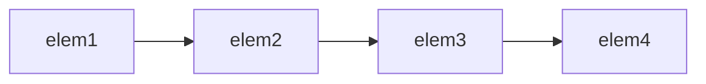
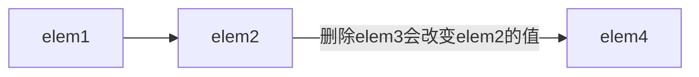

# primer学习

## 第九章 顺序容器

顺序容器(sequential container)为程序提供了控制元素存储和访问顺序的能力。

### 9.1 顺序容器概述

顺序容器性能折中:
向容器添加或从容器删除元素的代价
非顺序访问容器中元素的代价

表9.1:顺序容器类型
| 类型         | 描述                                                                        |
| ------------ | --------------------------------------------------------------------------- |
| vector       | 可变大小数组。支持快速随机访问。在尾部之外的位置插入或删除元素肯可能很慢。  |
| deque        | 双端队列。支持快速随机访问。在头尾位置插入/删除速度很快。                   |
| list         | 双向链表。只支持双向顺序访问。在list中任何位置进行插入/删除操作速度都很快。 |
| forward_list | 单项链表。只支持单向顺序访问。在链表任何位置进行插入/删除操作速度都很快。   |
| array        | 固定大小数组。支持快速随机访问。不能添加户删除元素。                        |
| string       | 与vector相似的容器,但专门用于保存字符。随机访问快。在尾部插入/删除数度快。  |

c++程序应该使用标准库容器,而不是更原始点数据结构,如内置数组。

#### 确定使用哪种顺序容器

vector是最好的选择,除非你有很好的理由选择其他容器。原则:
除非有很好的理由选择其他容器,否则应使用vector。
如果程序有很多小的元素,且空间的额外开销很重要,不要使用list或forward_list
如果程序要求随机访问元素,应使用vector或deque。
如果程序要求在容器但中间插入或删除元素,应使用list或forward_list。
如果程序需要咋头尾位置插入或删除元素,但不会在中间位置进行插入或删除操作,则使用deque。
如果程序只有在读取输入时才需要在容器中间位置插入元素,随后需要随机范文元素,则
首先,确定是否真的需要在容器中间位置添加元素。
当处理输入数据时,通常可以很容易地向vector追加数据,
然后再调用标准库的sort函数来重排容器中的元素,
从而避免在中间位置添加元素。
如果必须在中间位置插入元素,考虑在输入阶段使用list,一旦输入完成,
将list中的内容拷贝到一个vector中。
如果程序既需要随机访问元素,又需要在容器中间位置插入元素。
占主导地位的操作决定容器类型的选择,或者测试应用的性能。
如果不确定应该使用哪种容器,可以在程序中使用vector和list公共操作:
使用迭代器,不使用下标,避免随机访问。
在必要时选择使用vector或list都很方便。

### 9.2 容器库概览

容器类型上的操作形成了一种层次:
某些操作是所有容器类型都提供的。
另外一些操作仅针对顺序容器,或无序容器。
还有一些操作只适合于一小部分容器。
容器定义的头文件,文件名与类型名相同。deque、list等
容器均定义为模板类。如vector,提供额外信息来生成特定的容器类型。

#### 对容器可以保存的元素类型的限制

顺序容器几乎可以保存任意类型的元素。容器元素为容器。
`vector<vector<string>> lines;`
某些容器对元素类型有其自己的特殊要求。
如顺序容器构造函数的一个版本接受容器大小参数,
它使用了元素类型的默认构造函数。
但某些类没有默认的构造函数。可以定义一个保存这种类型对象的容器,
但我们在构造这种容器时不能只传递给它一个元素数目参数。

```cpp
//假定noDefault是一个没有默认构造函数的类型
vector<noDefault>v1(10,init);//正确:提供了元素初始化器
vector<noDefault>v2(10);//错误:必须提供一个元素初始化器
```

表9.2:容器操作

| 名称                                   | 描述                                                                         |
| -------------------------------------- | ---------------------------------------------------------------------------- |
| 类型别名                               |                                                                              |
| iterator                               | 此容器类型的迭代器类型                                                       |
| const_interator                        | 可以读取元素,不能修改元素的迭代器类型                                        |
| size_type                              | 无符号整数类型,足够保存此种容器类型最大可能容器但大小                        |
| difference_type                        | 带符号整数类型,足够保存两个迭代器之间的距离                                  |
| value_type                             | 元素类型                                                                     |
| reference                              | 元素的左值类型,与value_type&含义相同                                         |
| const_reference                        | 元素的const左值类型(即,const value_type&)                                    |
| 构造函数                               |                                                                              |
| C c                                    | 默认构造函数,构造空容器(array)                                               |
| C c1(c2)                               | 构造c2的拷贝c1                                                               |
| C c(b,e)                               | 构造c,将迭代器b和e指定的范围内的元素拷贝到c(array不支持)                     |
| C c{a,b,c,...}                         | 列表初始化c                                                                  |
| 赋值与swap                             |                                                                              |
| c1=c2                                  | 将c1中的元素替换为c2中的元素                                                 |
| c1={a,b,c...}                          | 将c1中的元素替换为列表中的元素(适用于array,但列表元素个数必须小于等于c1大小) |
| a.swap(b)                              | 交换a和b的元素                                                               |
| swap(a,b)                              | 与a.swap(b)等价                                                              |
| 大小                                   |                                                                              |
| c.size()                               | c中元素的数目(不支持forward_list)                                            |
| c.max_size()                           | c可以保存的最大元素数目                                                      |
| c.empty()                              | 若c中存储了元素,返回false,否则返回true                                       |
| 添加/删除元素(不适用于array)           |                                                                              |
| 在不同容器中,这些操作的接口都不同      |                                                                              |
| c.insert(args)                         | 将args中的元素拷贝进c                                                        |
| c.emplace(inits)                       | 使用inits构造c中的一个元素                                                   |
| c.erase(args)                          | 删除args指定的元素                                                           |
| c.clear()                              | 删除c中的所有元素,返回void                                                   |
| 关系运算符                             |                                                                              |
| ==,!=                                  | 所有容器都支持相等(不等)运算符                                               |
| <,<=,>,>=                              | 关系运算符(无序关联容器不支持)                                               |
| 获取迭代器                             |                                                                              |
| c.begin(),c.begin()                    | 返回指向c的首元素和尾元素之后位置的迭代器                                    |
| c.cbegin(),c.cbegin()                  | 返回const_iterator                                                           |
| 反向容器但额外成员(不支持forward_list) |                                                                              |
| reverse_iterator                       | 按逆序寻址元素的迭代器                                                       |
| const_reverse_iterator                 | 不能修改元素的逆序迭代器                                                     |
| c.rbegin(),c.rbegin()                  | 返回指向c的尾元素和首元素之前位置的迭代器                                    |
| c.crbegin(),c.credn()                  | 返回const_reverse_iterator                                                   |

#### 9.2.1迭代器

##### 迭代器范围

一个迭代器范围(iterator range)由一对迭代器表示,
两个迭代器分别指向同一容器中的元素或者是尾元素之后的位置(one past the last element)。
这种元素范围被称为左闭合区间(left-inclusive interval)

##### 使用左闭合范围蕴含的编程假定

这种范围有三种方便的性质:
如果 begin与end相等,则范围为空
如果begin与end不等,则范围至少包含一个元素
可以对begin递增若干次,使得begin==end*/

#### 9.2.2 容器类型成员

每个容器都定义类多个类型:size_type、iterator、const_iterator。
反向迭代器
类型别名,通过类型别名,可以在不了解容器中元素类型的情况下使用它。
元素类型:value_type,元素类型的一个引用reference或const_reference。

```cpp
//iter是通过list<string>定义的一个迭代器类型
list<string>::iterator iter;
//count是通过vector<int>定义的一个difference_type类型
vector<int>::difference_type count;*/
```

#### 9.2.3 begin和end成员

当不需要协访问时,应使用cbegin和cend

#### 9.2.4 容器定义和初始化

每个容器类型都定义类一个默认构造函数,array除外。

表9.3:容器定义和初始化

| 名称                                                | 描述                                                                                         |
| --------------------------------------------------- | -------------------------------------------------------------------------------------------- |
| C c                                                 | 默认构造函数,如果C是一个array,则c中元素按默认方式初始化,否则为空                             |
| C c1(c2)                                            | c1初始化为c2的拷贝。c1和c2必须是相同的类型,                                                  |
| C c1=c2                                             | 相同容器,相同元素类型。array类型,还必须相同大小。                                            |
| C c{a,b,c...}                                       | c初始化为初始化列表中元素的拷贝。列表元素类型必须与C的元素类型相容。                         |
| C c={a,b,c...}                                      | 对于array类型,列表中元素数目必须等于或小于array的大小。                                      |
| C c(b,e)                                            | c初始化为迭代器b和e指定范围中的元素的拷贝。范围中元素的类型必须与CD元素类型相容(array不适用) |
| 只有顺序容器(不包括array)的构造函数才能接受大小参数 |                                                                                              |
| C seq(n)                                            | seq包含n个元素,这些元素进行了值初始化,此构造函数是explicit的。string类型不适用               |
| C seq(n,t)                                          | seq包含n个初始化为值t的元素                                                                  |

##### 将一个容器初始化为另一个容器但拷贝

每个容器有三个元素,用给定的初始化器进行初始化

```cpp
list<string>authors={"Milton","Shakespeare","Austen"};
vector<const char*>articles={"a","an","the"};
list<string>list2(authors);//正确:类型匹配
deque<string>authList(authors);//错误:容器类型不匹配
vector<string>words(articles);//错误:容器元素类型必须匹配
//正确:可以将const char*元素转换为string
forward_list<string> words(articles.begin(), articles.begin());
```

由于迭代器表示一个范围,可以使用这种构造函数拷贝一个容器但子序列。

##### 列表初始化

##### 与顺序容器大小相关的构造函数

元素类型是内置类型或者是具有默认构造函数的类类型,
可以只为构造函数提供一个容器大小参数。
否则必须指定一个显式地元素初始值。

##### 标准库array具有固定大小

```cpp
array<int,2>//2个int的数组
array<string,10>
array<int,10>::size_type i;
```

大小是array类型的一部分,array不支持普通容器构造函数。
一个默认构造的array是非空的,包含了与其大小一样多的元素。
这些元素都被默认初始化。与内置数组中的元素相同。
不能对内置数组进行拷贝或对象赋值操作,但array并无此限制。*/

#### 9.2.5 赋值和swap

赋值运算符将左边容器中的全部元素替换为右边容器中元素的拷贝。
如果两个容器原来大小不同,赋值运算后两者的大小都与右边容器的原大小相同。
与内置内置数组不同,标准库array类型允许赋值。
赋值号左右两边的运算对象必须具有相同的类型,不支持显式转换。
由于右边运算对象的大小可能与左边运算对象的大小不同,array不支持assign。

表9.4:容器赋值运算

| 运算                              | 描述                                                                                                               |
| --------------------------------- | ------------------------------------------------------------------------------------------------------------------ |
| c1=c2                             | 将c1中的元素替换为c2中的元素的拷贝。c1和c2必须具有相同的类型。array还必须是相同的大小,其他容器拷贝后c1,c2大小同c2. |
| c={a1,a2,a3...}                   | 将c1中元素替换为初始化列表中元素的拷贝,array适用,但注意列表元素个数小于等于array元素个数                           |
| swap(c1,c2) c1.swap(c2)           | 交换c1和c2中的元素。c1和c2必须具有相同的类型。swap通常比从c2向c1拷贝元素快得多                                     |
| assign操作不适用于关联容器和array |
| seq.assign(b,e)                   | 将seq中的元素替换为迭代器b和e所表示的范围中的元素。迭代器b和e不能指向seq中的元素                                   |
| seq.assign(il)                    | 将seq中的元素替换为初始化列表il中的元素                                                                            |
| seq.assign(n,t)                   | 将seq中的元素替换为n个值为t的元素                                                                                  |

赋值相关运算回导致指向左边容器内部的迭代器、引用和指针失效。
swap操作不会导致失效(array和string的情况除外)

##### 使用assign(仅顺序容器)

赋值运算符要求左右两边运算对象类型相同,assign可以实现char*值赋予string类型对象

##### 使用swap

除array外,swap不对任何元素进行拷贝、删除或插入操作,可以保证在常数时间内完成。
swap之后,指向容器的迭代器、引用、指针不会失效。
对于array和string使用swap交换后,交换了元素。指针因元素个数不同会失效。*/

#### 9.2.6 容器大小操作

每个容器类型有三个大小操作
size返回容器元素的数目
empty当size为0时返回布尔值true,否则返回false
max_size返回一个大于或等于改类型容器所能容纳的最大元素数的值
forward_list支持max_size和empty,不支持size

#### 9.2.7 关系运算符

每个容器都支持相等运算符==和!=;
除了无序容器外的所有容器都支持关系运算符>,>=,<,<=。
关系运算符左右两端的运算对象必须是相同类型的容器,且必须保持元素类型相同。
比较两个容器实际上进行元素的逐对比较。与string的关系运算相似。
如果两个容器具有相同大小且所有元素都两两相等,则两个容器相等;否则不等。
如果两个容器大小不同,当较小容器中每个元素都等于较大容器中对应的元素,则较小容器小于较大容器。
如果两个容器不是另一个容器的前缀子序列,则它们的比较结果取决于第一个不想等元素的比较结果。

##### 容器的关系运算符使用元素的关系运算符完成比较

如果容器的元素不支持==和<运算,则容器也不能使用相应的关系运算。

```cpp
#include <iostream>
#include <array>
#include <vector>
#include <list>
using namespace std;

int main()
{
    array<int, 10> a1 = {0, 1, 2, 3, 4, 5, 6, 7, 8, 9};
    array<int, 10> a2 = {0}; //所有元素均为0
    array<int, 10> a3 = a1;  //默认初始化很奇怪啊？所以没有默认构造函数？
    a1 = a2;                 //替换a1中的元素,a2的大小必须哈a1相同
    a2 = {0};                //能将一个花括号类别赋予数组。列表大小不能大于a1大小
    auto iter3 = a1.begin()+1;
    cout << *iter3 << " ";
    a1.swap(a3);
    cout << *iter3 << endl;//元素交换了位置
    for (auto i = a1.begin(); i != a1.end(); ++i)
        cout << *i << " ";
    cout << endl;
    vector<int> vi1 = {0, 1, 2, 3, 4, 5, 6, 7, 8, 9};
    vector<int> vi2 = {0};
    vector<int> vi3 = vi1;
    vi1 = vi2;
    vi2 = {0, 3};
    auto iter = vi2.begin()+1;
    cout << *iter << " ";
    vi2.swap(vi3);
    cout << *iter << endl;//iter指向的元素不变
    vi1.assign(vi2.begin(), vi2.begin());
    for (auto i = vi2.begin(); i != vi2.end(); ++i)
        cout << *i << " ";
    cout << endl;
    list<string> names;
    list<string> vs = {"abc", "Hello", "world"};
    auto iter1 = vs.begin();
    cout << *iter1 << " ";
    names.swap(vs);
    cout << *iter1 << endl;//元素不变
    vector<const char *> oldstyle = {"abc", "Hello", "world"};
    //正确,可以将const char*转换为string
    names.assign(oldstyle.cbegin(), oldstyle.cend());
    for (auto i : names)
        cout << i << " ";
    cout << endl;
    //等价于slist1.clear();
    //后跟slist1.insert(slist1.begin(),10,"Hiya!");
    list<string> slist1(1);     //1个元素,为空string
    slist1.assign(10, "Hiya!"); //10个元素,每个都是“Hiya!”
    string s1 = "Hello!W", s2 = "World!";
    auto iter2 = s1.begin();
    cout << *iter2 << " ";
    swap(s1, s2);
    cout << *iter2 << endl;//元素交换了位置
    for (auto i = s1.begin(); i != s1.end(); ++i)
        cout << *i << " ";
    cout << endl;
    return 0;
}
```

### 9.3顺序容器操作

顺序容器和关联容器的不同之处在于两者组织元素的方式。这些不同之处直接关系到了元素如何存储、访问、添加以及删除。上一节介绍了所有容器都支持的操作(罗列于表9.2(第295页))。本章剩余部分将介绍顺序容器所特有的操作。

#### 9.3.1向顺序容器添加元素

除array外,所有标准库容器都提供灵活的内存管理。在运行时可以动态添加或删除元素来改变容器大小。表9.5列出了向顺序容器(非array)添加元素的操作。

表9.5:向顺序容器添加元素的操作

| 操作                                                                | 描述                                                                                                                                    |
| ------------------------------------------------------------------- | --------------------------------------------------------------------------------------------------------------------------------------- |
| 这些操作会改变容器的大小;array不支持这些操作。                      |
| forward list 有自己专有版本的insert和emplace;参见9.3.4节(第312页)。 |
| forward list 不支持push back和emplace back。                        |
| vector和string不支持push front和emplace front。                     |
| c.push_back(t)c.emplace_back(args)                                  | 在c的尾部创建一个值为t或由args创建的元素。返回void                                                                                      |
| c.push_front(t)c.emplace_front(args)                                | 在c的头部创建一个值为t或由args创建的元素。返回void                                                                                      |
| c.insert(p,t)c.emplace(p,args)                                      | 在迭代器p指向的元素之前创建一个值为t或由args创建的元素。返回指向新添加的元素的迭代器                                                    |
| c.insert(p,n,t)                                                     | 在迭代器p指向的元素之前插入n个值为t的元素。返回指向新添加的第一个元素的迭代器;若n为0,则返回p                                            |
| c.insert(p,b,e)                                                     | 将迭代器b和e指定的范围内的元素插入到迭代器p指向的元素之前。b和e不能指向c中的元素。返回指向新添加的第一个元素的迭代器;若范围为空,则返回p |
| c.insert(p,i1)                                                      | il是一个花括号包围的元素值列表。将这些给定值插入到迭代器p指向的元素之前。返回指向新添加的第一个元素的迭代器;若列表为空,则返回p          |

**WARNING** 向一个vector、string或deque插入元素会使所有指向容器的选代器、引用和指针失效。

当我们使用这些操作时,必须记得不同容器使用不同的策略来分配元素空间,而这些策略直接影响性能。在一个vector或string的尾部之外的任何位置,或是一个deque的首尾之外的任何位置添加元素,都需要移动元素。而且,向一个vector或string添加元素可能引起整个对象存储空间的重新分配。重新分配一个对象的存储空间需要分配新的内存,并将元素从旧的空间移动到新的空间中。

##### 使用push_back

在3.3.2节(第90页)中,我们看到push_back将一个元素追加到一个vector的尾部。除array和forward 1ist之外,每个顺序容器(包括string类型)都支持push_back。

例如,下面的循环每次读取一个string到word中,然后追加到容器尾部:

```cpp
//从标准输入读取数据,将每个单词放到容器末尾
string word;while(cin>>word)
container.push_back(word);
```

对push back的调用在container尾部创建了一个新的元素,将container的size增大了1。该元素的值为word的一个拷贝。container的类型可以是list、vector或deque。

由于string是一个字符容器,我们也可以用push back在string末尾添加字符:

```cpp
void pluralize(size_t cnt,string &word){
if(cnt>1)
word.push_back('s');//等价于word+='s'
}
```

>**关键概念:容器元素是拷贝**当我们用一个对象来初始化容器时,或将一个对象插入到容器中时,实际上放入到容器中的是对象值的一个拷贝,而不是对象本身。就像我们将一个对象传递给非引用参数(参见3.2.2节,第79页)一样,容器中的元素与提供值的对象之间没有任何关联。随后对容器中元素的任何改变都不会影响到原始对象,反之亦然。

使用push_front除了push_back,list、forward 1ist和deque容器还支持名为push front的类似操作。此操作将元素插入到容器头部:

```cpp
1ist<int>ilist;//将元素添加到ilist开头
for(sizet ix=0;ix！=4;++ix)
ilist.push front(ix);
```

此循环将元素0、1、2、3添加到ilist头部。每个元素都插入到1ist的新的开始位置(new beginning)。即,当我们插入1时,它会被放置在0之前,2被放置在1之前,依此类推。因此,在循环中以这种方式将元素添加到容器中,最终会形成逆序。在循环执行完毕后,ilist保存序列3、2、1、0。

注意,deque像 vector一样提供了随机访问元素的能力,但它提供了vector所不支持的push_front。deque保证在容器首尾进行插入和删除元素的操作都只花费常数时间。与vector一样,在deque首尾之外的位置插入元素会很耗时。

##### 在容器中的特定位置添加元素

push back和push_front操作提供了一种方便地在顺序容器尾部或头部插入单个元素的方法。insert成员提供了更一般的添加功能,它允许我们在容器中任意位置插入0个或多个元素。vector、deque、list和string都支持insert成员。forward_list提供了特殊版本的insert成员,我们将在9.3.4节(第312页)中介绍。

每个insert函数都接受一个迭代器作为其第一个参数。迭代器指出了在容器中什么位置放置新元素。它可以指向容器中任何位置,包括容器尾部之后的下一个位置。由于迭代器可能指向容器尾部之后不存在的元素的位置,而且在容器开始位置插入元素是很有用的功能,所以insert函数将元素插入到迭代器所指定的位置之前。例如,下面的语句

```cpp
slist.insert(iter,"Hello！");//将“Hel1o！”添加到iter之前的位置将一个值为“He11o”的string插入到iter指向的元素之前的位置。
```

虽然某些容器不支持push_front操作,但它们对于insert操作并无类似的限制(插入开始位置)。因此我们可以将元素插入到容器的开始位置,而不必担心容器是否支持push front:

```cpp
vector<string>svec;list<string>slist;
//等价于调用slist.push_front("Hello！");
slist.insert(slist.begin(),"Hello！");
//vector不支持push_front,但我们可以插入到begin()之前
//警告:插入到vector末尾之外的任何位置都可能很慢
svec.insert(svec.begin(),"Hello！");
```

**WARNING** 将元素插入到vector、deque和string中的任何位置都是合法的。然而,RN色这样做可能很耗时。

##### 插入范围内元素

除了第一个迭代器参数之外,insert函数还可以接受更多的参数,这与容器构造函数类似。其中一个版本接受一个元素数目和一个值,它将指定数量的元素添加到指定位置之前,这些元素都按给定值初始化:

`svec.insert(svec.end(),10,"Anna");`

这行代码将10个元素插入到svec的末尾,并将所有元素都初始化为string"Anna”。

接受一对迭代器或一个初始化列表的insert版本将给定范围中的元素插入到指定位置之前:

```cpp
vector<string>v={"quasi","simba","frollo","scar");
//将v的最后两个元素添加到slist的开始位置
slist.insert(slist.begin(),v.end()-2,v.end());
slist.insert(slist.end(),{"these","words","will",
"go","at","the","end"});
C.emplace back();//使用Sales data的默认构造函数
c.emplace(iter,"999-999999999");//使用Sales_data(string)
//使用Sales data的接受一个ISBN、一个count和一个price的构造函数
c.emplace_front("978-0590353403",25,15.99);
```

**Note** emplace函数在容器中直接构造元素。传递给emplace函数的参数必须与元Nate 素类型的构造函数相匹配.

#### 9.3.2访问元素

表9.6列出了我们可以用来在顺序容器中访问元素的操作。如果容器中没有元素,访问操作的结果是未定义的。

包括array在内的每个顺序容器都有一个front成员函数,而除forward list之外的所有顺序容器都有一个back成员函数。这两个操作分别返回首元素和尾元素的引

```cpp
//在解引用一个迭代器或调用front或back之前检查是否有元素
if(.c.empty()){
//val和va12是c中第一个元素值的拷贝
auto val=*c.begin(),val2=c.front();
//va13和val4是c中最后一个元素值的拷贝
auto last=c.end();auto val3=*(--last);//不能递减forward list 迭代器auto val4=c.back();//forward list不支持
}
```

此程序用两种不同方式来获取c中的首元素和尾元素的引用。直接的方法是调用front和back。而间接的方法是通过解引用begin返回的迭代器来获得首元素的引用,以及通过递减然后解引用end返回的迭代器来获得尾元素的引用。

这个程序有两点值得注意:迭代器end指向的是容器尾元素之后的(不存在的)元素。为了获取尾元素,必须首先递减此迭代器。另一个重要之处是,在调用front和back(或解引用begin和end返回的迭代器)之前,要确保c非空。如果容器为空,if中操作的行为将是未定义的。

表9.6:在顺序容器中访问元素的操作
| 操作                                               | 描述                                                                             |
| -------------------------------------------------- | -------------------------------------------------------------------------------- |
| at和下标操作只适用于string、vector、deque和array。 |
| back不适用于forward list。                         |
| c.back()                                         | 返回c中尾元素的引用。若c为空,函数行为未定义                                     |
| c.front()                                        | 返回c中首元素的引用。若c为空,函数行为未定义                                     |
| c[n]                                               | 返回c中下标为n的元素的引用,n是一个无符号整数。若n>=c.size(),则函数行为未定义 |
| c.at(n)                                          | 返回下标为n的元素的引用。如果下标越界,则抛出一out_of_range异常                  |

**WARNING**对一个空容器调用front和back,就像使用一个越界的下标一样,是一WARNING种严重的程序设计错误。

##### 访问成员函数返回的是引用

在容器中访问元素的成员函数(即,front、back、下标和at)返回的都是引用。如果容器是一个const对象,则返回值是const的引用。如果容器不是const的,则返回值是普通引用,我们可以用来改变元素的值:

```cpp
if(！c.empty()){
c.front()=42;//将42赋予c中的第一个元素auto&v=c.back();//获得指向最后一个元素的引用v=1024;//改变c中的元素
auto v2=c.back();//v2不是一个引用,它是c.back()的一个拷贝v2=0;//未改变c中的元素
}
```

与往常一样,如果我们使用auto变量来保存这些函数的返回值,并且希望使用此变量来改变元素的值,必须记得将变量定义为引用类型。

##### 下标操作和安全的随机访问

提供快速随机访问的容器(string、vector、deque和array)也都提供下标运算符(参见3.3.3节,第91页)。就像我们已经看到的那样,下标运算符接受一个下标参数,返回容器中该位置的元素的引用。给定下标必须“在范围内”(即,大于等于0,且小于容器的大小)。保证下标有效是程序员的责任,下标运算符并不检查下标是否在合法范围内。使用越界的下标是一种严重的程序设计错误,而且编译器并不检查这种错误。如果我们希望确保下标是合法的,可以使用at成员函数。at成员函数类似下标运算符,但如果下标越界,at会抛出一个out_of_range异常(参见5.6节,第173页):

```cpp
vector<string>svec;//空vector
cout <<svec[0];//运行时错误:svec中没有元素！
cout<<svec.at(0);//抛出一个out_of_range异常
```

#### 9.3.3删除元素

与添加元素的多种方式类似,(非array)容器也有多种删除元素的方式。表9.7列出了这些成员函数。

表9.7:顺序容器的删除操作

| 操作                                                     | 描述                                                                                                                                                                                                                                                                                      |
| -------------------------------------------------------- | ----------------------------------------------------------------------------------------------------------------------------------------------------------------------------------------------------------------------------------------------------------------------------------------- |
| 这些操作会改变容器的大小,所以不适用于array。            |
| forward list 有特殊版本的erase,参见9.3.4节(第312页)。 |
| f                                                        | orward_list不支持pop back;vector和string不支持pop front。                                                                                                                                                                                                                                |
| c.pop_back()                                           | 删除c中尾元素。若c为空,则函数行为未定义。函数返回void c.pop_front()删除c中首元素。若c为空,则函数行为未定义。函数返回void c.erase(p)删除迭代器p所指定的元素,返回一个指向被删元素之后元素的迭代器,若p指向尾元素,则返回尾后(off-the-end)迭代器。若p是尾后迭代器,则函数行为未定义 |
| c.erase(b,e)                                          | 删除迭代器b和e所指定范围内的元素。返回一个指向最后一个被删元素之后元素的迭代器,若e本身就是尾后迭代器,则函数也返回尾后迭代器                                                                                                                                                             |
| c.clear()                                              | 删除c中的所有元素。返回void|

**WARNING**删除deque中除首尾位置之外的任何元素都会使所有迭代器、引用和指针失效。指向vector或string中删除点之后位置的迭代器、引用和指针都会失

**WARNING**删除元素的成员函数并不检查其参数。在删除元素之前,程序员必须确保它(们)是存在的。

##### pop_front和pop_back成员函数

pop_front和pop_back成员函数分别删除首元素和尾元素。与vector和string不支持push_front一样,这些类型也不支持pop front。类似的,forward list不支持pop_back。与元素访问成员函数类似,不能对一个空容器执行弹出操作。

这些操作返回void。如果你需要弹出的元素的值,就必须在执行弹出操作之前保存它:

```cpp
while(lilist.empty()){
process(ilist.front());//对ilist的首元素进行一些处理
ilist.pop_front();//完成处理后删除首元素
}
```

##### 从容器内部删除一个元素

成员函数erase从容器中指定位置删除元素。我们可以删除由一个迭代器指定的单个元素,也可以删除由一对迭代器指定的范围内的所有元素。两种形式的erase都返回指向删除的(最后一个)元素之后位置的迭代器。即,若j是i之后的元素,那么erase(i)将返回指向j的迭代器。

例如,下面的循环删除一个1ist中的所有奇数元素:

```cpp
1ist<int>lst={0,1,2,3,4,5,6,7,8,9};
auto it=lst.begin();while(it！=lst.end())
if(*it%2)//若元素为奇数
it=lst.erase(it);//删除此元素
else
++it;
```

每个循环步中,首先检查当前元素是否是奇数。如果是,就删除该元素,并将it设置为我们所删除的元素之后的元素。如果*it为偶数,我们将it递增,从而在下一步循环检查下一个元素。

##### 删除多个元素

接受一对迭代器的erase版本允许我们删除一个范围内的元素:

```cpp
//删除两个迭代器表示的范围内的元素
//返回指向最后一个被删元素之后位置的迭代器
elem1=slist.erase(elem1,elem2);//调用后,elem1==elem2
```

迭代器elem1指向我们要删除的第一个元素,elem2指向我们要删除的最后一个元素之后的位置。

为了删除一个容器中的所有元素,我们既可以调用clear,也可以用begin和end获得的迭代器作为参数调用erase:

```cpp
slist.clear();//删除容器中所有元素
slist.erase(slist.begin(),slist.end());//等价调用
```

#### 9.3.4 特殊的forward_list操作

为了理解 forward_list为什么有特殊版本的添加和删除操作,考虑当我们从一个单向链表中删除一个元素时会发生什么。如图9.1所示,删除一个元素会改变序列中的链接。在此情况下,删除elems会改变elem2,elem2原来指向elem3,但删除elems后,elemz指向了elem4。



删除elem3会改变elem2的值



当添加或删除一个元素时,删除或添加的元素之前的那个元素的后继会发生改变。为了添加或删除一个元素,我们需要访问其前驱,以便改变前驱的链接。但是,forwardlist是单向链表。在一个单向链表中,没有简单的方法来获取一个元素的前驱。出于这个原因,在一个forward 1ist中添加或删除元素的操作是通过改变给定元素之后的元素来完成的。这样,我们总是可以访问到被添加或删除操作所影响的元素。

由于这些操作与其他容器上的操作的实现方式不同,forwardlist并未定义insert、emplace和erase,而是定义了名为insert after、emplace after和erase after的操作(参见表9.8)。例如,在我们的例子中,为了删除elem,应该用指向elem,的迭代器调用erase after。为了支持这些操作,forward list也定义了before begin,它返回一个首前(off-the-beginning)迭代器。这个迭代器允许我们在链表首元素之前并不存在的元素“之后”添加或删除元素(亦即在链表首元素之前添加删除元素)。

表9.8:在forward_list中插入或删除元素的操作

|操作|描述|
|---|---|
|lst.before_begin()lst.cbefore_begin()|返回指向链表首元素之前不存在的元素的迭代器。此迭代器不能解引用。cbefore_begin()返回一个const iterator|
|lst.insert_after(p,t)lst.insert_after(p,n,t)lst.insert_after(p,b,e)lst.insert_after(p,i1)|在迭代器p之后的位置插入元素。t是一个对象,n是数量,b和e是表示范围的一对迭代器(b和e不能指向lst内),il是一个花括号列表。返回一个指向最后一个插入元素的迭代器。如果范围为空,则返回p。若p为尾后迭代器,则函数行为未定义|
|emplace_after(p,args)|使用args在p指定的位置之后创建一个元素。返回一个指向这个新元素的迭代器。若p为尾后迭代器,则函数行为未定义|
|lst.erase_after(p)lst.erase_after(b,e)|删除p指向的位置之后的元素,或删除从b之后直到(但不包含)e之间的元素。返回一个指向被删元素之后元素的迭代器,若不存在这样的元素,则返回尾后迭代器。如果p指向lst的尾元素或者是一个尾后迭代器,则函数行为未定义|

当在forward_1ist中添加或删除元素时,我们必须关注两个迭代器——一个指向我们要处理的元素,另一个指向其前驱。例如,可以改写第312页中从1ist中删除奇数元素的循环程序,将其改为从forward 1ist中删除元素:

```cpp
forward_list<int>flst={0,1,2,3,4,5,6,7,8,9};
auto prev=flst.before_begin();//表示flst的“首前元素”
auto curr=flst.begin();//表示flst中的第一个元素
while(curr！=flst.end()){//仍有元素要处理
if(*curr%2)//若元素为奇数
curr=flst.erase_after(prev);//删除它并移动curr
else{
prev=curr;//移动迭代器curr,指向下一个元素,prev指向
++curr;//curr之前的元素
}
}
```

此例中,curr表示我们要处理的元素,prev表示curr的前驱。调用begin来初始化curr,这样第一步循环就会检查第一个元素是否是奇数。我们用before_begin来初始化prev,它返回指向curr之前不存在的元素的迭代器。

当找到奇数元素后,我们将prev 传递给erase_after。此调用将prev之后的元素删除,即,删除curr指向的元素。然后我们将curr重置为erase_after的返回值,使得curr指向序列中下一个元素,prev保持不变,仍指向(新)curr之前的元素。如果curr指向的元素不是奇数,在else中我们将两个迭代器都向前移动。

#### 9.3.5改变容器大小

如表9.9所描述,我们可以用resize来增大或缩小容器,与往常一样,array不支持resize。如果当前大小大于所要求的大小,容器后部的元素会被删除;如果当前大小小于新大小,会将新元素添加到容器后部:

```cpp
list<int>ilist(10,42);//10个int:每个的值都是42
ilist.resize(15);//将5个值为0的元素添加到ilist的末尾
ilist.resize(25,-1);//将10个值为-1的元素添加到ilist的末尾
ilist.resize(5);//从ilist末尾删除20个元素
```

resize操作接受一个可选的元素值参数,用来初始化添加到容器中的元素。如果调用者未提供此参数,新元素进行值初始化(参见3.3.1节,第88页)。如果容器保存的是类类型元素,且resize向容器添加新元素,则我们必须提供初始值,或者元素类型必须提供一个默认构造函数。

表9.9:顺序容器大小操作

|操作|描述|
|---|----|
|resize 不适用于array
| c.resize(n)|调整c的大小为n个元素。若n<c.size(),则多出的元素被丢弃。若必须添加新元素,对新元素进行值初始化|
|c.resize(n,t)|调整c的大小为n个元素。任何新添加的元素都初始化为值t|

**WARNING** 如果resize缩小容器,则指向被删除元素的迭代器、引用和指针都会失效;对vector、string 或deque进行resize 可能导致迭代器、指针和引用失效。

#### 9.3.6容器操作可能使迭代器失效

向容器中添加元素和从容器中删除元素的操作可能会使指向容器元素的指针、引用或迭代器失效。一个失效的指针、引用或迭代器将不再表示任何元素。使用失效的指针、引用或迭代器是一种严重的程序设计错误,很可能引起与使用未初始化指针一样的问题(参见2.3.2节,第49页)

在向容器添加元素后:

- 如果容器是vector或string,且存储空间被重新分配,则指向容器的迭代器、指针和引用都会失效。如果存储空间未重新分配,指向插入位置之前的元素的迭代器、指针和引用仍有效,但指向插入位置之后元素的迭代器、指针和引用将会失效。·对于deque,插入到除首尾位置之外的任何位置都会导致迭代器、指针和引用失效。如果在首尾位置添加元素,迭代器会失效,但指向存在的元素的引用和指针不会失效。
- 对于1ist和forward_list,指向容器的迭代器(包括尾后迭代器和首前迭代器)、指针和引用仍有效。
当我们从一个容器中删除元素后,指向被删除元素的迭代器、指针和引用会失效,这应该不会令人惊讶。毕竟,这些元素都已经被销毁了。当我们删除一个元素后:
- 对于1ist和forward_list,指向容器其他位置的迭代器(包括尾后迭代器和首前迭代器)、引用和指针仍有效。
- 对于deque,如果在首尾之外的任何位置删除元素,那么指向被删除元素外其他元素的迭代器、引用或指针也会失效。如果是删除deque的尾元素,则尾后迭代器也会失效,但其他迭代器、引用和指针不受影响;如果是删除首元素,这些也不会受影响。
- 对于vector和string,指向被删元素之前元素的迭代器、引用和指针仍有效。

注意:当我们删除元素时,尾后迭代器总是会失效。

**WARNING**八使用失效的迭代器、指针或引用是严重的运行时错误。

**建议:**
>管理迭代器
>当你使用迭代器(或指向容器元素的引用或指针)时,最小化要求迭代器必须保持有效的程序片段是一个好的方法。
>由于向迭代器添加元素和从迭代器删除元素的代码可能会使迭代器失效,因此必须保证每次改变容器的操作之后都正确地重新定位送代器。这个建议对vector、string和deque尤为重要。

##### 编写改变容器的循环程序

添加/删除 vector、string 或deque元素的循环程序必须考虑迭代器、引用和指针可能失效的问题。程序必须保证每个循环步中都更新迭代器、引用或指针。如果循环中调用的是insert或erase,那么更新迭代器很容易。这些操作都返回迭代器,我们可以用来更新:

```cpp
//傻瓜循环,删除偶数元素,复制每个奇数元素
vector<int>vi={0,1,2,3,4,5,6,7,8,9};
auto iter=vi.begin();//调用begin而不是cbegin,因为我们要改变vi
while(iter！=vi.end()){
if(*iter%2){
iter=vi.insert(iter,*iter);//复制当前元素
iter+=2;//向前移动迭代器,跳过当前元素以及插入到它之前的元素
}else iter=vi.erase(iter);//删除偶数元素
//不应向前移动迭代器,iter指向我们删除的元素之后的元素
}
```

此程序删除 vector中的偶数值元素,并复制每个奇数值元素。我们在调用insert和erase后都更新迭代器,因为两者都会使迭代器失效。

在调用erase后,不必递增迭代器,因为erase返回的迭代器已经指向序列中下一个元素。调用insert后,需要递增迭代器两次。记住,insert在给定位置之前插入新元素,然后返回指向新插入元素的迭代器。因此,在调用insert后,iter指向新插入元素,位于我们正在处理的元素之前。我们将迭代器递增两次,恰好越过了新添加的元素和正在处理的元素,指向下一个未处理的元素。

##### 不要保存end返回的迭代器

当我们添加/删除 vector或string的元素后,或在deque中首元素之外任何位置添加/删除元素后,原来end返回的迭代器总是会失效。因此,添加或删除元素的循环程序必须反复调用end,而不能在循环之前保存end返回的迭代器,一直当作容器末尾使用。通常C++标准库的实现中end()操作都很快,部分就是因为这个原因。

例如,考虑这样一个循环,它处理容器中的每个元素,在其后添加一个新元素。我们希望循环能跳过新添加的元素,只处理原有元素。在每步循环之后,我们将定位迭代器,使其指向下一个原有元素。如果我们试图“优化”这个循环,在循环之前保存end()返回的迭代器,一直用作容器末尾,就会导致一场灾难:

```cpp
//灾难:此循环的行为是未定义的
auto begin=v.begin(),end=v.end();//保存尾迭代器的值是一个坏主意
while(begin！=end){
//做一些处理
//插入新值,对begin重新赋值,否则的话它就会失效
++begin;//向前移动begin,因为我们想在此元素之后插入元素
begin=v.insert(begin,42);//插入新值
++begin;//向前移动begin跳过我们刚刚加入的元素
}
```

此代码的行为是未定义的。在很多标准库实现上,此代码会导致无限循环。问题在于我们将end操作返回的迭代器保存在一个名为end的局部变量中。在循环体中,我们向容器中添加了一个元素,这个操作使保存在end中的迭代器失效了。这个迭代器不再指向v中任何元素,或是v中尾元素之后的位置。

**Tip**如果在一个循环中插入/删除deque、string或vector中的元素,不要缓Tn/存end返回的选代器。

必须在每次插入操作后重新调用end(),而不能在循环开始前保存它返回的迭代器:

```cpp
//更安全的方法:在每个循环步添加/删除元素后都重新计算end
while(begin！=v.end()){
//做一些处理
++begin;//向前移动begin,因为我们想在此元素之后插入元素
begin=v.insert(begin,42);//插入新值
++begin;//向前移动begin,跳过我们刚刚加入的元素
}
```

### 9.4 vector对象是如何增长的

为了支持快速随机访问,vector将元素连续存储一—每个元素紧挨着前一个元素存储。通常情况下,我们不必关心一个标准库类型是如何实现的,而只需关心它如何使用。然而,对于vector和string,其部分实现渗透到了接口中。

假定容器中元素是连续存储的,且容器的大小是可变的,考虑向vector或string中添加元素会发生什么:如果没有空间容纳新元素,容器不可能简单地将它添加到内存中其他位置一—因为元素必须连续存储。容器必须分配新的内存空间来保存已有元素和新元素,将已有元素从旧位置移动到新空间中,然后添加新元素,释放旧存储空间。如果我们每添加一个新元素,vector就执行一次这样的内存分配和释放操作,性能会慢到不可接受。

为了避免这种代价,标准库实现者采用了可以减少容器空间重新分配次数的策略。当不得不获取新的内存空间时,vector和string的实现通常会分配比新的空间需求更大的内存空间。容器预留这些空间作为备用,可用来保存更多的新元素。这样,就不需要每次添加新元素都重新分配容器的内存空间了。

这种分配策略比每次添加新元素时都重新分配容器内存空间的策略要高效得多。其实际性能也表现得足够好——虽然vector在每次重新分配内存空间时都要移动所有元素,但使用此策略后,其扩张操作通常比1ist和deque还要快。

#### 管理容量的成员函数

如表9.10所示,vector和string类型提供了一些成员函数,允许我们与它的实现中内存分配部分互动。capacity操作告诉我们容器在不扩张内存空间的情况下可以容纳多少个元素。reserve操作允许我们通知容器它应该准备保存多少个元素。

表9.10:容器大小管理操作

|操作|描述|
|---|---|
|shrink_to_fit只适用于vector、string和deque。
|capacity和 reserve 只适用于vector和string。
|c.shrink_to_fit()|请将 capacity()减少为与size()相同大小|
|c.capacity()|不重新分配内存空间的话,c可以保存多少元素|
|c.reserve(n)|分配至少能容纳n个元素的内存空间|

**Note** reserve 并不改变容器中元素的数量,它仅影响 vector预先分配多大的内存空间。

只有当需要的内存空间超过当前容量时,reserve 调用才会改变 vector的容量。如果需求大小大于当前容量,reserve至少分配与需求一样大的内存空间(可能更大)。

如果需求大小小于或等于当前容量,reserve什么也不做。特别是,当需求大小小于当前容量时,容器不会退回内存空间。因此,在调用reserve之后,capacity将会大于或等于传递给 reserve的参数。

这样,调用reserve永远也不会减少容器占用的内存空间。类似的,resize成员函数(参见9.3.5节,第314页)只改变容器中元素的数目,而不是容器的容量。我们同样不能使用resize来减少容器预留的内存空间。

在新标准库中,我们可以调用shrink_to_fit 来要求deque、vector或string退回不需要的内存空间。此函数指出我们不再需要任何多余的内存空间。但是,具体的实现可以选择忽略此请求。也就是说,调用shrink_to_fit也并不保证一定退回内存空间。

#### capacity 和size

理解 capacity和size的区别非常重要。容器的size是指它已经保存的元素的数目;而capacity则是在不分配新的内存空间的前提下它最多可以保存多少元素。

下面的代码展示了size和capacity之间的相互作用:

```cpp
vector<int>ivec;
//size应该为0;capacity的值依赖于具体实现
cout<<"ivec:size:"<<ivec.size()
<<"capacity:"<< ivec.capacity()<<endl;
//向ivec添加24个元素
for(vector<int>::size_type ix=0;ix！=24;++ix)
ivec.push_back(ix);

//size应该为24;capacity应该大于等于24,具体值依赖于标准库实现
cout <<"ivec:size:"<< ivec.size()
<<"capacity:"<<ivec.capacity()<<end1
```

当在我们的系统上运行时,这段程序得到如下输出:

```text
ivec:size:0 capacity:0
ivec:size:24 capacity:32
```

我们知道一个空vector的size为0,显然在我们的标准库实现中一个空vector的capacity也为0。当向vector中添加元素时,我们知道size与添加的元素数目相等。而 capacity至少与size一样大,具体会分配多少额外空间则视标准库具体实现而定。在我们的标准库实现中,每次添加1个元素,共添加24个元素,会使capacity变为32。

可以想象ivec的当前状态如下图所示:

0|1|2|...|23保留空间
ivec.size()ivec.capacity()

现在可以预分配一些额外空间:

```cpp
ivec.reserve(50);//将capacity至少设定为50,可能会更大
//size应该为24;capacity应该大于等于50,具体值依赖于标准库实现
cout<<"ivec:size:"<<ivec.size()
<<"capacity:"<< ivec.capacity()<<endl;
```

程序的输出表明reserve严格按照我们需求的大小分配了新的空间:

`ivec:size:24 capacity:50`

接下来可以用光这些预留空间:

```cpp
//添加元素用光多余容量
while(ivec.size()！=ivec.capacity())
ivec.push back(0);
//capacity应该未改变,size和capacity不相等cout <<"ivec:size:"<< ivec.size()
<<"capacity:"<<ivec.capacity()<<endl;
```

程序输出表明此时我们确实用光了预留空间,size和capacity相等:

`ivec:size:50 capacity:50`

由于我们只使用了预留空间,因此没有必要为vector分配新的空间。实际上,只要没有操作需求超出vector的容量,vector 就不能重新分配内存空间。

如果我们现在再添加一个新元素,vector就不得不重新分配空间:

```cpp
ivec.push back(42);//再添加一个元素
//size应该为51;capacity应该大于等于51,具体值依赖于标准库实现cout<<"ivec:size:"<< ivec.size()
<<"capacity:"<<ivec.capacity()<<endl;
```

这段程序的输出为

`ivec:size:51 capacity:100`

这表明 vector的实现采用的策略似乎是在每次需要分配新内存空间时将当前容量翻倍。

可以调用shrink to_fit 来要求vector将超出当前大小的多余内存退回给系统:

```cpp
ivec.shrink to fit();//要求归还内存
//size应该未改变;capacity的值依赖于具体实现
cout<<"ivec:size:"<<ivec.size()
<<"capacity:"<< ivec.capacity()<< endl;
```

调用shrink_to_fit只是一个请求,标准库并不保证退还内存。

**Note** 每个vector实现都可以选择自己的内存分配策略。但是必须遵守的一条原则是:只有当迫不得已时才可以分配新的内存空间。

只有在执行insert 操作时size与capacity相等,或者调用resize或reserve时给定的大小超过当前 capacity,vector才可能重新分配内存空间。会分配多少超过给定容量的额外空间,取决于具体实现。

虽然不同的实现可以采用不同的分配策略,但所有实现都应遵循一个原则:确保用push_back向vector添加元素的操作有高效率。从技术角度说,就是通过在一个初始为空的vector 上调用n次push back来创建一个n个元素的vector,所花费的时间不能超过n的常数倍。

### 9.5额外的string操作

除了顺序容器共同的操作之外,string类型还提供了一些额外的操作。这些操作中的大部分要么是提供string类和C风格字符数组之间的相互转换,要么是增加了允许我们用下标代替迭代器的版本。

标准库string类型定义了大量函数。幸运的是,这些函数使用了重复的模式。由于函数过多,本节初次阅读可能令人心烦,因此读者可能希望快速浏览本节。当你了解string支持哪些类型的操作后,就可以在需要使用一个特定操作时回过头来仔细阅读。

#### 9.5.1构造string的其他方法

除了我们在3.2.1节(第76页)已经介绍过的构造函数,以及与其他顺序容器相同的构造函数(参见表9.3,第299页)外,string类型还支持另外三个构造函数,如表9.11所示。

表9.11：构造string的其他方法

|方法|描述|
|---|---|
|n、len2和pos2都是无符号值
|string s(cp,n)|s是cp指向的数组中前n个字符的拷贝。此数组至少应该包含n个字符|
|strings(s2,pos2)|s是strings2从下标pos2开始的字符的拷贝。若pos2>s2.size(),构造函数的行为未定义|
|string s(s2,pos2,1en2)|s是strings2从下标pos2开始1en2个字符的拷贝。若pos2>s2.size(),构造函数的行为未定义。不管1en2的值是多少,构造函数至多拷贝s2.size()-pos2个字符

这些构造函数接受一个string或一个const char*参数,还接受(可选的)指定拷贝多少个字符的参数。当我们传递给它们的是一个string时,还可以给定一个下标来指出从哪里开始拷贝：

```cpp
const char*cp="Hel1o World！！！";//以空字符结束的数组
char noNull[]={'H','i'};//不是以空字符结束
string sl(cp);//拷贝cp中的字符直到遇到空字符;s1=="Hello World！！！"
string s2(noNul1,2);//从noNul1拷贝两个字符;s2=="Hi"
string s3(noNul1);//未定义：noNu11不是以空字符结束
string s4(cp+6,5);//从cp[6]开始拷贝5个字符;s4=="World"
string s5(s1,6,5);//从s1[6]开始拷贝5个字符;s5=="World"
string s6(s1,6);//从s1[6]开始拷贝,直至s1末尾;s6=="World！！！"
string s7(s1,6,20);//正确,只拷贝到s1末尾;s7=="World！！！"
string s8(s1,16);//抛出一个out_of range异常
```

通常当我们从一个const char*创建string时,指针指向的数组必须以空字符结尾,拷贝操作遇到空字符时停止。如果我们还传递给构造函数一个计数值,数组就不必以空字符结尾。如果我们未传递计数值且数组也未以空字符结尾,或者给定计数值大于数组大小,则构造函数的行为是未定义的。

当从一个string拷贝字符时,我们可以提供一个可选的开始位置和一个计数值。开始位置必须小于或等于给定的string的大小。如果位置大于size,则构造函数抛出一个out_of_range异常(参见5.6节,第173页)。如果我们传递了一个计数值,则从给定位置开始拷贝这么多个字符。不管我们要求拷贝多少个字符,标准库最多拷贝到string结尾,不会更多。

##### substr操作

substr操作(参见表9.12)返回一个string,它是原始string的一部分或全部的拷贝。可以传递给substr一个可选的开始位置和计数值：

```cpp
string s("hello world");
string s2=s.substr(0,5);//s2=hel1o
string s3=s.substr(6);//s3=world
string s4=s.substr(6,11);//s3=world
string s5=s.substr(12);//抛出一个out_of_range异常
```

如果开始位置超过了string的大小,则substr 函数抛出一个out_of_range异常(参见5.6节,第173页)。如果开始位置加上计数值大于string的大小,则substr会调整计数值,只拷贝到string的末尾。

表9.12：子字符串操作

|操作|描述|
|---|---|
|s.substr(pos,n)|返回一个string,包含s中从pos开始的n个字符的拷贝。pos的默认值为0。n的默认值为s.size()-pos,即拷贝从pos开始的所有字符|

#### 9.5.2改变string的其他方法

string类型支持顺序容器的赋值运算符以及assign、insert 和erase操作(参见9.2.5节,第302页;9.3.1节,第306页;9.3.3节,第311页)。除此之外,它还定义了额外的insert和erase版本。

除了接受迭代器的insert和erase版本外,string还提供了接受下标的版本。下标指出了开始删除的位置,或是insert到给定值之前的位置：

```cpp
s.insert(s.size(),5,’！');//在s末尾插入5个感叹号
s.erase(s.size()-5,5);//从s删除最后5个字符
```

标准库string类型还提供了接受C风格字符数组的insert和assign版本。例如,我们可以将以空字符结尾的字符数组insert到或assign给一个string：

```cpp
const char*cp="Stately,plump Buck";s.assign(cp,7);//s=="Stately"
s.insert(s.size(),cp+7);//s=="stately,plump Buck"
```

此处我们首先通过调用assign替换s的内容。我们赋予s的是从cp指向的地址开始的7个字符。要求赋值的字符数必须小于或等于cp指向的数组中的字符数(不包括结尾的空字符)。

接下来在s上调用insert,我们的意图是将字符插入到s[size()]处(不存在的)元素之前的位置。在此例中,我们将cp开始的7个字符(至多到结尾空字符之前)拷贝到s中。

我们也可以指定将来自其他string或子字符串的字符插入到当前string中或赋予当前string：

```cpp
strings="some string",s2="some other string";
s.insert(0,s2);//在s中位置0之前插入s2的拷贝
//在s[0]之前插入s2中s2[0]开始的s2.size()个字符
s.insert(0,s2,0,s2.size());a
```

##### ppend和replace函数

string类定义了两个额外的成员函数：append和replace,这两个函数可以改变string的内容。表9.13描述了这两个函数的功能。append操作是在string末尾进行插入操作的一种简写形式：

```cpp
strings("C++ Primer"),s2=s;//将s和s2初始化为"C++Primer"
s.insert(s.size(),"4th Ed.");//s=="C++ Primer 4th Ed."
s2.append("4th Ed.");//等价方法：将"4th Ed.”追加到s2;s==s2
```

replace 操作是调用erase和insert的一种简写形式：

```cpp
//将“4th“替换为“5th”的等价方法
s.erase(11,3);//s=="C++ Primer Ed."
s.insert(11,"5th");//s=="C++ Primer 5th Ed."
//从位置11开始,删除3个字符并插入"5th"
s2.replace(11,3,"5th");//等价方法：s==s2
```

此例中调用replace时,插入的文本恰好与删除的文本一样长。这不是必须的,可以插入一个更长或更短的string：

```cpp
s.replace(11,3,"Fifth");//s=="C++ Primer Fifth Ed."
```

在此调用中,删除了3个字符,但在其位置插入了5个新字符。

表9.13：修改string的操作

||||||
|---|---|---|---|---|
|s.insert(pos,args)|在pos之前插入args指定的字符。pos可以是一个下标或一个迭代器。接受下标的版本返回一个指向s的引用;接受迭代器的版本返回指向第一个插入字符的迭代器|
|s.erase(pos,len)|删除从位置pos开始的1en个字符。如果1en被省略,则删除从pos开始直至s末尾的所有字符。返回一个指向s的引用|
|s.assign(args)|将s中的字符替换为args指定的字符。返回一个指向s的引用|
|s.append(args)|将args追加到s。返回一个指向s的引用|
|s.replace(range,args)|删除s中范围range内的字符,替换为args指定的字符。range或者是一个下标和一个长度,或者是一对指向s的迭代器。返回一个指向s的引用|
|args可以是下列形式之一;append和assign可以使用所有形式。
|str不能与s相同,迭代器b和e不能指向s。
|str|字符串str|
|str,pos,1en |str中从pos开始最多1en个字cp,1en从cp指向的字符数组的前(最多)1en个字符|
|cp|cp指向的以空字符结尾的字符数组|
|b,e|迭代器b和e指定的范围内的字符|
|初始化列表|花括号包围的,以逗号分隔的字符列表|
|replace和insert所允许的args形式依赖于range和pos是如何指定的。
|replace |replace| insert |insert |args可以是
|(pos,len,args)|(b,e,args)|(pos,args)|(iter,args)
|是|是|是|否|str|
|是|否|是|否|str,pos,len|
|是|是|是|否|cp,len|
|是|是|否|否|cp|
|是|是|是|是|n,c|
|否|是|否|是|b2,e2|
|否|是|否|是|初始化列表|

##### 改变string的多种重载函数

表9.13列出的append、assign、insert 和replace函数有多个重载版本。根据我们如何指定要添加的字符和string中被替换的部分,这些函数的参数有不同版本。幸运的是,这些函数有共同的接口。

assign和append 函数无须指定要替换string中哪个部分：assign总是替换string中的所有内容,append总是将新字符追加到string末尾。

replace函数提供了两种指定删除元素范围的方式。可以通过一个位置和一个长度来指定范围,也可以通过一个迭代器范围来指定。insert函数允许我们用两种方式指定插入点：用一个下标或一个迭代器。在两种情况下,新元素都会插入到给定下标(或迭代器)之前的位置。

可以用好几种方式来指定要添加到string中的字符。新字符可以来自于另一个string,来自于一个字符指针(指向的字符数组),来自于一个花括号包围的字符列表,或者是一个字符和一个计数值。当字符来自于一个string或一个字符指针时,我们可以传递一个额外的参数来控制是拷贝部分还是全部字符。

并不是每个函数都支持所有形式的参数。例如,insert就不支持下标和初始化列表参数。类似的,如果我们希望用迭代器指定插入点,就不能用字符指针指定新字符的来源。

#### 9.5.3 string搜索操作

string类提供了6个不同的搜索函数,每个函数都有4个重载版本。表9.14描述了这些搜索成员函数及其参数。每个搜索操作都返回一个string:size_type值,表示匹配发生位置的下标。如果搜索失败,则返回一个名为string:npos的static成员(参见7.6节,第268页)。标准库将npos定义为一个const string:size_type类型,并初始化为值-1。由于npos是一个unsigned类型,此初始值意味着npos等于任何string最大的可能大小(参见2.1.2节,第32页)。

`WARNING` string 搜索函数返回string:：size_type值,该类型是一个unsigned类型。因此,用一个int或其他带符号类型来保存这些函数的返回值不是一WARNING个好主意(参见2.1.2节,第33页)。

find函数完成最简单的搜索。它查找参数指定的字符串,若找到,则返回第一个匹配位置的下标,否则返回npos：

```cpp
string name("AnnaBelle");
auto posl=name.find("Anna");//posl==0
```

这段程序返回0,即子字符串"Anna"在"AnnaBe11e"中第一次出现的下标。

搜索(以及其他string操作)是大小写敏感的。当在string中查找子字符串时,要注意大小写：

```cpp
string lowercase("annabelle");
pos1=lowercase.find("Anna");//pos1==npos
```

这段代码会将pos1置为npos,因为Anna与anna不匹配。

一个更复杂一些的问题是查找与给定字符串中任何一个字符匹配的位置。例如,下面代码定位name中的第一个数字：

```cpp
string numbers("0123456789"),name("r2d2");
//返回1,即,name中第一个数字的下标
auto pos=name.find_first_of(numbers);
```

如果是要搜索第一个不在参数中的字符,我们应该调用find_first_not_of。例如,为了搜索一个string中第一个非数字字符,可以这样做：

```cpp
string dept("03714p3");
//返回5—一字符’p’的下标
auto pos=dept.find first_not of(numbers);
```

表9.14：string搜索操作

|操作|描述|
|---|---|
|搜索操作返回指定字符出现的下标,如果未找到则返回npos。
|s.find(args)|查找s中args第一次出现的位置|
|s.rfind(args)|查找s中args最后一次出现的位置|
|s.find_first_of(args)|在s中查找args中任何一个字符第一次出现的位置。|
|s.find_last_of(args)|在s中查找args中任何一个字符最后一次出现的位置|
|s.find_first_not_of(args)|在s中查找第一个不在args中的字符|
|s.find_last_not_of(args)|在s中查找最后一个不在args中的字符|
|args必须是以下形式之一
|c,pos|从s中位置pos开始查找字符c。pos默认为0|
|s2,pos|从s中位置pos开始查找字符串s2。pos默认为0|
|cp,pos|从s中位置pos开始查找指针cp指向的以空字符结尾的C风格字符串。pos默认为0|
|cp,pos,n|从s中位置pos开始查找指针cp指向的数组的前n个字符。pos和n无默认值|

##### 指定在哪里开始搜索

我们可以传递给find操作一个可选的开始位置。这个可选的参数指出从哪个位置开始进行搜索。默认情况下,此位置被置为0。一种常见的程序设计模式是用这个可选参数在字符串中循环地搜索子字符串出现的所有位置：

```cpp
string:：size type pos=0;
//每步循环查找name中下一个数
while((pos=name.find_first_of(numbers,pos))
！=string:：npos){
cout <<"found number at index:"<<pos
<<"element is"<< name[pos]<<endl;
++pos;//移动到下一个字符
}
```

while的循环条件将pos重置为从pos开始遇到的第一个数字的下标。只要find_first_of返回一个合法下标,我们就打印当前结果并递增pos。

如果我们忽略了递增pos,循环就永远也不会终止。为了搞清楚原因,考虑如果不做递增运算会发生什么。在第二步循环中,我们从pos指向的字符开始搜索。这个字符是一个数字,因此find_first_of会(重复地)返回pos！

##### 逆向搜索

到现在为止,我们已经用过的find操作都是由左至右搜索。标准库还提供了类似的,但由右至左搜索的操作。rfind成员函数搜索最后一个匹配,即子字符串最靠右的出现位置：

```cpp
string river("Mississippi");
auto first_pos=river.find("is");//返回1
auto last pos=river.rfind("is");//返回4
```

find返回下标1,表示第一个“is”的位置,而rfind返回下标4,表示最后一个“is”的位置。

类似的,find_last函数的功能与find_first函数相似,只是它们返回最后一个而不是第一个匹配：

- find_last_of搜索与给定string中任何一个字符匹配的最后一个字符。
- find_last_not_of搜索最后一个不出现在给定string中的字符。

每个操作都接受一个可选的第二参数,可用来指出从什么位置开始搜索。

#### 9.5.4 compare函数

除了关系运算符外(参见3.2.2节,第79页),标准库string类型还提供了一组compare函数,这些函数与C标准库的strcmp函数(参见3.5.4节,第109页)很相似。类似strcmp,根据s是等于、大于还是小于参数指定的字符串,s.compare返回0、正数或负数。

如表9.15所示,compare有6个版本。根据我们是要比较两个string还是一个string与一个字符数组,参数各有不同。在这两种情况下,都可以比较整个或一部分字符串。

表9.15：s.compare的几种参数形式

|参数|描述|
|---|---|
|s|比较s和s2|
|pos1,n1,s2|将s中从pos1开始的n1个字符与s2进行比较|
|pos1,n1,s2,pos2,n2|将s中从pos1开始的n1个字符与s2中从pos2开始的n2个字符进行比较|
|cp|比较s与cp指向的以空字符结尾的字符数组|
|pos1,n1,cp|将s中从pos1开始的n1个字符与cp指向的以空字符结尾的字符数组进行比较|
|pos1,n1,cp,n2|将s中从pos1开始的n1个字符与指针cp指向的地址开始的n2个字符进行比较|

#### 9.5.5数值转换

字符串中常常包含表示数值的字符。例如,我们用两个字符的string表示数值15一字符1’后跟字符5。一般情况,一个数的字符表示不同于其数值。数值15如果保存为16位的short类型,则其二进制位模式为0000000000001111,而字符串"15"存为两个Latin-1编码的char,二进制位模式为0011000100110101。第一个字节表示字符1’,其八进制值为061,第二个字节表示5,其Latin-1编码为八进制值065。

新标准引入了多个函数,可以实现数值数据与标准库string之间的转换：

```cpp
inti=42;strings=to_string(i);//将整数i转换为字符表示形式
doubled=stod(s);//将字符串s转换为浮点数
```

此例中我们调用to_string将42转换为其对应的string表示,然后调用stod将此string转换为浮点值。

要转换为数值的string中第一个非空白符必须是数值中可能出现的字符：

```cpp
string s2="pi=3.14";
//转换s中以数字开始的第一个子串,结果d=3.14
d=stod(s2.substr(s2.find_first_of("+-.0123456789")));
```

在这个stod调用中,我们调用了find first of(参见9.5.3节,第325页)来获得s中第一个可能是数值的一部分的字符的位置。我们将s中从此位置开始的子串传递给stod。stod函数读取此参数,处理其中的字符,直至遇到不可能是数值的一部分的字符。然后它就将找到的这个数值的字符串表示形式转换为对应的双精度浮点值。

string参数中第一个非空白符必须是符号(+或一)或数字。它可以以0x或0x开头来表示十六进制数。对那些将字符串转换为浮点值的函数,string参数也可以以小数点(.)开头,并可以包含e或E来表示指数部分。对于那些将字符串转换为整型值的函数,根据基数不同,string参数可以包含字母字符,对应大于数字9的数。

**Note** 如果string 不能转换为一个数值,这些函数抛出一个invalid argument Nate异常(参见5.6节,第173页)。如果转换得到的数值无法用任何类型来表示,则抛出一个out_of_range异常。

表9.16：string和数值之间的转换

|转换|操作|
|---|---|
|to_string(val)|一组重载函数,返回数值val的string表示。val可以是任何算术类型(参见2.1.1节,第30页)。对每个浮点类型和int或更大|的整型,都有相应版本的to string。与往常一样,小整型会被提升(参见4.11.1节,第142页)|
|stoi(s,p,b) sto1(s,p,b) stoul(s,p,b) sto11(s,P,b) stoull(s,p,b)|返回s的起始子串(表示整数内容)的数值,返回值类型分别是int、long、unsigned long、1ong long、unsignedlonglong。b表示转换所用的基数,默认值为10。p是sizet指针,用来保存s中第一个非数值字符的下标,p默认为0,即,函数不保存下标
|stof(s,p) stod(s,p) stold(s,p)|返回s的起始子串(表示浮点数内容)的数值,返回值类型分别是float、double或1ong double。参数p的作用与整数转换函数中一样|

### 9.6容器适配器

除了顺序容器外,标准库还定义了三个顺序容器适配器：stack、queue和priority_queue。适配器(adaptor)是标准库中的一个通用概念。容器、迭代器和函数都有适配器。本质上,一个适配器是一种机制,能使某种事物的行为看起来像另外一种事物一样。一个容器适配器接受一种已有的容器类型,使其行为看起来像一种不同的类型。例如,stack适配器接受一个顺序容器(除array或forward_list外),并使其操作起来像一个stack一样。表9.17列出了所有容器适配器都支持的操作和类型。

表9.17：所有容器适配器都支持的操作和类型

|操作|描述|
|---|---|
|size_type|一种类型,足以保存当前类型的最大对象的大小|
|value_type|元素类型|
|container_type|实现适配器的底层容器类型|
|Aa;|创建一个名为a的空适配器|
|Aa(c);|创建一个名为a的适配器,带有容器c的一个拷贝|
|关系运算符|每个适配器都支持所有关系运算符：一、！=、<、<=、>和>=这些运算符返回底层容器的比较结果|
|a.empty()|若a包含任何元素,返回false,否则返回true|
|a.size()|返回a中的元素数目|
|swap(a,b) a.swap(b)|交换a和b的内容,a和b必须有相同类型,包括底层容器类型也必须相同|

#### 定义一个适配器

每个适配器都定义两个构造函数：默认构造函数创建一个空对象,接受一个容器的构造函数拷贝该容器来初始化适配器。例如,假定deq是一个`deque<int>`,我们可以用deq来初始化一个新的stack,如下所示：

```cpp
stack<int>stk(deq);//从deq拷贝元素到stk
```

默认情况下,stack和queue是基于deque实现的,priority_queue是在vector之上实现的。我们可以在创建一个适配器时将一个命名的顺序容器作为第二个类型参数,来重载默认容器类型。

```cpp
//在vector上实现的空栈
stack<string,vector<string>>str stk;
//str_stk2在 vector上实现,初始化时保存svec的拷贝
stack<string,vector<string>>str stk2(svec);
```

对于一个给定的适配器,可以使用哪些容器是有限制的。所有适配器都要求容器具有添加和删除元素的能力。因此,适配器不能构造在array之上。类似的,我们也不能用forward_list 来构造适配器,因为所有适配器都要求容器具有添加、删除以及访问尾元素的能力。stack只要求push back、pop_back和back操作,因此可以使用除array和forward_list 之外的任何容器类型来构造stack。queue适配器要求back、push_back、front和push_front,因此它可以构造于1ist或deque之上,但不能基于vector构造。priority_queue除了front、push back和popback操作之外还要求随机访问能力,因此它可以构造于vector或deque之上,但不能基于list构造。

#### 栈适配器

stack类型定义在stack头文件中。表9.18列出了stack所支持的操作。下面的程序展示了如何使用stack：

```cpp
stack<int>intStack;//空栈
//填满栈
for(size_tix=0;ix！=10;++ix)
intStack.push(ix);//intStack保存0到9十个数
while(！intStack.empty()){//intStack中有值就继续循环
int value=intstack.top();
//使用栈顶值的代码
intStack.pop();//弹出栈顶元素,继续循环
}
```

其中,声明语句

```cpp
stack<int>intStack;//空栈
```

定义了一个保存整型元素的栈intStack,初始时为空。for循环将10个元素添加到栈中,这些元素被初始化为从0开始连续的整数。while循环遍历整个stack,获取top值,将其从栈中弹出,直至栈空。

表9.18：表9.17未列出的栈操作

|操作|描述|
|---|---|
|栈默认基于deque实现,也可以在list或vector之上实现。
|s.pop()|删除栈顶元素,但不返回该元素值|
|s.push(item) s.emplace(args)|创建一个新元素压入栈顶,该元素通过拷贝或移动item而来,或者由args构造|
|s.top()|返回栈顶元素,但不将元素弹出栈|

每个容器适配器都基于底层容器类型的操作定义了自己的特殊操作。我们只可以使用适配器操作,而不能使用底层容器类型的操作。例如,

```cpp
intstack.push(ix);//intStack保存0到9十个数
```

此语句试图在intStack的底层deque 对象上调用push back。虽然stack是基于deque实现的,但我们不能直接使用deque操作。不能在一个stack上调用push back,而必须使用stack自己的操作push。

#### 队列适配器

queue和priority_queue适配器定义在queue头文件中。表9.19列出了它们所支持的操作。

表9.19：表9.17未列出的queue和priority_queue操作

|操作|描述|
|---|---|
|queue 默认基于deque实现,priority_queue默认基于vector实现;
|queue 也可以用list或vector 实现,priority_queue也可以用deque实现。
|q.pop()|返回queue的首元素或priority_queue的最高优先级的元素,但不删除此元素
|q.front()|返回首元素或尾元素,但不删除此元素|
|q.back()|只适用于queue|
|q.top()|返回最高优先级元素,但不删除该元素|
||只适用于priority_queue|
|q.push(item) q.emplace(args)|在queue 末尾或priority_queue中恰当的位置创建一个元素,其值为item,或者由args构造|

标准库queue使用一种先进先出(first-in,first-out,FIFO)的存储和访问策略。进入队列的对象被放置到队尾,而离开队列的对象则从队首删除。饭店按客人到达的顺序来为他们安排座位,就是一个先进先出队列的例子。

priority_queue允许我们为队列中的元素建立优先级。新加入的元素会排在所有优先级比它低的已有元素之前。饭店按照客人预定时间而不是到来时间的早晚来为他们安排座位,就是一个优先队列的例子。默认情况下,标准库在元素类型上使用<运算符来确定相对优先级。我们将在11.2.2节(第378页)学习如何重载这个默认设置。

术语表

- `适配器(adaptor)`标准库类型、函数或迭代器,它们接受一个类型、函数或迭代器,使其行为像另外一个类型、函数或迭代器一样。标准库提供了三种顺序容器适配器：stack、queue和priority queue。每个适配器都在其底层顺序容器类型之上定义了一个新的接口。
- `数组(array)`固定大小的顺序容器。为了定义一个array,除了元素类型之外还必须给定大小。array中的元素可以用其位置下标来访问。array支持快速的随机访问。
- `begin`容器操作,返回一个指向容器首元素的迭代器,如果容器为空,则返回尾后迭代器。是否返回const迭代器依赖于容器的类型。
- `cbegin`容器操作,返回一个指向容器首元素的const iterator,如果容器为空,则返回尾后迭代器。
- `cend`容器操作,返回一个指向容器尾元素之后(不存在的)的const iterator。
- `容器(container)`保存一组给定类型对象的类型。每个标准库容器类型都是一个模板类型。为了定义一个容器,我们必须指定保存在容器中的元素的类型。除了array之外,标准库容器都是大小可变的。
- `deque` 顺序容器。deque中的元素可以通过位置下标来访问。支持快速的随机访问。deque各方面都与vector类似,唯一的差别是,deque支持在容器头尾位置的快速插入和删除,而且在两端插入或删除元素都不会导致重新分配空间。
- `end` 容器操作,返回一个指向容器尾元素之后(不存在的)元素的迭代器。是否返回const迭代器依赖于容器的类型。
- `forward_list` 顺序容器,表示一个单向链表。forwardlist中的元素只能顺序访问。从一个给定元素开始,为了访问另一个元素,我们只能遍历两者之间的所有元素。forward list上的迭代器不支持递减运算(--)。forward list 支持任意位置的快速插入(或删除)操作。与其他容器不同,插入和删除发生在一个给定的迭代器之后的位置。因此,除了通常的尾后迭代器之外,forward list还有一个“首前”迭代器。在添加新元素后,原有的指向forwardlist的迭代器仍有效。在删除元素后,只有原来指向被删元素的迭代器才会失效。
- `选代器范围(iterator range)`由一对迭代器指定的元素范围。第一个迭代器表示序列中第一个元素,第二个迭代器指向最后一个元素之后的位置。如果范围为空,则两个迭代器是相等的(反之亦然,如果两个迭代器不等,则它们表示一个非空范围)。如果范围非空,则必须保证,通过反复递增第一个迭代器,可以到达第二个迭代器。通过递增迭代器,序列中每个元素都能被访问到。
- `左闭合区间(left-inclusive interval)`值范围,包含首元素,但不包含尾元素。通常表示为[i,j),表示序列从i开始(包含)直至结束(不包含)。
- `list`顺序容器,表示一个双向链表。list中的元素只能顺序访问。从一个给定元素开始,为了访问另一个元素,我们只能遍历两者之间的所有元素。1ist上的迭代器既支持递增运算(++),也支持递减运算(--)。list支持任意位置的快速插入(或删除)操作。当加入新元素后,迭代器仍然有效。当删除元素后,只有原来指向被删除元素的迭代器才会失效。
- `首前迭代器(off-the-beginning iterator)`表示一个forwardlist开始位置之前(不存在的)元素的迭代器。是forward list 的成员函数before begin的返回值。与end()迭代器类似,不能被解引用。
- `尾后迭代器(off-the-end iterator)`表示范围中尾元素之后位置的迭代器。通常被称为“末尾迭代器”(end iterator)。
- `priority_queue` 顺序容器适配器,生成一个队列,插入其中的元素不放在末尾,而是根据特定的优先级排列。默认情况下,优先级用元素类型上的小于运算符确定。
- `queue` 顺序容器适配器,生成一个类型,使我们能将新元素添加到末尾,从头部删除元素。
- `顺序容器(sequential container)`保存相同类型对象有序集合的类型。顺序容器中的元素通过位置来访问。
- `stack`顺序容器适配器,生成一个类型,使我们只能在其一端添加和删除元素。
- `vector` 顺序容器。vector中的元素可以通过位置下标访问。支持快速的随机访问。我们只能在vector末尾实现高效的元素添加/删除。向 vector添加元素可能导致内存空间的重新分配,从而使所有指向vector的迭代器失效。在vector内部添加(或删除)元素会使所有指向插入(删除)点之后元素的迭代器失效。
