# 类图

- mermaid渲染类图


## 语法

### 类


### 定义类


### 定义类的成员

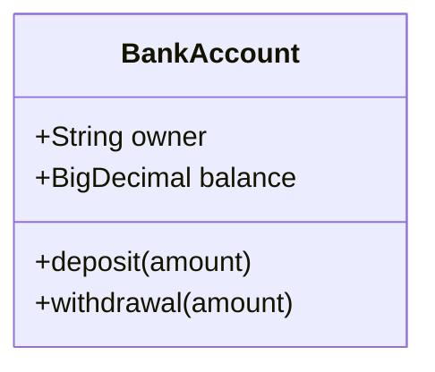

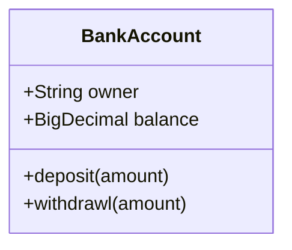

### 返回类型

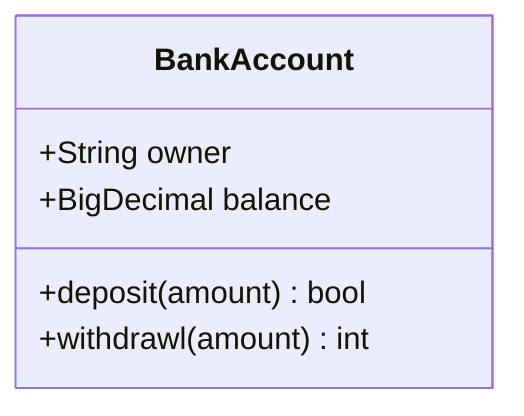

### 泛型类型

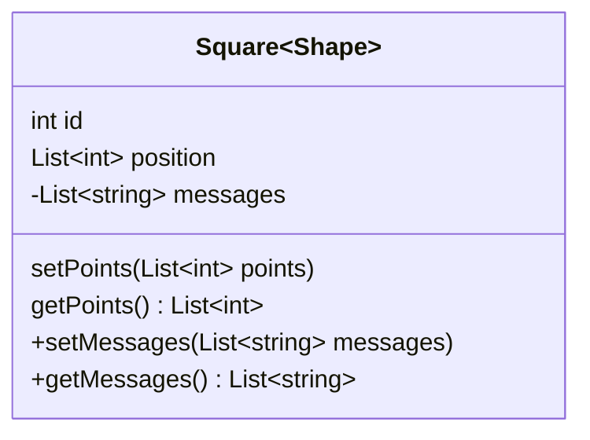

### 能见度

要指定类成员（即任何属性或方法）的可见性，可以将这些表示法放在成员名称之前，但它是可选的：

- +公共
- -私人
- #保护
- ~封装/内部

注意，您还可以通过在方法的末尾添加以下表示法（即：在 ：()

`*摘要例如：someAbstractMethod()*`
`$静态，例如：someStaticMethod()$`

- 注释 您还可以通过在字段名称的末尾添加以下表示法，在字段定义中包含其他分类器：

`$静态，例如：String someField$`

### 定义关系

| 类型  | 描述         |
| ----- | ------------ |
| <     | --           |
| *--   | 组成         |
| o--   | 集合体       |
| -->   | 协会         |
| --    | 链接（实心） |
| ..>   | 屬地         |
| ..\|> | 实现         |
| ..    | 链接（虚线） |

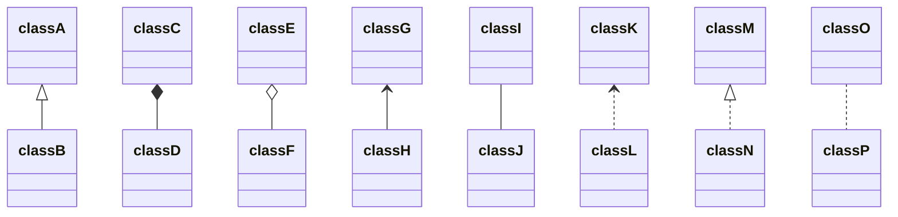

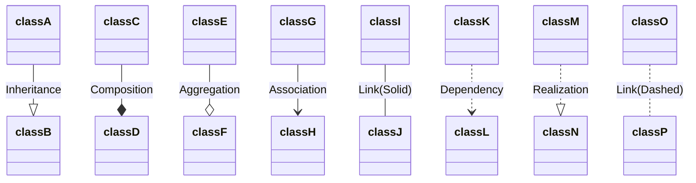

### 关系上的标签

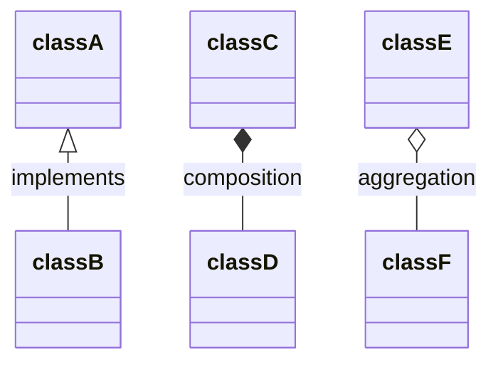

### 双向关系

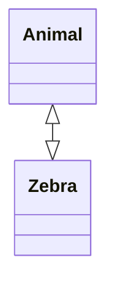

| 类型Type | 描述   |
| -------- | ------ |
| <\|      | 继承   |
| *        | 组成   |
| o        | 集合体 |
| >        | 协会   |
| <        | 协会   |
| \|>      | 实现   |

| Type | Description |
| ---- | ----------- |
| --   | 固体        |
| ..   | 虚线        |

### 关系上的基数/多重性

类图中的多重性或基数表示一个类链接到另一个类的一个实例的实例数。例如，一家公司将有一名或多名员工，但每个员工只为一家公司工作。

多重性表示法放置在关联的末尾附近。

不同的基数选项是：

- `1`仅 1
- `0..1`零或一
- `1..*`一个或多个
- `*`多
- `n`n {其中 n>1}
- `0..n`0 到 n {其中 n>1}
- `1..n`1 到 n {其中 n>1}

基数可以通过在给定箭头之前（可选）和之后（可选）的引号内放置基数文本来轻松定义。

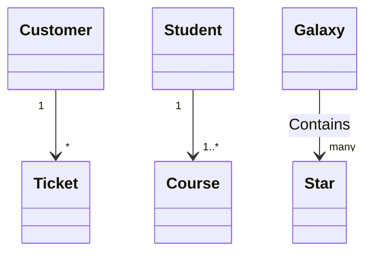

## 类的注释

可以使用特定的标记文本对类进行注释，该文本类似于类的元数据，从而清楚地表明其性质。一些常见的注释示例可能是：

- `<<Interface>>`表示接口类
- `<<abstract>>`表示抽象类
- `<<Service>>`表示服务类
- `<<enumeration>>`表示枚举

注释在开始和结束中定义。有两种方法可以向类添加注释，并且无论使用的语法如何，输出都将相同。这两种方式是：`<<``>>`

- 在定义类后的***单独\***行中。例如：

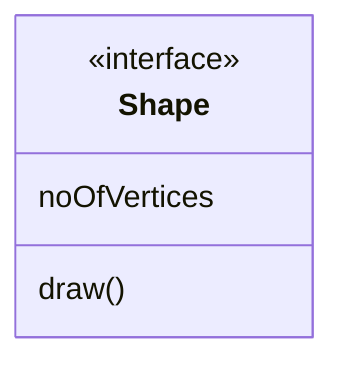

- 在***嵌套结构\***中以及类定义中。例如：

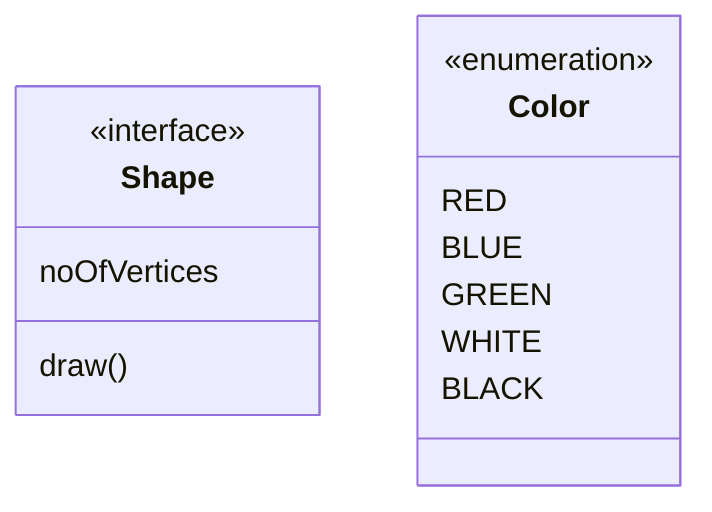

## 评论

可以在类图中输入注释，解析器将忽略这些注释。注释需要位于其自己的行上，并且必须以（双百分比符号）开头。下一个换行符的注释开始后的任何文本都将被视为注释，包括任何类图语法`%%`


## 设置逻辑示意图的方向

对于类图，您可以使用 direction 语句来设置图将呈现的方向，如本示例中所示。

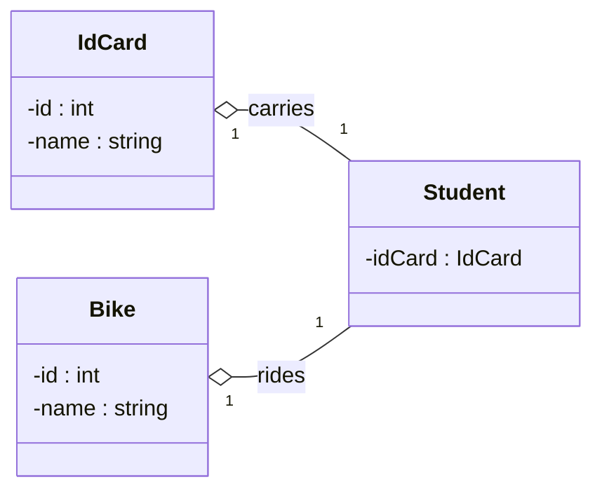

进行11骑11学生-身份证 ： 身份证身份证-id ： 整型-名称 ： 字符串自行车-id ： 整型-名称 ： 字符串

## 互动

可以将单击事件绑定到节点，单击可以导致 javascript 回调或将在新的浏览器选项卡中打开的链接。**注意**：使用 时禁用此功能，使用 时启用此功能。`securityLevel='strict'``securityLevel='loose'`

在声明所有类后，您可以在单独的行上定义这些操作。

```text
action className "reference" "tooltip"
click className call callback() "tooltip"
click className href "url" "tooltip"
```

- *action* 为 或 ，具体取决于要调用的交互类型`link``callback`
- *className* 是操作将与之关联的节点的 ID
- *引用*是 url 链接或回调的函数名称。
- (*可选*）工具提示是将鼠标悬停在元素上时要显示的字符串（注意：工具提示的样式由类 .mermaidTooltip 设置。
- 注意：回调函数将使用 nodeId 作为参数来调用。

### 例子

*网址链接：*

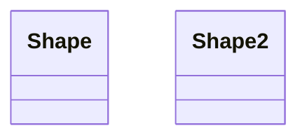

*回调：*


```html
<script>
    var callbackFunction = function () {
      alert('A callback was triggered');
    };
</script>
```

> **成功**工具提示功能和链接到 URL 的功能从版本 0.5.2 开始可用。

初学者提示，在html上下文中使用交互式链接的完整示例：

```html
<body>
  <div class="mermaid">
    classDiagram
    Animal <|-- Duck
    Animal <|-- Fish
    Animal <|-- Zebra
    Animal : +int age
    Animal : +String gender
    Animal: +isMammal()
    Animal: +mate()
    class Duck{
      +String beakColor
      +swim()
      +quack()
      }
    class Fish{
      -int sizeInFeet
      -canEat()
      }
    class Zebra{
      +bool is_wild
      +run()
      }

      callback Duck callback "Tooltip"
      link Zebra "https://www.github.com" "This is a link"
  </div>

  <script>
    var callback = function () {
        alert('A callback was triggered');
    };
    var config = {
        startOnLoad: true,
        securityLevel: 'loose'
    };
    mermaid.initialize(config);
  </script>
</body>
```

## 造型

### 设置节点样式

可以将特定样式（如较粗的边框或不同的背景色）应用于各个节点。这是通过预定义css样式中的类来完成的，这些类可以从图形定义中应用，如下面的示例所示：

```html
<style>
    .cssClass > rect{
        fill:#FF0000;
        stroke:#FFFF00;
        stroke-width:4px;
    }
</style>
```

然后将该类附加到特定节点，如下所示：

`cssClass "nodeId1" cssClass;`

还可以在一个语句中将类附加到节点列表：

`cssClass "nodeId1,nodeId2" cssClass;`

添加类的较短形式是使用以下运算符将类名附加到节点：`:::`

```text
\```mermaid
classDiagram
    class Animal:::cssClass
\```
```

艺术

```text
\```mermaid
classDiagram
    class Animal:::cssClass {
        -int sizeInFeet
        -canEat()
    }
\```
```

cssClasses 不能同时使用此速记方法作为关系语句添加。

由于类图的现有标记的限制，目前无法在类图本身中定义 css 类。***即将推出！\***

### 默认样式

类图的主要样式是使用预设数量的 css 类完成的。在渲染过程中，这些类是从位于 src/themes/class.scss 的文件中提取的。此处使用的类如下所述：

| 类                 | 描述                                 |
| ------------------ | ------------------------------------ |
| g.classGroup text  | 常规类文本的样式                     |
| classGroup .title  | 常规类标题的样式                     |
| g.classGroup rect  | 类图矩形的样式                       |
| g.classGroup line  | 类图线的样式                         |
| .classLabel .box   | 类标签框的样式                       |
| .classLabel .label | 类标注文本的样式                     |
| composition        | 合成箭头和箭头线的样式               |
| aggregation        | 聚合箭头和箭头线的样式（虚线或实线） |
| dependency         | 依赖关系箭头和箭头线的样式           |

#### 示例样式表

```scss
body {
    background: white;
}

g.classGroup text {
    fill: $nodeBorder;
    stroke: none;
    font-family: 'trebuchet ms', verdana, arial;
    font-family: var(--mermaid-font-family);
    font-size: 10px;

    .title {
        font-weight: bolder;
    }
}

g.classGroup rect {
    fill: $nodeBkg;
    stroke: $nodeBorder;
}

g.classGroup line {
    stroke: $nodeBorder;
    stroke-width: 1;
}

.classLabel .box {
    stroke: none;
    stroke-width: 0;
    fill: $nodeBkg;
    opacity: 0.5;
}

.classLabel .label {
    fill: $nodeBorder;
    font-size: 10px;
}

.relation {
    stroke: $nodeBorder;
    stroke-width: 1;
    fill: none;
}

@mixin composition {
    fill: $nodeBorder;
    stroke: $nodeBorder;
    stroke-width: 1;
}

#compositionStart {
    @include composition;
}

#compositionEnd {
    @include composition;
}

@mixin aggregation {
    fill: $nodeBkg;
    stroke: $nodeBorder;
    stroke-width: 1;
}

#aggregationStart {
    @include aggregation;
}

#aggregationEnd {
    @include aggregation;
}

#dependencyStart {
    @include composition;
}

#dependencyEnd {
    @include composition;
}

#extensionStart {
    @include composition;
}

#extensionEnd {
    @include composition;
}
```

## 配置

`Coming soon`
