# State diagrams状态图

> 状态图是计算机科学和相关领域用于描述系统行为的一种图。状态图要求所描述的系统由有限数量的状态组成;有时，情况确实如此，而在其他时候，这是一个合理的抽象。维基百科

Mermaid可以渲染状态图。该语法试图与plantUml中使用的语法兼容，因为这将使用户更容易在美人鱼和plantUml之间共享图表。

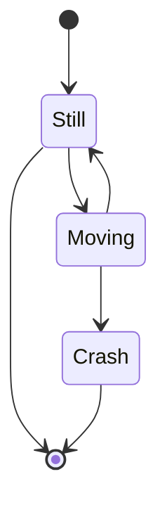

较旧的渲染器：


在状态图中，系统根据其状态以及系统状态如何通过转换更改为另一种状态来描述。上图显示了三种状态“**静止**”、“**移动**”和“**崩溃**”。你从静止状态开始。从“静止”中，您可以将状态更改为“移动”。在“移动”中，可以将状态更改回“静止”或“崩溃”。没有从静止到崩溃的过渡。

## States 状态

可以通过多种方式声明状态。最简单的方法是将状态 ID 定义为描述。

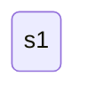

另一种方法是使用带有描述的 state 关键字，如下所示：

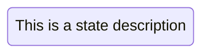

使用描述定义状态的另一种方法是定义状态 ID，后跟冒号和描述：


## Transitions转换

过渡是一种状态进入另一种状态时的路径/边。这是使用文本箭头“-->”表示的。

如果定义了两个状态之间的转换，并且尚未定义状态，则使用转换中的 id 定义未定义的状态。稍后可以向以这种方式定义的状态添加说明。

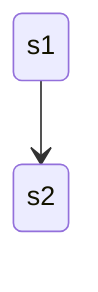

可以向过渡添加文本。描述它所代表的内容。

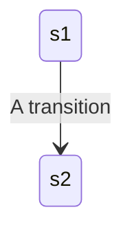

## Start and End

有两种特殊状态指示逻辑示意图的开始和停止。这些是用 [*] 语法编写的，过渡到它的方向将其定义为开始或停止状态。


## Composite states复合状态

在实际使用状态图时，您通常最终会得到多维的图，因为一个状态可以有多个内部状态。这些在此术语中称为复合状态。

为了定义复合状态，您需要使用 state 关键字，后跟一个 id 和 {} 之间的复合状态的主体。请参阅下面的示例：

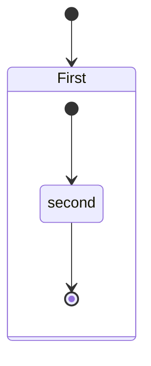

您可以在多个图层中执行此操作：

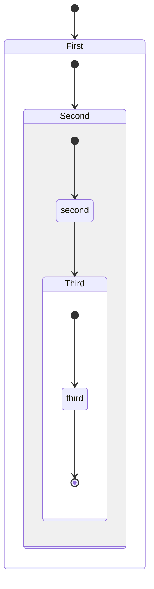

您还可以定义复合状态之间的转换：

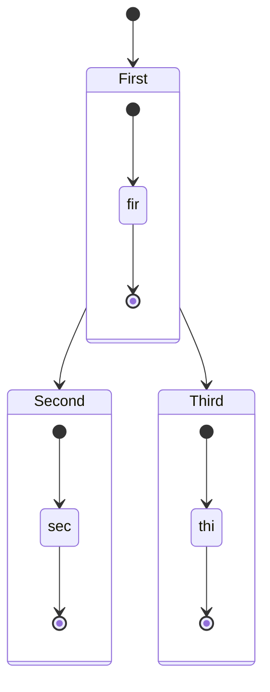

***不能定义属于不同复合状态的内部状态之间的转换***

## Choice选择

有时，您需要在两个或多个路径之间进行建模，您可以使用<<选择>>。

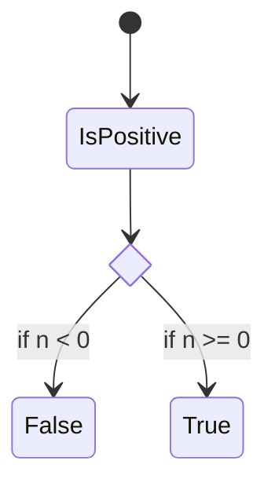

## Forks叉

可以使用`<<fork>> <<join>>`在图中指定分叉。

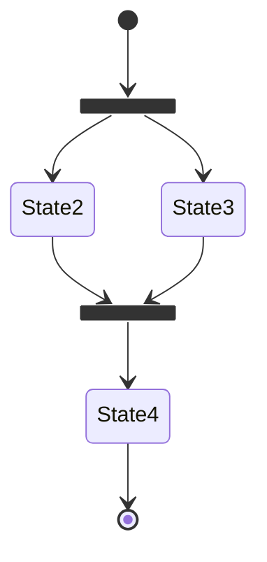

## Notes便利贴

有时没有什么比便利贴更好。在状态图中也是如此。

在这里，您可以选择将注释放在节点的右侧或左侧。

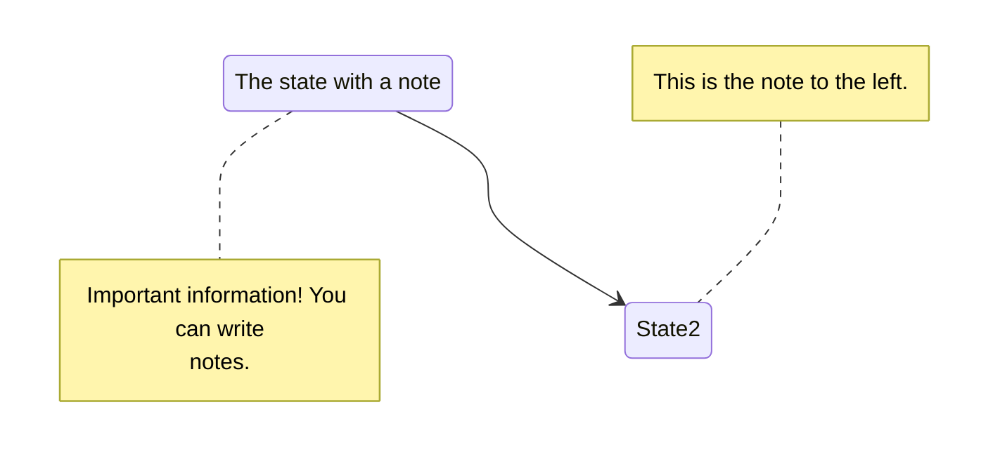

## Concurrency并发

与 plantUml 一样，您可以使用 -- 符号指定并发性。

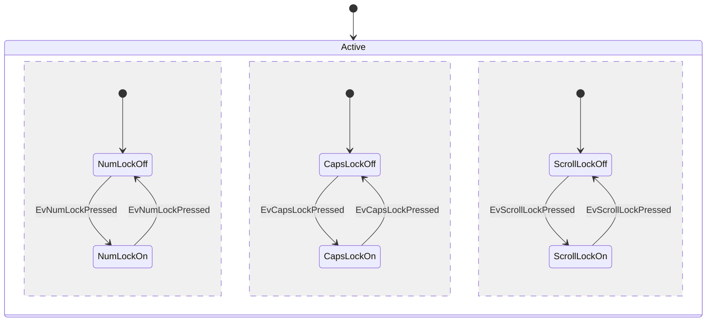

## Setting the direction of the diagram设置逻辑示意图的方向

对于状态图，您可以使用方向语句来设置关系图将呈现的方向，如本例中所示。

```mermaid
stateDiagram
    direction LR
    [*] --> A
    A --> B
    B --> C
    state B {
      direction LR
      a --> b
    }
    B --> D
 ```

## Comments评论

可以在状态图图表中输入注释，解析器将忽略这些注释。注释需要位于其自己的行上，并且必须以（双百分比符号）开头。下一个换行符的注释开始后的任何文本都将被视为注释，包括任何图表语法%%

```mmd
stateDiagram-v2
    [*] --> Still
    Still --> [*]
%% this is a comment
    Still --> Moving
    Moving --> Still %% another comment
    Moving --> Crash
    Crash --> [*]
```

## Styling样式

状态图的样式设置是通过定义许多 css 类来完成的。在渲染过程中，这些类是从位于 src/themes/state.scss 的文件中提取的
