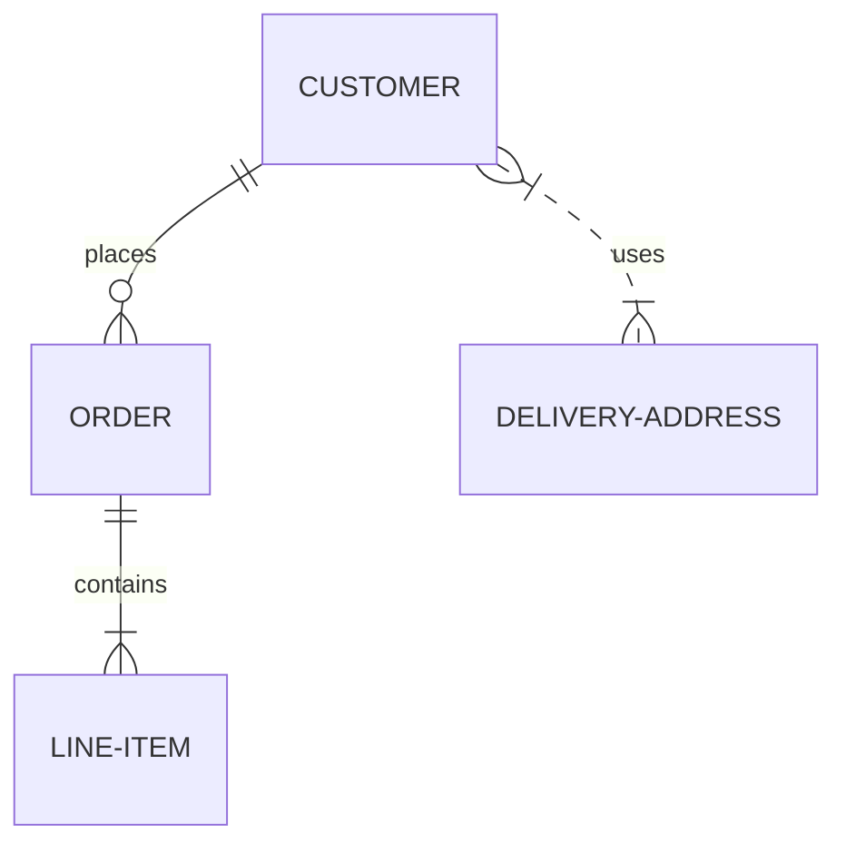
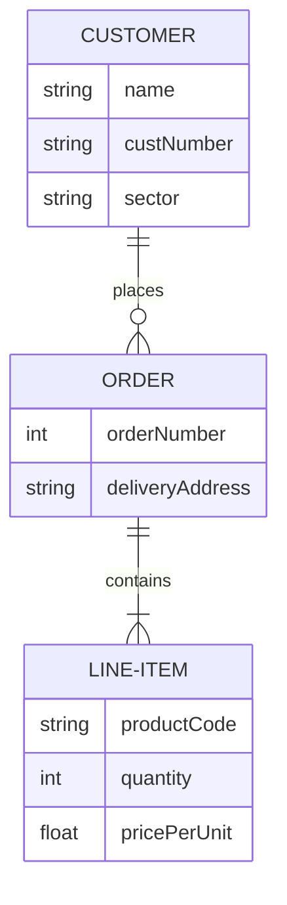
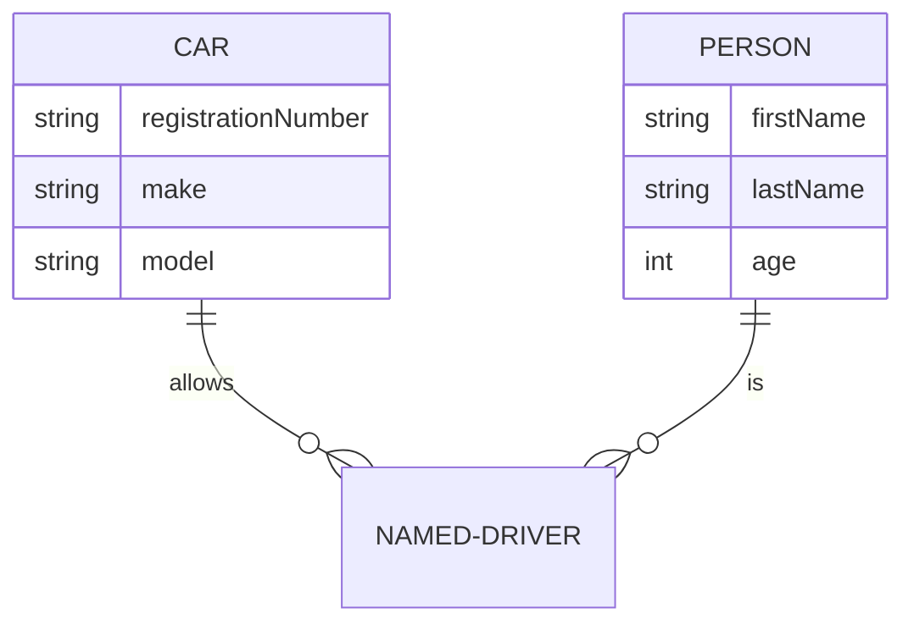
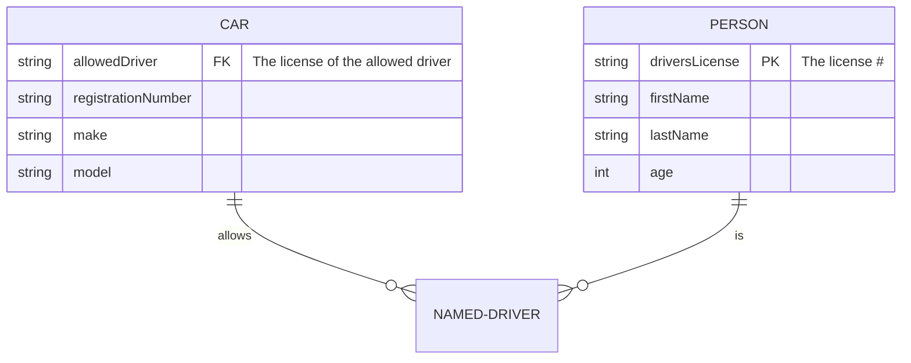

# Entity Relationship Diagrams 实体关系图

实体关系模型（或ER模型）描述了特定知识领域中感兴趣的相互关联的事物。基本 ER 模型由实体类型（对感兴趣的事物进行分类）组成，并指定实体（这些实体类型的实例）之间可能存在的关系。维基百科。

请注意，ER 建模的从业者几乎总是将实体类型简单地称为实体。例如，实体类型将简称为实体。这种情况很常见，不建议做任何其他事情，但从技术上讲，实体是实体类型的抽象实例，这就是ER图所显示的 - 抽象实例以及它们之间的关系。这就是为什么实体总是使用单数名词命名的原因。`CUSTOMER CUSTOMER`

Mermaid可以渲染ER图



实体名称通常大写，尽管对此没有公认的标准，美人鱼也没有要求。

实体之间的关系由线条表示，终点标记表示基数。美人鱼使用最流行的鱼尾纹符号。鱼尾纹直观地传达了它所连接的实体的许多实例的可能性。

ER 图可用于各种目的，从没有任何实现细节的抽象逻辑模型到关系数据库表的物理模型。在 ER 图上包含属性定义有助于理解实体的用途和含义会很有用。这些不一定需要详尽无遗。通常，一小部分属性就足够了。美人鱼允许根据其类型和名称进行定义。



在 ER 关系图上包括属性时，必须决定是否将外键作为属性包括在内。这可能取决于您尝试表示关系表结构的紧密程度。如果你的图是一个逻辑模型，并不意味着意味着关系实现，那么最好省略这些，因为关联关系已经传达了实体的关联方式。例如，JSON 数据结构可以使用数组实现一对多关系，而无需外键属性。类似地，面向对象的编程语言可以使用指向集合的指针或引用。即使对于用于关系实现的模型，您也可以决定包含外键属性会复制关系中已描绘的信息，并且不会为实体增加意义。最终，这是您的选择。

## Syntax语法

### Entities and Relationships 实体和关系

ER 图的美人鱼语法与 PlantUML 兼容，并具有用于标记关系的扩展。每个语句由以下部分组成：

```text
    <first-entity> [<relationship> <second-entity> : <relationship-label>]
```

Where:

- `first-entity`是实体的名称。名称必须以字母字符开头，并且还可以包含数字、连字符和下划线。
- `relationship`描述两个实体相互关联的方式。见下文。
- `second-entity`是另一个实体的名称。
- `relationship-label`从第一个实体的角度描述关系。

For example:

```text
    PROPERTY ||--|{ ROOM : contains
```

此语句可以理解为*一个属性包含一个或多个房间，并且一个房间是一个且只有一个属性的一部分*。您可以看到，此处的标签是从第一个实体的角度出发的：属性包含一个房间，但一个房间不包含属性。当从第二个实体的角度考虑时，等效标签通常很容易推断出来。（某些 ER 图从两个角度标记关系，但此处不支持此操作，并且通常是多余的）。

只有语句的部分是必需的。这样就可以显示没有关系的实体，这在关系图的迭代构造期间非常有用。如果指定了语句的任何其他部分，则所有部分都是必需的。`first-entity`

### Relationship Syntax 关系语法

每个语句的部分可以分为三个子组件：`relationship`

- 第一个实体相对于第二个实体的基数，
- 这种关系是否赋予“子”实体身份
- 第二个实体相对于第一个实体的基数

基数是一个属性，用于描述另一个实体的多少个元素可以与相关实体相关。在上面的示例中，a 可以有一个或多个与之关联的实例，而 a 只能与一个 相关联。在每个基数标记中，有两个字符。最外层的字符表示最大值，最里面的字符表示最小值。下表总结了可能的基数。`PROPERTY``ROOM``ROOM``PROPERTY`

| Value (left) | Value (right) | Meaning                                             |
| :----------: | :-----------: | --------------------------------------------------- |
|     \|o      |      o\|      | Zero or one  零或一                                 |
|     \|\|     |     \|\|      | Exactly one 正好一个                                |
|      }o      |      o{       | Zero or more (no upper limit)  零个或多个（无上限） |
|     }\|      |      \|{      | One or more (no upper limit)  一个或多个（无上限）  |

### Identification鉴定

关系可以分为*标识性*或*非标识性*关系，并且这些关系分别以实线或虚线呈现。当一个有关实体不能在没有另一个实体的情况下独立存在时，这是相关的。例如，一家为人们驾驶汽车提供保险的公司可能需要在s上存储数据。在对此进行建模时，我们可以从观察a可以由许多实例驱动开始，并且a可以驱动许多s - 两个实体都可以在没有另一个实体的情况下存在，因此这是一种非识别关系，我们可以在美人鱼中指定为：。请注意关系中间的两个点，这两个点将导致在两个实体之间绘制虚线。但是，当这种多对多关系被解析为两个一对多关系时，我们观察到a如果没有a和a就不能存在 - 这些关系变得具有识别性，并且将使用连字符指定，这转化为实线：`NAMED-DRIVER``CAR``PERSON``PERSON``CAR``PERSON }|..|{ CAR : "driver"``NAMED-DRIVER``PERSON``CAR`

```mmd
erDiagram
    CAR ||--o{ NAMED-DRIVER : allows
    PERSON ||--o{ NAMED-DRIVER : is
```

### Attributes属性

可以通过指定实体名称后跟包含多个对的块来为实体定义属性，其中块由开始和结束分隔。例如：`type name``{``}



这些属性呈现在实体框中：


和 值必须以字母字符开头，并且可以包含数字、连字符或下划线。除此之外，没有限制，也没有有效的数据类型隐式集。`type``name`

#### 属性键和注释Attribute Keys and Comments

属性还可以定义 注释 或 注释。键可以是“PK”或“FK”，用于主键或外键。a 由属性末尾的双引号定义。注释本身不能包含双引号字符。`key``comment``



### Other Things其他事项

- 如果希望关系标签是多个单词，则必须在短语两边使用双引号
- 如果根本不想要关系上的标签，则必须使用空的双引号字符串

## Styling 样式

### Config options配置选项

对于简单的颜色自定义：

| Name名字 | Used as用作                                                                                              |
| :------- | :------------------------------------------------------------------------------------------------------- |
| `fill`   | Background color of an entity or attribute实体或属性的背景色                                             |
| `stroke` | Border color of an entity or attribute, line color of a relationship实体或属性的边框颜色，关系的线条颜色 |

### Classes used使用的类

以下 CSS 类选择器可用于更丰富的样式设置：

| Selector                   | Description                                                               |
| :------------------------- | :------------------------------------------------------------------------ |
| `.er.attributeBoxEven`     | The box containing attributes on even-numbered rows 包含偶数行上属性的框  |
| `.er.attributeBoxOdd`      | The box containing attributes on odd-numbered rows包含奇数行上属性的框    |
| `.er.entityBox`            | The box representing an entity 表示实体的框                               |
| `.er.entityLabel`          | The label for an entity  实体的标签                                       |
| `.er.relationshipLabel`    | The label for a relationship   关系的标签                                 |
| `.er.relationshipLabelBox` | The box surrounding a relationship label 关系标签周围的框                 |
| `.er.relationshipLine`     | The line representing a relationship between entities表示实体之间关系的线 |
