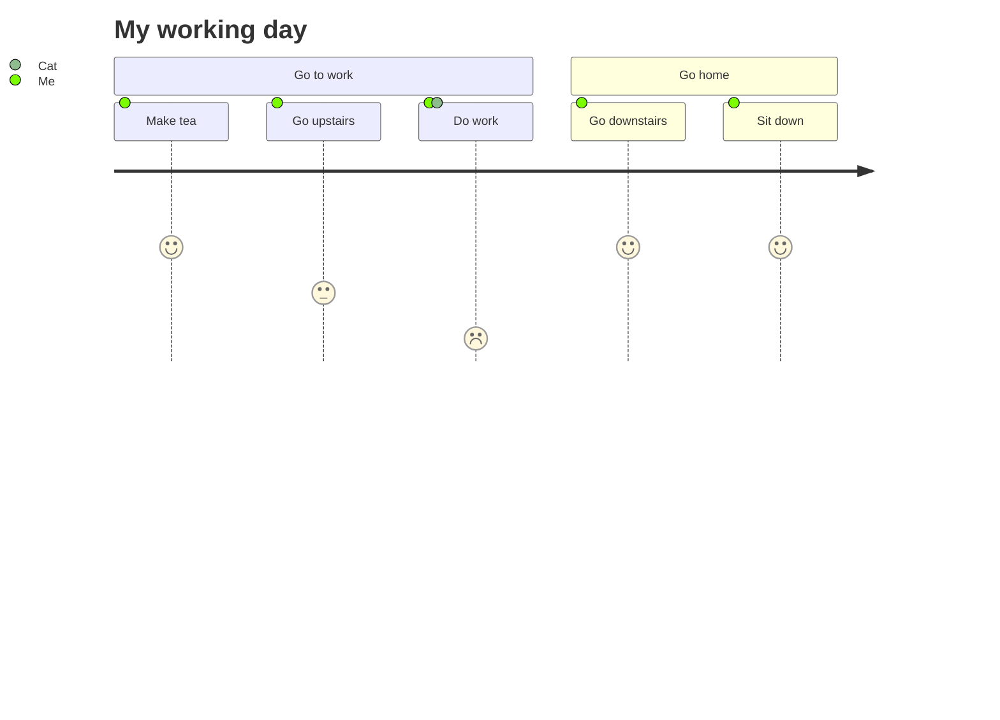

# User Journey Diagram 用户旅程图

> 用户旅程详细描述了不同用户为完成系统，应用程序或网站中的特定任务而采取的步骤。此技术显示当前（按原样）用户工作流，并显示待定工作流的改进领域。（维基百科）

Mermaid 可以渲染用户旅程图：

每个用户旅程都分为几个部分，这些部分描述了用户尝试完成的任务部分。

任务语法为`Task name: <score>: <comma separated list of actors>`
