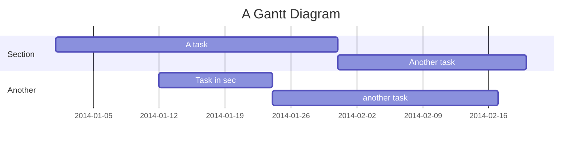
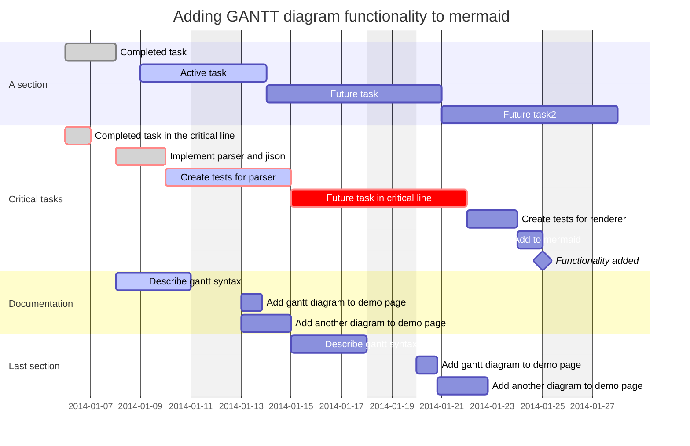
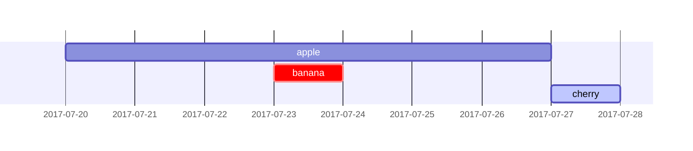

# Gantt diagrams甘特图

> 甘特图是一种条形图，最初由卡罗尔·阿达米茨基于1896年开发，并由亨利·甘特在1910年代独立开发，它说明了项目时间表以及完成任何一个项目所需的时间。甘特图说明了项目的终端元素和摘要元素的开始日期和完成日期之间的天数。

## A note to users用户须知

 甘特图会将每个计划任务记录为一个从左向右延伸的连续条形图。x 轴表示时间，y 记录不同的任务以及完成这些任务的顺序。

请务必记住，当“排除”特定于任务的日期、日期或日期集合时，甘特图将通过向右延伸相等天数来适应这些更改，而不是通过在任务内部创建间隙。如此处所示

但是，如果排除的日期介于设置为连续开始的两个任务之间，则排除的日期将以图形方式跳过并留空，并且以下任务将在排除的日期结束后开始。如此处所示

甘特图对于跟踪项目完成之前所需的时间量很有用，但它也可用于以图形方式表示“非工作日”，只需进行一些调整。

美人鱼可以将甘特图渲染为SVG，PNG或可以粘贴到文档中的MarkDown链接。



## Syntax 语法



可以设置由空格分隔的多个依赖项：



### Title 标题

是一个*可选*字符串，显示在甘特图的顶部，用于将图表描述为一个整体。`title`

### Section statements### 节语句

您可以将图表划分为不同的部分，例如，将项目的不同部分（如开发和文档）分开。

为此，请使用关键字开始一行，并为其命名。（请注意，与[整个图表的标题](https://mermaid-js.github.io/mermaid/#/gantt?id=title)不同，此名称是*必需的*。`section`

### Milestones里程碑

您可以向图表添加里程碑。里程碑与任务不同，因为它们在时间上代表单个时刻，并由关键字标识。下面是有关如何使用里程碑的示例。您可能会注意到，里程碑的确切位置由里程碑的初始日期和任务的“持续时间”确定，如下所示：初始日期+持续时间/2。`milestone`

```mermaid
gantt
dateFormat HH:mm
axisFormat %H:%M
Initial milestone : milestone, m1, 17:49,2min
taska2 : 10min
taska3 : 5min
Final milestone : milestone, m2, 18:14, 2min
```



## Setting dates设置日期

`dateFormat`定义甘特图元素的日期**输入**的格式。这些日期在呈现的图表**输出**中的表示方式由 定义。`axisFormat`

### Input date format输入日期格式

默认输入日期格式为 。您可以定义自定义`.YYYY-MM-DD` `dateFormat`

```text
dateFormat YYYY-MM-DD
```

支持以下格式设置选项：

```text
Input       Example             Description:
YYYY        2014                4 digit year
YY          14                  2 digit year
Q           1..4                Quarter of year. Sets month to first month in quarter.
M MM        1..12               Month number
MMM MMMM    January..Dec        Month name in locale set by moment.locale()
D DD        1..31               Day of month
Do          1st..31st           Day of month with ordinal
DDD DDDD    1..365              Day of year
X           1410715640.579      Unix timestamp
x           1410715640579       Unix ms timestamp
H HH        0..23               24 hour time
h hh        1..12               12 hour time used with a A.
a A         am pm               Post or ante meridiem
m mm        0..59               Minutes
s ss        0..59               Seconds
S           0..9                Tenths of a second
SS          0..99               Hundreds of a second
SSS         0..999              Thousandths of a second
Z ZZ        +12:00              Offset from UTC as +-HH:mm, +-HHmm, or Z
```

More info in更多信息: <http://momentjs.com/docs/#/parsing/string-format/>

### Output date format on the axis轴上的输出日期格式

默认输出日期格式为 YYYY-MM-DD。您可以定义自定义 ，例如2020年第一季度。`axisFormat` `2020-Q1`

```text
axisFormat  %Y-%m-%d
```

支持以下格式设置字符串：

```text
%a - abbreviated weekday name.
%A - full weekday name.
%b - abbreviated month name.
%B - full month name.
%c - date and time, as "%a %b %e %H:%M:%S %Y".
%d - zero-padded day of the month as a decimal number [01,31].
%e - space-padded day of the month as a decimal number [ 1,31]; equivalent to %_d.
%H - hour (24-hour clock) as a decimal number [00,23].
%I - hour (12-hour clock) as a decimal number [01,12].
%j - day of the year as a decimal number [001,366].
%m - month as a decimal number [01,12].
%M - minute as a decimal number [00,59].
%L - milliseconds as a decimal number [000, 999].
%p - either AM or PM.
%S - second as a decimal number [00,61].
%U - week number of the year (Sunday as the first day of the week) as a decimal number [00,53].
%w - weekday as a decimal number [0(Sunday),6].
%W - week number of the year (Monday as the first day of the week) as a decimal number [00,53].
%x - date, as "%m/%d/%Y".
%X - time, as "%H:%M:%S".
%y - year without century as a decimal number [00,99].
%Y - year with century as a decimal number.
%Z - time zone offset, such as "-0700".
%% - a literal "%" character.
```

More info in更多信息: <https://github.com/mbostock/d3/wiki/Time-Formatting>

## Comments评论

可以在甘特图中输入注释，解析器将忽略该注释。注释需要位于自己的行上，并且必须以（双百分比符号）开头。下一个换行符的注释开始后的任何文本都将被视为注释，包括任何图表语法`%%`

```mmd
gantt
    title A Gantt Diagram
    %% this is a comment
    dateFormat  YYYY-MM-DD
    section Section
    A task           :a1, 2014-01-01, 30d
    Another task     :after a1  , 20d
    section Another
    Task in sec      :2014-01-12  , 12d
    another task      : 24d

```

## Styling样式

甘特图的样式是通过定义许多css类来完成的。在渲染过程中，这些类是从位于 src/themes/gantt.scss 的文件中提取的

### Classes used使用的类

| Class                 | Description                                                                                                |
| --------------------- | ---------------------------------------------------------------------------------------------------------- |
| grid.tick             | Styling for the Grid Lines网格线的样式                                                                     |
| grid.path             | Styling for the Grid's borders网格边框的样式                                                               |
| .taskText             | Task Text Styling任务文本样式                                                                              |
| .taskTextOutsideRight | Styling for Task Text that exceeds the activity bar towards the right.超出右侧活动栏的任务文本的样式。     |
| .taskTextOutsideLeft  | Styling for Task Text that exceeds the activity bar, towards the left.超出活动栏的“任务文本”的样式，朝左。 |
| todayMarker           | Toggle and Styling for the "Today Marker"“今日标记”的切换和样式                                            |

### Sample stylesheet示例样式表

```css
.grid .tick {
    stroke: lightgrey;
    opacity: 0.3;
    shape-rendering: crispEdges;
}
.grid path {
    stroke-width: 0;
}

#tag {
    color: white;
    background: #FA283D;
    width: 150px;
    position: absolute;
    display: none;
    padding:3px 6px;
    margin-left: -80px;
    font-size: 11px;
}

#tag:before {
    border: solid transparent;
    content: ' ';
    height: 0;
    left: 50%;
    margin-left: -5px;
    position: absolute;
    width: 0;
    border-width: 10px;
    border-bottom-color: #FA283D;
    top: -20px;
}
.taskText {
    fill:white;
    text-anchor:middle;
}
.taskTextOutsideRight {
    fill:black;
    text-anchor:start;
}
.taskTextOutsideLeft {
    fill:black;
    text-anchor:end;
}
```

## Today marker今日标记

您可以设置当前日期的标记样式或将其隐藏。若要设置其样式，请为键添加一个值。`todayMarker`

```text
todayMarker stroke-width:5px,stroke:#0f0,opacity:0.5
```

要隐藏标记，请设置为 。`todayMarker` `off`

```text
todayMarker off
```

## Configuration配置

可以调整用于呈现甘特图的边距。

这是通过定义配置对象的一部分来完成的。如何使用 CLI 在 mermaidCLI 页面中进行了描述。`ganttConfig`

mermaid.ganttConfig可以设置为带有配置参数或相应对象的JSON字符串。

```javascript
mermaid.ganttConfig = {
    titleTopMargin:25,
    barHeight:20,
    barGap:4,
    topPadding:75,
    sidePadding:75
}
```

### Possible configuration params可能的配置参数

| Param           | Description                                                                                                                                                                                                                           | Default value |
| --------------- | ------------------------------------------------------------------------------------------------------------------------------------------------------------------------------------------------------------------------------------- | ------------- |
| mirrorActor     | Turns on/off the rendering of actors below the diagram as well as above it打开/关闭图下方和上方的Actor渲染                                                                                                                            | false         |
| bottomMarginAdj | Adjusts how far down the graph ended. Wide borders styles with css could generate unwanted clipping which is why this config param exists.调整图表的结束程度。带有css的宽边框样式可能会产生不需要的剪切，这就是存在此配置参数的原因。 | 1             |

## Interaction互动

可以将单击事件绑定到任务。单击可导致 javascript 回调或将在当前浏览器选项卡中打开的链接。注意：此功能在使用 时处于禁用状态，在使用 时启用。`securityLevel='strict'``securityLevel='loose'`

```text
click taskId call callback(arguments)
click taskId href URL
```

- taskId 是任务的 id
- 回调是在显示图形的页面上定义的javascript函数的名称，如果没有指定其他参数，则将使用taskId作为参数调用该函数。

初学者提示，在html上下文中使用交互式链接的完整示例：

```html
<body>
  <div class="mermaid">
    gantt
      dateFormat  YYYY-MM-DD

      section Clickable
      Visit mermaidjs           :active, cl1, 2014-01-07, 3d
      Print arguments         :cl2, after cl1, 3d
      Print task              :cl3, after cl2, 3d

      click cl1 href "https://mermaidjs.github.io/"
      click cl2 call printArguments("test1", "test2", test3)
      click cl3 call printTask()
  </div>

  <script>
    var printArguments = function(arg1, arg2, arg3) {
      alert('printArguments called with arguments: ' + arg1 + ', ' + arg2 + ', ' + arg3);
    }
    var printTask = function(taskId) {
      alert('taskId: ' + taskId);
    }
    var config = {
      startOnLoad:true,
      securityLevel:'loose',
    };
    mermaid.initialize(config);
  </script>
</body>
```
