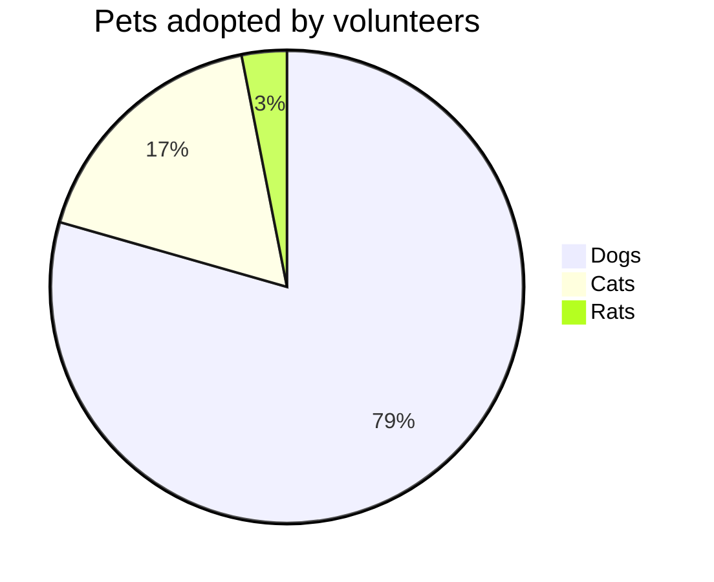
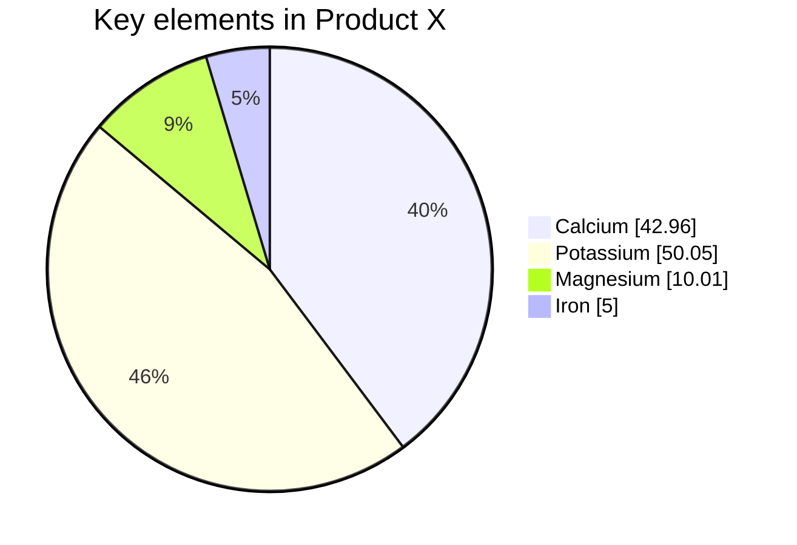

# Pie chart diagrams饼图

> 饼图（或圆图）是一种圆形统计图形，它被划分为多个切片以说明数字比例。在饼图中，每个切片的弧长（以及因此其中心角度和面积）与其表示的数量成正比。虽然它因其与切片的馅饼的相似性而得名，但在呈现方式上存在差异。已知最早的饼图通常归功于威廉·普莱费尔（William Playfair）1801年的《统计手册》（Statistical Breviary of 1801） - 维基百科，自由的百科全书

Mermaid 可以渲染饼图。



## Syntax语法

绘制饼图在美人鱼中非常简单。

- 以关键字开头以开始图表`pie`

  - `showData`以在图例文本之后呈现实际数据值。这是***可选的\***

- 后跟关键字及其字符串值，为饼图提供标题。这是***可选的\***`title`

- 后跟数据集

  - `label`对于饼图中引号内的某个部分。`" "`
  - 后跟冒号作为分隔符`:`
  - 后跟（最多支持两个小数位）`positive numeric value`

```text
[pie] [showData] (OPTIONAL)
     [title] [titlevalue]  (OPTIONAL)
      "[datakey1]" : [dataValue1]
      "[datakey2]" : [dataValue2]
      "[datakey3]" : [dataValue3]
```

## Example例


