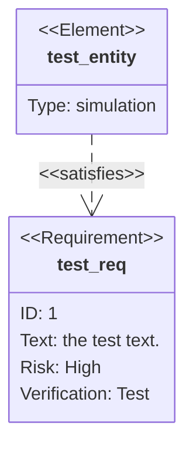
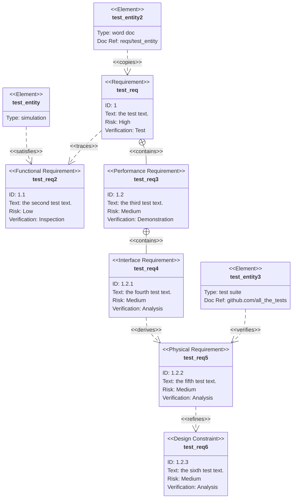

# Requirement Diagram需求图

> 需求图为需求及其相互连接以及其他记录的元素提供可视化。建模规范遵循 SysML v1.6 定义的规范。

渲染要求很简单。



## Syntax语法

需求图有三种类型的组件：需求、元素和关系。

定义每个的语法定义如下。尖括号中表示的单词（如 ）是枚举关键字，在表中阐述了选项。 在需要用户输入的任何地方使用。`<word>``user_defined_...`

关于用户文本的重要说明：所有输入都可以用引号括起来，也可以不用引号括起来。例如，两者都有效。但是，用户必须小心使用未加引号的输入。如果检测到另一个关键字，解析器将失败。`Id: "here is an example"``Id: here is an example`

### Requirement要求

需求定义包含需求类型、名称、ID、文本、风险和验证方法。语法如下：

```text
<type> user_defined_name {
    id: user_defined_id
    text: user_defined text
    risk: <risk>
    verifymethod: <method>
}
```

类型、风险和方法是在 SysML 中定义的枚举。

| Keyword            | Options                                                                                                                                                                             |
| ------------------ | ----------------------------------------------------------------------------------------------------------------------------------------------------------------------------------- |
| Type               | requirement, functionalRequirement, interfaceRequirement, performanceRequirement, physicalRequirement, designConstraint 需求， 功能要求， 接口要求， 性能要求， 物理要求， 设计约束 |
| Risk               | Low, Medium, High  低、中、高                                                                                                                                                       |
| VerificationMethod | Analysis, Inspection, Test, Demonstration 分析、检验、测试、演示                                                                                                                    |

### Element元素

元素定义包含元素名称、类型和文档引用。这三个都是用户定义的。元素功能旨在轻量级，但允许将要求连接到其他文档的某些部分。

```text
element user_defined_name {
    type: user_defined_type
    docref: user_defined_ref
}
```

### Relationship关系

关系由源节点、目标节点和关系类型组成。

每个都遵循以下定义格式

```text
{name of source} - <type> -> {name of destination}
```

或

```text
{name of destination} <- <type> - {name of source}
```

“源名称”和“目标名称”应为在其他地方定义的要求或元素节点的名称。

关系类型可以是包含、复制、派生、满足、验证、优化或跟踪之一。

每个关系都在关系图中标记。

## Larger Example更大的示例

此示例使用关系图的所有功能。


