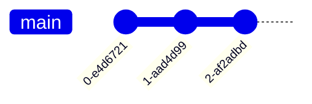
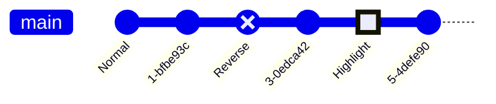
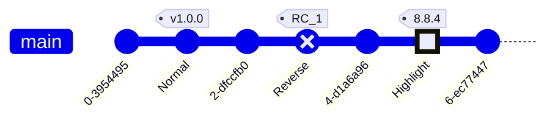
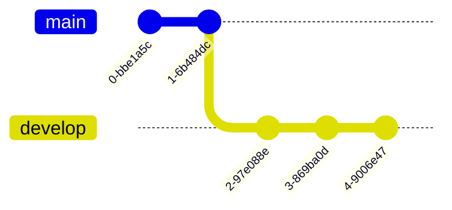
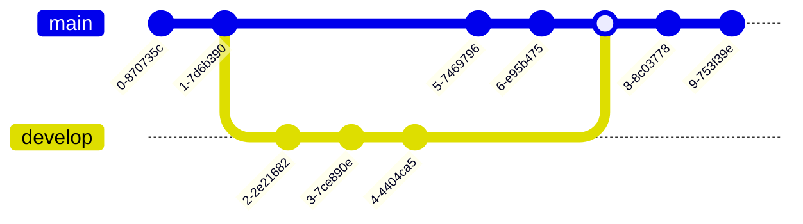
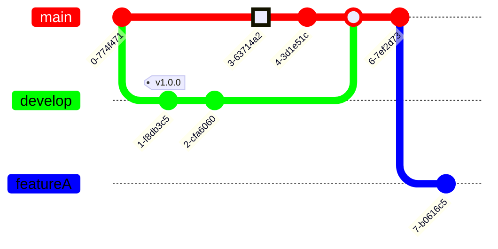
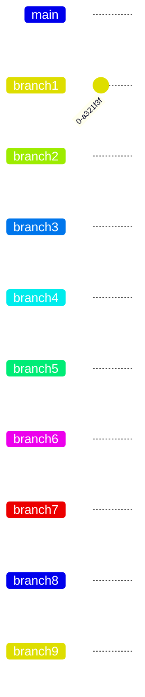
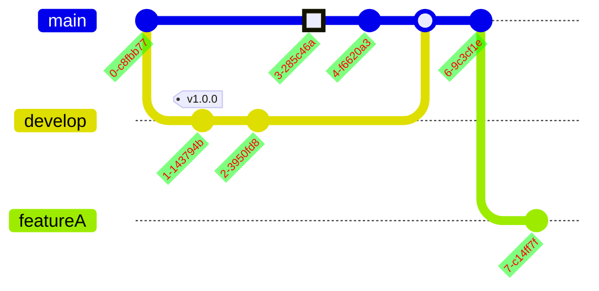
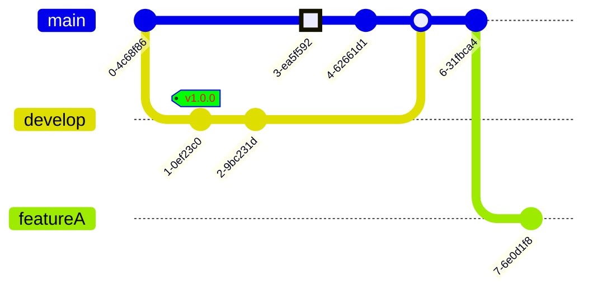

# Gitgraph Diagrams 分支图

> Git Graph 是 git 提交和 git 操作（命令）在各个分支上的图形表示。

这些图表对于开发人员和 DevOps 团队共享其 Git 分支策略特别有帮助。例如，它使可视化 git 流的工作方式变得更加容易。

Mermaid可以渲染Git图表


在美人鱼中，我们支持基本的git操作，例如：

- *commit* : 表示当前分支上的新提交。
- *branch* : 创建并切换到新分支，将其设置为当前分支。
- *checkout* : 签出现有分支并将其设置为当前分支。
- *merge* : 将现有分支合并到当前分支上。

借助这些关键的git命令，您将能够非常轻松快速地在Mermaid中绘制gitgraph。实体名称通常大写，尽管对此没有公认的标准，并且在美人鱼中也不是必需的。

## Syntax语法

Gitgraph的美人鱼语法非常简单明了。它遵循声明性方法，其中每个提交都绘制在图中的时间轴上，按其在代码中的出现/存在顺序进行。基本上，它遵循每个命令的插入顺序。

您要做的第一件事是使用 **gitgraph** 关键字声明您的图表类型。这个关键字告诉美人鱼，你想画一个gitgraph，并相应地解析图表代码。`gitgraph`

每个 gitgraph 都使用***主\***分支进行初始化。因此，除非您创建其他分支，否则默认情况下，提交将转到主分支。这是由git的工作方式驱动的，在开始时，你总是从主分支（以前称为***主\***分支）开始。默认情况下，分支设置为***当前分支\***。`main`

您可以使用 ***commit\*** 关键字在当前分支上注册提交。让我们看看它是如何工作的：

一个简单的 gitgraph，显示默认（***主\***）分支上的三个提交：



如果仔细查看前面的示例，可以看到默认分支以及三个提交。另外，请注意，默认情况下，每个提交都被赋予了一个唯一和随机的ID。如果要为提交提供自己的自定义 ID，该怎么办？是的，美人鱼是可以做到的。`main`

### Adding custom commit id添加自定义提交 ID

对于给定的提交，您可以在使用属性声明时指定自定义ID，后跟引号内的自定义值。例如：`id``:``""``commit id: "your_custom_id"`

让我们看看在下图的帮助下是如何工作的：


在此示例中，我们为提交提供了自定义 ID。

### Modifying commit type修改提交类型

在 Mermaid 中，提交可以是三种类型，它们在图中呈现略有不同。这些类型是：

- `NORMAL`：默认提交类型。由图中的实心圆表示
- `REVERSE`：强调提交为反向提交。由关系图中交叉的实心圆表示。
- `HIGHLIGHT`：突出显示图中的特定提交。由关系图中的填充矩形表示。

对于给定的提交，您可以在使用属性声明它时指定其类型，后跟上面讨论的必需类型选项。例如：`type``:``commit type: HIGHLIGHT`

注意：如果未指定提交类型，则选择为默认值。`NORMAL`

让我们看看这些不同的提交类型在下图的帮助下看起来如何：



在此示例中，我们为每个提交指定了不同的类型。另外，看看我们在声明提交时如何将两者一起包括在内。`id``type`

### Adding Tags添加标签

对于给定的提交，您可以将其装饰为**标记**，类似于git世界中标记或发布版本的概念。您可以在声明提交时使用该属性附加自定义标记，后跟和引号内的自定义值。例如：`tag``:``""``commit tag: "your_custom_tag"`

让我们看看在下图的帮助下是如何工作的：



在此示例中，我们为提交提供了自定义标记。另外，请参阅我们如何在单个提交声明中组合所有这些属性。您可以根据需要混合匹配这些属性。

### Create a new branch创建新分支

在美人鱼中，为了创建一个新的分支，您可以使用关键字。您还需要提供新分支的名称。该名称必须是唯一的，并且不能是现有分支的名称。用法示例：`branch``branch develop`

当美人鱼读取关键字时，它会创建一个新分支并将其设置为当前分支。相当于你创建一个新的分支，并在 Git 世界中签出它。`branch`

让我们在一个例子中看到这一点：



在此示例中，请参阅我们如何从默认分支开始，并推送到该分支的提交。然后我们创建了分支，之后的所有提交都放在分支上，因为它成为当前分支。`main``develop``develop`

### Checking out an existing branch签出现有分支

在美人鱼中，为了切换到现有的分支，您可以使用关键字。您还需要提供现有分支的名称。如果未找到具有给定名称的分支，则会导致控制台错误。用法示例：`checkout``checkout develop`

当美人鱼读取关键字时，它会找到给定的分支并将其设置为当前分支。相当于在 Git 世界中签出一个分支。`checkout`

让我们看看修改我们前面的例子：


在此示例中，请参阅我们如何从默认分支开始，并推送到该分支的提交。然后我们创建了分支，之后的所有三个提交都放在分支上，因为它成为当前分支。在此之后，我们使用关键字将当前分支设置为 ，并且随后的所有提交都针对当前分支进行注册，即 .`main``develop``develop``checkout``main``main`

### Merging two branches合并两个分支

在美人鱼中，为了合并或加入现有分支，您可以使用关键字。您还需要提供要从中合并的现有分支的名称。如果未找到具有给定名称的分支，则会导致控制台错误。此外，如果只能合并两个单独的分支，并且不能将分支与自身合并。在这种情况下，将抛出错误。`merge`

用法示例：`merge develop`

当 Mermaid 读取关键字时，它会找到给定的分支及其 head 提交（该分支上的最后一个提交），并将其与**当前分支**上的 head 提交联接。每次合并都会产生一个***合并提交\***，在图中用**填充的双圆圈**表示。`merge`

让我们看看修改我们前面的示例以合并我们的两个分支：



在此示例中，请参阅我们如何从默认分支开始，并推送到该分支的提交。然后我们创建了分支，之后的所有三个提交都放在分支上，因为它成为当前分支。在此之后，我们使用关键字将当前分支设置为 ，并且随后的所有提交都针对当前分支进行注册，即 .在此之后，我们将分支合并到当前分支上，从而产生合并提交。由于此时的当前分支仍然是，最后两个提交是针对该分支注册的。`main``develop``develop``checkout``main``main``develop``main``main`

## Gitgraph specific configuration options从另一个分支的 Cherry Pick 提交

类似于“git”允许您从另一个**分支**中挑选提交到**当前**分支的方式，Mermaid也支持此功能。您还可以使用关键字从另一个分支中挑选提交。`cherry-pick`

要使用关键字，必须使用属性指定 id，后跟引号内和所需的提交 ID。例如：`cherry-pick``id``:``""`

```text
cherry-pick id: "your_custom_id"
```

在这里，在当前分支上创建了一个表示樱桃选择的新 commt，并在图中以可视方式突出显示了**樱桃**和一个标记，该标记描绘了从中挑选樱桃的提交 ID。

这里要注意的几个重要规则是：

1. 您需要为现有提交提供，以便进行挑选。如果给定的提交 ID 不存在，则会导致错误。为此，请使用声明提交的格式。请参阅上面的示例。`id``commit id:$value`
2. 给定的提交不得存在于当前分支上。Cherry picked commit 必须始终是与当前分支不同的分支。
3. 当前分支必须至少有一个提交，然后才能挑选提交，否则将引发错误。

让我们看一个例子：


## Gitgraph specific configuration options特定于 Gitgraph 的配置选项

在美人鱼中，您可以选择配置gitgraph图表。您可以配置以下选项：

- `showBranches`：布尔值，默认值为 。如果设置为 ，则分支不会显示在图中。`true``false`
- `showCommitLabel`：布尔值，默认值为 。如果设置为 ，则提交标签不会显示在图中。`true``false`
- `mainBranchName`：字符串，默认值为 。默认/根分支的名称。`main`
- `mainBranchOrder`：主分支在分支列表中的位置。默认值为 ，这意味着，默认情况下分支是顺序中的第一个。`0``main`

让我们一看。

## Hiding Branch names and lines隐藏分支名称和行

有时，您可能希望从关系图中隐藏分支名称和线条。您可以使用关键字执行此操作。再见默认其值为 。您可以使用指令将其设置为 false`showBranches``true`

用法示例：


## Hiding commit labels隐藏提交标签

有时，您可能希望从关系图中隐藏提交标签。您可以使用关键字执行此操作。默认情况下，其值为 。可以将其设置为 using 指令。`showCommitLabel``true``false`

用法示例：


>重要：
>美人鱼支持主题变量覆盖最多8个分支的默认值，即您可以使用主题变量设置最多8个分支的颜色/样式。在8个分支的阈值之后，主题变量以循环方式重用，即第9个分支将使用第1个分支的颜色/样式，或者索引位置“8”的分支将使用索引位置“0”处分支的颜色/样式。下一节将对此进行详细介绍。请参阅下面有关自定义分支标签颜色的示例

### Customizing branch colors自定义分支颜色

您可以使用 to 主题变量自定义分支颜色。美人鱼允许您设置最多8个分支的颜色，其中变量将驱动第一个分支的值，将驱动第二个分支的值，依此类推。`git0``git7``git0``git1`

注意：这些主题变量的默认值是从所选主题中选择的。如果要覆盖默认值，可以使用调用添加自定义主题变量值。`initialize`

例：

现在，让我们覆盖 to 变量的默认值：`git0``git3`



了解如何将分支颜色更改为主题变量中指定的值。

### Customizing branch label colors自定义分支标签颜色

您可以使用 to 主题变量自定义分支标签颜色。美人鱼允许您为最多8个分支设置颜色，其中变量将驱动第一个分支标签的值，将驱动第二个分支标签的值，依此类推。`gitBranchLabel0``gitBranchLabel7``gitBranchLabel0``gitBranchLabel1`

让我们看看如何使用默认主题来设置分支标签的颜色：

现在，让我们覆盖 to 变量的默认值：`gitBranchLabel0``gitBranchLabel2`



在这里，您可以看到 颜色和样式分别从索引位置（）和（）处的分支中选取，即**分支主题变量循环重复**。`branch8``branch9``0``main``1``branch1`

### Customizing Commit colors自定义提交颜色

您可以使用 和 主题变量分别自定义提交标签颜色和背景颜色的更改。`commitLabelColor``commitLabelBackground`

示例：现在让我们覆盖 to 变量的默认值：`commitLabelColor``commitLabelBackground`



了解如何将提交标签颜色和背景颜色更改为主题变量中指定的值。

### Customizing Tag colors自定义标签颜色

您可以使用 、和主题变量分别自定义标签标签颜色、标签标签背景颜色和标签边框的变化。示例：现在让我们覆盖 、 和 变量的默认值：`tagLabelColor``tagLabelBackground``tagLabelBorder``tagLabelColor``tagLabelBackground``tagLabelBorder`



了解如何将标签颜色更改为主题变量中指定的值。

### Customizing Highlight commit colors自定义突出显示提交颜色

您可以使用 to 主题变量自定义与分支相关的突出显示提交颜色。美人鱼允许您为最多8个分支的特定突出显示提交设置颜色，其中变量将驱动第一个分支的突出显示提交的值，将驱动第二个分支的高亮提交标签的值，依此类推。`gitInv0``gitInv7``gitInv0``gitInv1`

例：

现在，让我们覆盖 to 变量的默认值：`git0``git3`


了解如何将第一个分支上的突出显示提交颜色更改为主题变量 中指定的值。`gitInv0`
