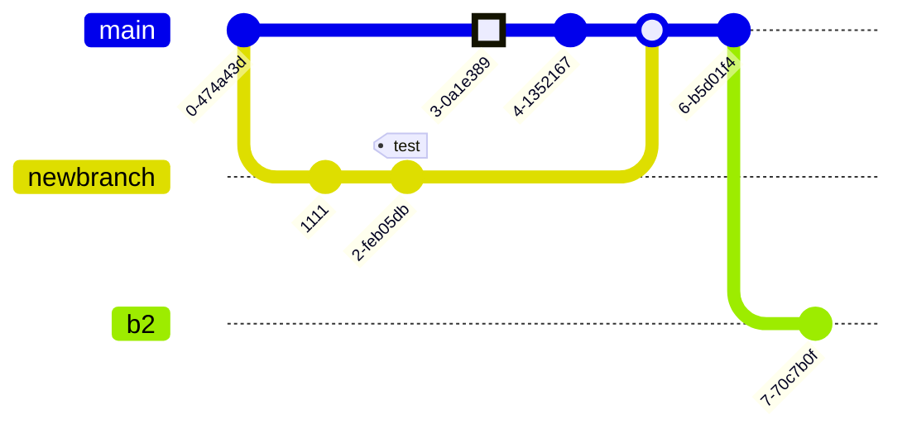

# Examples例子

此页面包含可以通过美人鱼及其无数应用程序创建的图表和图表示例的集合。

如果您想在网页上学习如何支持美人鱼，请阅读初学者指南。

如果您想了解美人鱼的语法，请阅读图表语法部分。

## Basic Pie Chart基本饼图

## Basic sequence diagram基本序列图

## Basic flowchart基本流程图

## Larger flowchart with some styling具有一些样式的较大流程图

## SequenceDiagram: Loops, alt and opt序列关系图：循环、alt 和选择

## SequenceDiagram: Message to self in loop序列关系图：在循环中向自身发送消息

## Sequence Diagram: Blogging app service communication序列图：博客应用服务通信

## A commit flow diagram提交流程图

