# 了不起的Markdown

## 第三章 沉浸在写作之中——Typora

Typora是一款功能全面、简洁高效，而且又非常优雅的Markdown编辑器。它把源码编辑和效果预览合二为一，在输入标记之后随即生成预览效果，提供了“所见即所得 ”的Markdown写作体验。

> 本文所有的图都无法显示，部分md语法知乎也不支持，要想看到效果，请移步CSDN：
> [《了不起的Markdown》第三章_SinkingStone的博客-CSDN博客](https://link.zhihu.com/?target=https%3A//blog.csdn.net/m0_47838348/article/details/119844596)

## 3.1 你好，Typora

Typora是目前最受欢迎的Markdown编辑器之一。它的主要特性如下。

1. 实时预览：传统的Markdown编辑器都有两个窗口，左边是源码，右边是渲染后的效果。Typora独辟蹊径，把源码编辑和效果预览合二为一，实现了真正的所见即所得。
2. 扩展语法：Typora不光支持GFM，还扩展了数学公式、流程图等功能。
3. 快捷操作：Typora对几乎所有的Markdown标记都提供了快捷操作方式，使用起来非常高效。
4. 界面漂亮：默认支持6种主题，可自定义，好看又好用。
5. 文件转换：支持多种文件格式通过导入/导出功能跟.md格式相互转换。
6. 支持中文：支持中文，可以帮助大家更好地理解各项功能。
7. 视图模式：支持大纲和文档列表视图，方便在不同段落和不同文件之间进行切换。
8. 跨平台：支持macOS、Windows和Linux系统。
9. 目前免费：这么好用的编辑器竟然是免费的。

### 3.1.1 快速开始

1. 下载安装 下载地址：[https://typora.io/#download](https://link.zhihu.com/?target=https%3A//typora.io/%23download)。
2. 设置语言 【偏好设置】→【通用】→【语言】，选择语言后，重启Typora即可生效。
3. 界面概览 读者自查
4. 大纲面板 读者自查
5. 字数统计 读者自查
6. 主题 读者自查
7. 实时预览 Typora编辑器最具特色的功能是实时预览，当输入Markdown标记后，按回车键或把光标定位到别的段落就能够看到预览效果。

### 3.1.2 安装Pandoc

Pandoc是一个标记语言转换工具，可实现不同标记语言间的格式转换。 Typora的文件导入/导出功能是使用Pandoc把Markdown文件转换成不同格式的文件，所以如果想使用文件导入/导出功能，必须要先安装Pandoc。 如果不安装Pandoc，Typora只支持导出HTML和PDF格式的文件。 如果安装了Pandoc，Typora支持的文件格式如下。

- 导入文件格式 如.docx、.latex、.tex、.ltx，.rst、.rest、.org、.wiki、.dokuwiki、.textile、.opml、.epub等
- 导出文件格式 如HTML、PDF、Word、OpenOffice、RTF、ePub、LA TEX、MediaWiki、PNG等

## 3.2 高效地使用Markdown

Typora支持GFM，还扩展了很多其他的功能（如支持数学公式、上标、下标、高亮、各种图表等），它几乎为每一种标记都提供了快捷的操作方式，并且通过最佳实践规避了一些令人困惑的操作

### 3.2.1 基础语法和GFM语法

### 1.编辑样式

菜单栏→【格式】→【加粗/斜体/代码（行内代码）/图像/超链接】可以添加或移除关于文字样式 的标记符号。如果没有选中文字，则只会添加标记符号；如果选中了文字，则会为选中的文字添加或移除标记符号。

| 操作     | macOS系统                  | Windows系统      |
| -------- | -------------------------- | ---------------- |
| 粗体     | Command + B                | Ctrl + B         |
| 斜体     | Command + I                | Ctrl + I         |
| 行内代码 | Command + `                |                  |
| 图片     | Contril + Command + B      | Ctrl + Shift + I |
| 超链接   | Command + K                | Ctrl + K         |
| 链接引用 | Contril + Shift + `        |                  |
| 删除线   | Contril + Shift + ~        | Alt + Shift + 5  |
| 表情符号 | Contril + Command + 空格键 |                  |

**小提示：** 如果想使用自动补全表情符号的功能，需要到【偏好设置】中去激活：【偏好设置】→【编辑器】→【触发自动完成】→勾选【Emoji表情】，然后在输入Emoji标记语法时，Typora会自动给出补全信息。

### 2.编辑段落

### a. 段落与换行

1. 使用Typora的默认设置。
2. 在Typora混合界面（预览界面）写作。
3. 使用Enter键插入新段落，避免多插入空行。
4. 如果要插入强制换行符，请使用HTML标签`<br/>`。最通用的插入强制换行符的方法有两种。
   1. 在行尾加两个空格然后按回车键。
   2. 使用HTML标签`<br/>`实现换行，在默认情况下`<br/>`不显示

### b. 标题

对标题进行设置的快捷键:

| 操作         | macOS系统   | Windows系统 |
| ------------ | ----------- | ----------- |
| 设为一级标题 | Command + 1 | Ctrl + 1    |
| 设为二级标题 | Command + 2 | Ctrl + 2    |
| 设为三级标题 | Command + 3 | Ctrl + 3    |
| 设为四级标题 | Command + 4 | Ctrl + 4    |
| 设为五级标题 | Command + 5 | Ctrl + 5    |
| 提升标题级别 | Command + = | Ctrl + =    |
| 降低标题级别 | Command + - | Ctrl + -    |
| 设为普通文本 | Command + 0 | Ctrl + 0    |

### c. 列表

Typora支持有序列表、无序列表和任务列表，它们之间可以通过快捷键实现快速切换，还可以使用列表缩进功能快速调整缩进，使用起来非常方便。

| 操作         | macOS系统            | Windows系统      |
| ------------ | -------------------- | ---------------- |
| 添加有序列表 | Option + Command + O | Ctrl + Shift + [ |
| 添加无序列表 | Option + Command + U | Ctrl + Shift + ] |
| 增加缩进     | Command + ]          | Ctrl + ]         |
| 减少缩进     | Command + [          | Ctrl + [         |
| 添加任务列表 | Option + Command + X |                  |
| 切换任务状态 | Contril + X          |                  |

### d. 引用和水平分隔线

| 操作           | macOS系统            | Windows系统      |
| -------------- | -------------------- | ---------------- |
| 添加引用       | Option + Command + Q | Ctrl + Shift + Q |
| 添加水平分割线 | Shift + Command + -  |                  |

### e. 表格

| macOS系统            | Windows系统 |
| -------------------- | ----------- |
| Option + Command + T | Ctrl + T    |

还有一种可以快速创建表格的比较酷的方式：输入表头的标记语法，在最后一个 | 之后按回车键

- 增加行/删除行、复制表格、格式化表格。

可以在表格中单击鼠标右键，选择【表格】，通过其列出的操作选项对表格进行操作

| 操作               | macOS系统                | Windows系统 |
| ------------------ | ------------------------ | ----------- |
| 增加一行（下一行） | Command + Enter          |             |
| 删除一行（当前行） | Shift + Command + Delete |             |

- 快速调整表格

如果想快速调整表格的行数、列数、对齐方式，可以将光标放在表格中，表格左上方和右上方都会显示操作菜单，直接进行操作即可。 如果想调整表格中行或列的顺序，可将光标放在行的最左边或列的最上边，待光标变成双向箭头后拖动即可调整顺序。

### f. 代码

- 插入围栏代码块

如果想添加或删除围栏代码块的标记，可以执行：菜单栏→【段落】→【代码块】。如果想把某段内容使用围栏代码块包裹，需要先选中该内容，然后执行上述操作。

| macOS系统            | Windows系统      |
| -------------------- | ---------------- |
| Option + Command + C | Ctrl + Shift + K |

- 显示代码行数

代码块默认是不显示代码行数的，如果想显示，则需要执行：文件→【偏好设置】→【代码块】→勾选【显示行号】。

- 自动换行

在代码块中，如果代码过长，默认是会自动换行的，如果我们不希望代码自动换行，可以执行：文件→【偏好设置】→【代码块】→不勾选【代码块自动换行】

### 3.2.2 Typora扩展语法

Typora扩展了下画线、数学公式、目录、脚注、上标和下标、图表操作等功能，并且支持很多HTML标签，使排版格式变得更加齐全。

### 1. 编辑样式

### a. 下画线

在Typora中，下画线是通过HTML的`<u>`标签实现的

```text
<u>这个文字下面有下滑线</u>
```

这个文字下面有下滑线

| macOS系统   | Windows系统 |
| ----------- | ----------- |
| Command + U | Ctrl + U    |

### b. 内联数学公式

内联数学公式的语法是使用$把数学公式包裹起来

```text
$数学公式$
```

- 实例演示

```text
分数：$f(x,y)=\frac{x^2}{y^3}$
开根号：$f(x,y)=\sqrt[n]{{x^2}{y^3}}$
省略号：$f(x_1,x_2,\ldots,x_n)=x_1+x_2+\ldots+x_n$
```

分数：![[公式]](https://www.zhihu.com/equation?tex=f%28x%2Cy%29%3D%5Cfrac%7Bx%5E2%7D%7By%5E3%7D)

开根号： ![[公式]](https://www.zhihu.com/equation?tex=f%28x%2Cy%29%3D%5Csqrt%5Bn%5D%7B%7Bx%5E2%7D%7By%5E3%7D%7D)

省略号： ![[公式]](https://www.zhihu.com/equation?tex=f%28x_1%2Cx_2%2C%5Cldots%2Cx_n%29%3Dx_1%2Bx_2%2B%5Cldots%2Bx_n)

### c. 下标和上标

- 语法格式

```text
~下标内容~
^上标内容^
```

- 语法说明
  - 使用~把下标内容包裹起来。
  - 使用^把上标内容包裹起来。

- 实例演示

```text
下标：H~2~O
上标：X^2^+Y^3^
```

下标：H~2~O 上标：X^2^+Y^3^

> **知乎不支持上标、下表，具体情况可查看：**
> **[《了不起的Markdown》第三章_SinkingStone的博客-CSDN博客](https://link.zhihu.com/?target=https%3A//blog.csdn.net/m0_47838348/article/details/119844596)**

### d. 高亮

- 语法格式

```text
==高亮内容==
```

- 语法说明
  - 使用两个等号（=）把想要高亮的内容包裹起来。
  - 设置为高亮的内容显示为黄色。

- 实例演示

```text
为什么==乌鸦==像==写字台==
```

为什么==乌鸦==像==写字台==

> **知乎不支持上标、下表，具体情况可查看：**
> **[《了不起的Markdown》第三章_SinkingStone的博客-CSDN博客](https://link.zhihu.com/?target=https%3A//blog.csdn.net/m0_47838348/article/details/119844596)**

| macOS系统           | Windows系统 |
| ------------------- | ----------- |
| Command + Shift + H |             |

### e. 注释

- 语法格式

```text
<!-- 我是注释 -->
```

| macOS系统   | Windows系统 |
| ----------- | ----------- |
| Contril + - |             |

### f. 清除样式

如果想快速清除样式，可以执行：菜单栏→【格式】→【清除样式】

| macOS系统 | Windows系统 | | :---------: | :---------: | | Command + \ | Ctrl + \ |

### 2. 编辑段落

### a. 数学公式块

- 语法格式

```text
$$
数学公式
$$
```

| macOS系统   | Windows系统 |
| ----------- | ----------- |
| Command + \ | Ctrl + \    |

### b. 目录

在Typora中，可以自动获取文章的标题来生成目录，当标题修改时，目录会随之自动更新。

- 语法格式

```text
[TOC]
```

- 语法说明
  - TOC是Table of Contents的缩写。
  - 在想插入目录的位置输入[TOC]，按回车键后就可以自动生成文章的目录了。

### c. 脚注

- 语法格式

```text
我们可以这样引用一个脚注[^参考]
[^参考]: 这段文字是对脚注的描述
```

我们可以这样引用一个脚注[^参考]

[^参考]: 这段文字是对脚注的描述

> ***知乎不支持脚注\***

| macOS系统            | Windows系统 |
| -------------------- | ----------- |
| Option + Command + R |             |

### d. 图表（序列图、流程图和Mermaid）

如果想使用图表功能，需要先激活：文件→【偏好设置】→【Markdown扩展语法】→勾选【图表】→重启Typora。

**注意:**

1. 图表是Typora的扩展语法，标准的Markdown语法、CommonMark和GFM都不支持这一语法。
2. 如果想要把图表使用到更多的地方，推荐直接插入图片，不推荐在Typora中进行绘制。
3. 在Typora中，图表在导出HTML/PDF/ePub/docx等格式的文件时会被正常显示，但是其他的Markdown编辑器不一定支持此语法。

### 序列图

序列图（Sequence Diagram）也被称为循序图，是一种UML（Unified Modeling Language，统一建模语言）行为图，它通过描述对象之间发送消息的时间顺序显示多个对象之间的动态协作。 Typora提供的序列图语法标记功能是基于开源项目（js-sequence-diagrams）开发的。

**几个例子：**

```sequence
张三 -> 李四: 李四，吃了吗
Note right of 李四: 我显示在李四的右边
李四 --> 张三: 好久不见，刚吃了
```

```sequence
Title: Here is a title
A->B: Normal line
B-->C: Dashed line
C->>D: Open arrow
D-->>A: Dashed open arrow
```

```sequence
# Example of a comment.
Note left of A: Note to the\n left of A
Note right of A: Note to the\n right of A
Note over A: Note over A
Note over A,B: Note over both A and B
```

```sequence
participant C
participant B
participant A
Note right of A: By listing the participants\n you
```

- 语法说明
  - 使用3个`+sequence包裹js-sequence-diagrams语法。
  - js-sequence-diagrams语法参考[https://bramp.github.io/js-sequence-diagrams/](https://link.zhihu.com/?target=https%3A//bramp.github.io/js-sequence-diagrams/)。

```text
张三 -> 李四: 李四，吃了吗

Note right of 李四: 我显示在李四的右边

李四 --> 张三: 好久不见，刚吃了
```

### 流程图

flow流程图是以图像的方式表示过程、算法和流程的，Typora提供的流程图语法标记是基于开源项目（flowchart.js）开发的。

- 语法格式
  \```flow flowchart语法 ```

- 语法说明
  - 使用3个`+flow包裹flowchart.js语法。
  - flowchart.js语法参考[http://flowchart.js.org/](https://link.zhihu.com/?target=http%3A//flowchart.js.org/)。

- 实例演示

```flow

st=>start: 开始

op=>operation: 你爱我吗

cond=>condition: Yes or No?

e=>end: 结束

st->op->cond

cond(yes)->e

cond(no)->op

```

```text
st=>start: 开始
op=>operation: 你爱我吗
cond=>condition: Yes or No?
e=>end: 结束

st->op->cond
cond(yes)->e
cond(no)->op
```

```flow
st=>start: Start:>http://www.google.com[blank]
e=>end:>http://www.google.com
op1=>operation: My Operation
sub1=>subroutine: My Subroutine
cond=>condition: Yes
or No?:>http://www.google.com
io=>inputoutput: catch something...
para=>parallel: parallel tasks

st->op1->cond
cond(yes)->io->e
cond(no)->para
para(path1, bottom)->sub1(right)->op1
para(path2, top)->op1
```

```flow
st=>start: Start|past:>http://www.google.com[blank]
e=>end: End|future:>http://www.google.com
op1=>operation: My Operation|past
op2=>operation: Stuff|current
sub1=>subroutine: My Subroutine|invalid
cond=>condition: Yes
or No?|approved:>http://www.google.com
c2=>condition: Good idea|rejected
io=>inputoutput: catch something...|future

st->op1(right)->cond
cond(yes, right)->c2
cond(no)->sub1(left)->op1
c2(yes)->io->e
c2(no)->op2->e
```

```flow
st=>start: Improve your
l10n process!
e=>end: Continue to have fun!:>https://youtu.be/YQryHo1iHb8[blank]
op1=>operation: Go to locize.com:>https://locize.com[blank]
sub1=>subroutine: Read the awesomeness
cond(align-next=no)=>condition: Interested to
getting started?
io=>inputoutput: Register:>https://www.locize.app/register[blank]
sub2=>subroutine: Read about improving
your localization workflow
or another source:>https://medium.com/@adrai/8-signs-you-should-improve-your-localization-process-3dc075d53998[blank]
op2=>operation: Login:>https://www.locize.app/login[blank]
cond2=>condition: valid password?
cond3=>condition: reset password?
op3=>operation: send email
sub3=>subroutine: Create a demo project
sub4=>subroutine: Start your real project
io2=>inputoutput: Subscribe

st->op1->sub1->cond
cond(yes)->io->op2->cond2
cond2(no)->cond3
cond3(no,bottom)->op2
cond3(yes)->op3
op3(right)->op2
cond2(yes)->sub3
sub3->sub4->io2->e
cond(no)->sub2(right)->op1

st@>op1({"stroke":"Red"})@>sub1({"stroke":"Red"})@>cond({"stroke":"Red"})@>io({"stroke":"Red"})@>op2({"stroke":"Red"})@>cond2({"stroke":"Red"})@>sub3({"stroke":"Red"})@>sub4({"stroke":"Red"})@>io2({"stroke":"Red"})@>e({"stroke":"Red","stroke-width":6,"arrow-end":"classic-wide-long"})
```

```flow
st=>start: Need something to be translated!:>https://www.localistars.com[blank]
e=>end: Be happy!:>https://youtu.be/e6Ede8hdU8c
cond=>condition: Are you a client
or a translator?
subc=>subroutine: Why should you choose a localistar?:>https://www.localistars.com/for-clients.html
subt=>subroutine: Why should you become a localistar?:>https://www.localistars.com/for-translators.html
op=>operation: Check out how it works!:>https://www.localistars.com/how-it-works.html
io=>inputoutput: Work together with your partner!:>https://www.localistars.app/login

st->cond
cond(no@client)->subc->op->io->e
cond(yes@translator)->subt->op->io->e
```

### Mermaid

Typora集成了Mermaid，Mermaid支持使用文本的方式生成图表，包括序列图、流程图和甘特图。

1）Mermaid序列图的语法如下（可参考[https://knsv.github.io/mermaid/#loops32](https://link.zhihu.com/?target=https%3A//knsv.github.io/mermaid/%23loops32)）。

- 语法格式

```text
\```mermaid
Mermaid序列图语法
\```
```

- 实例演示

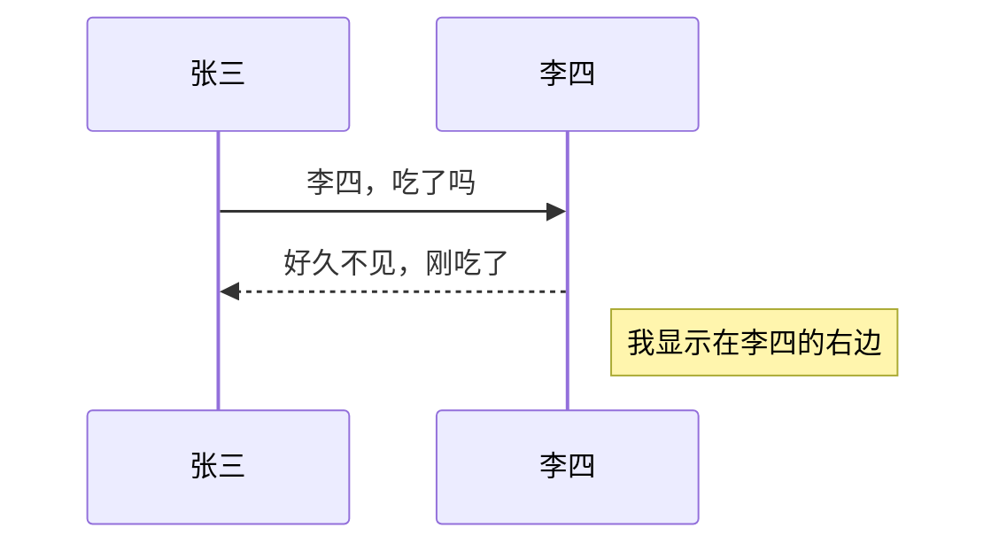

```text
%% 序列图举例（注释）
sequenceDiagram
张三->>李四: 李四，吃了吗
李四-->>张三:好久不见，刚吃了
Note right of 李四: 我显示在李四的右边
```

时序图

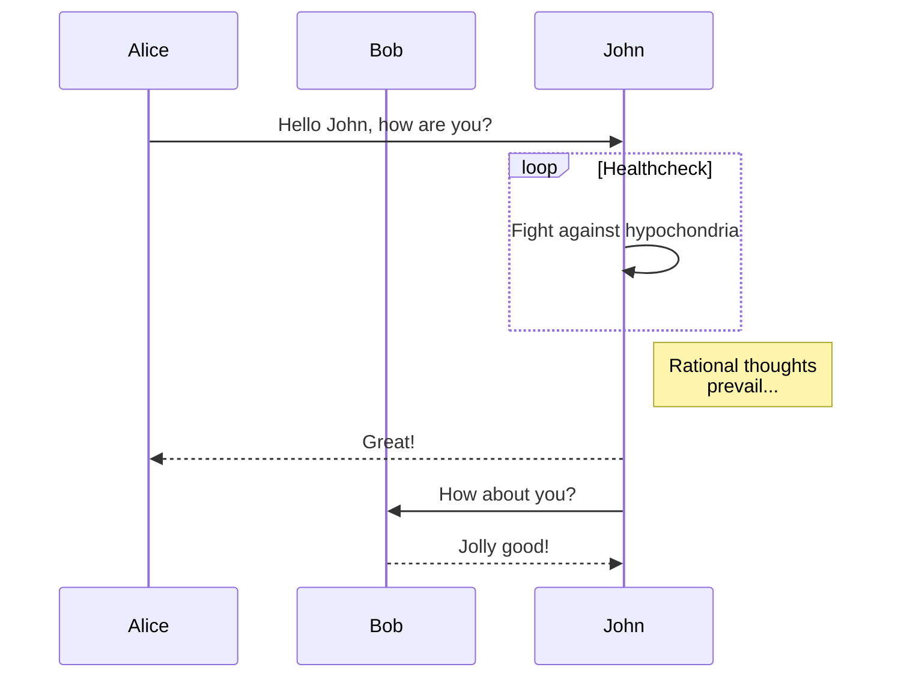

类图

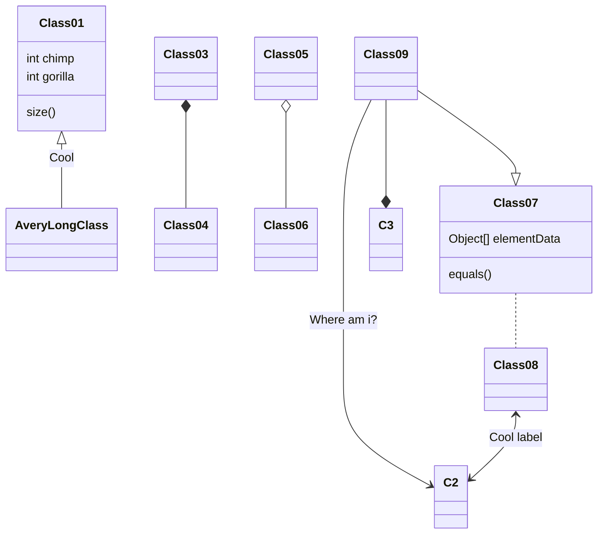

分支图

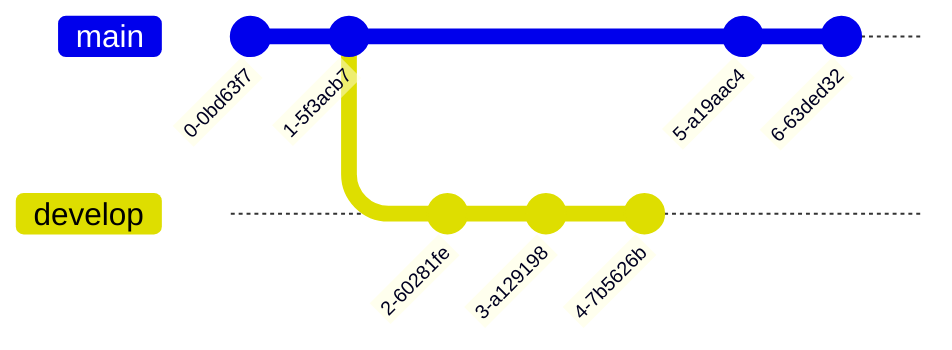

实体关系图

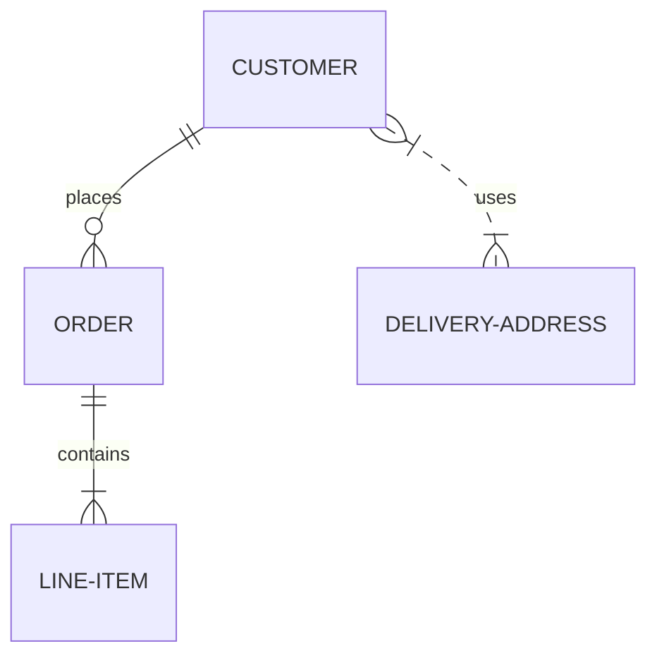

用户行程/计划图

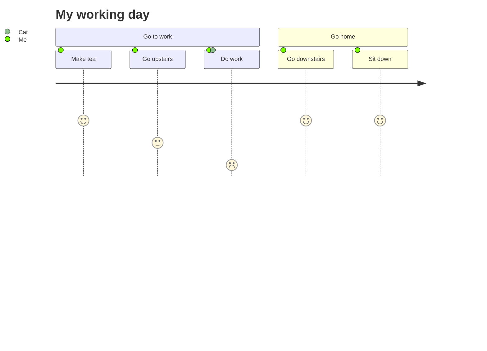

流程图

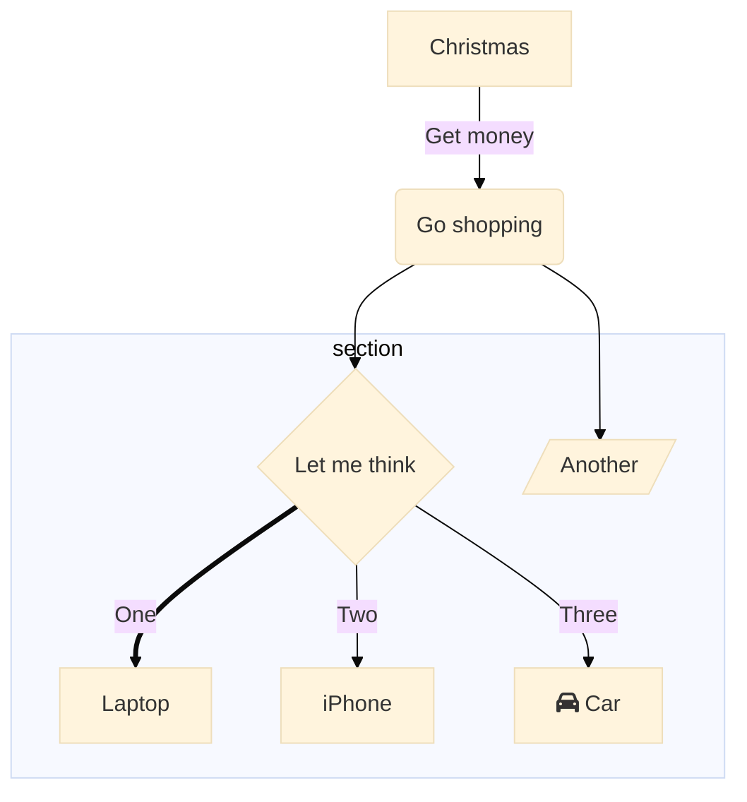

状态图

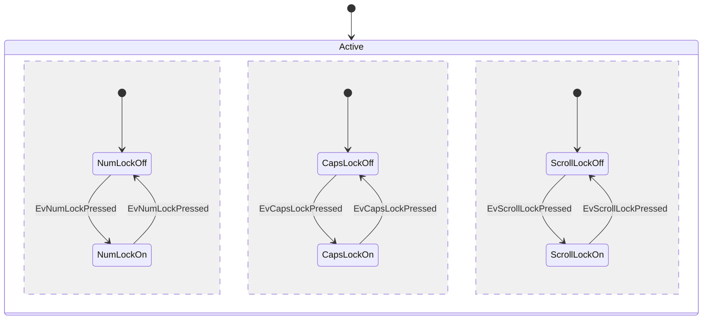

饼图

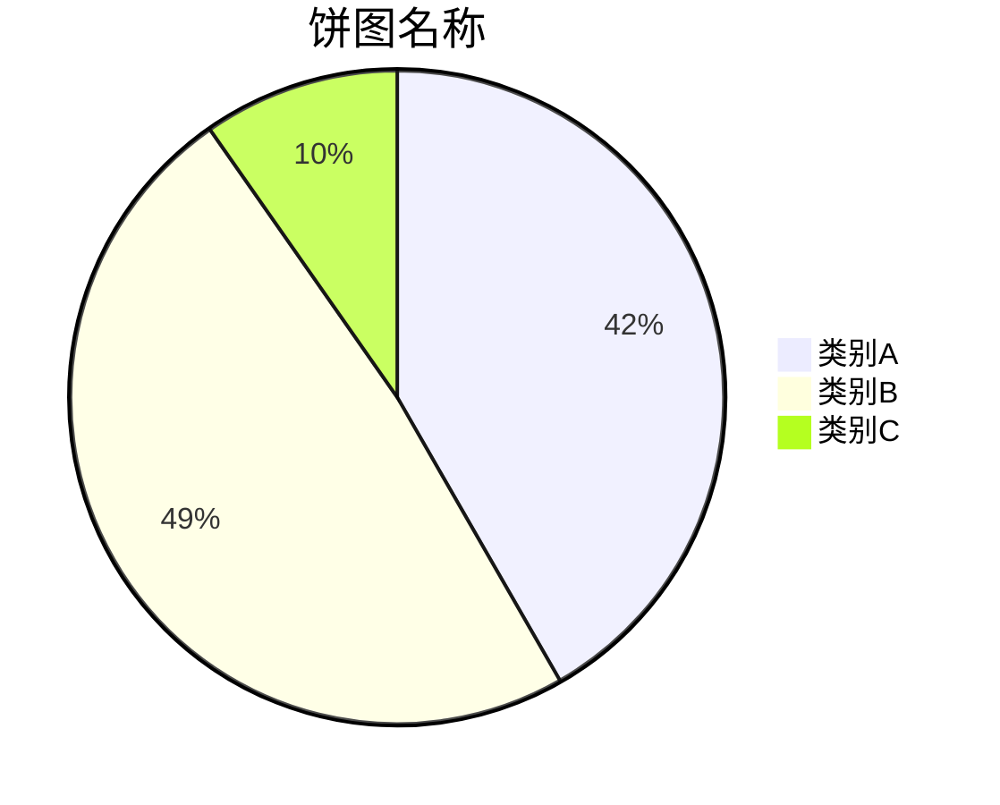

2）Mermaid流程图的语法如下（可参考[https://knsv.github.io/mermaid/#graph18](https://link.zhihu.com/?target=https%3A//knsv.github.io/mermaid/%23graph18)）。

语法格式

```text
\```mermaid
Mermaid流程图
\```
```

绘图方向

| 命令 | 方向     |
| ---- | -------- |
| TB   | 从上到下 |
| TD   | 从上到下 |
| BT   | 从下到上 |
| RL   | 从右到左 |
| LR   | 从左到右 |

> T = TOP，B = BOTTOM，L = LEFT，R = RIGHT，D = DOWN

节点形状


节点之间的连接
节点间的连接线有多种形状，可以在连接线中加入标签：

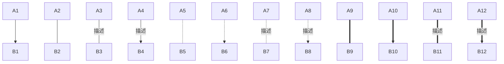

| 命令                | 形状             |
| ------------------- | ---------------- |
| A1 --> B1           | 箭头连接         |
| A2 — B2             | 开放连接         |
| A3 – 描述 — B3      | 标签连接         |
| A4 – 描述 --> B4    | 箭头标签连接     |
| A5 -.- B5           | 虚线开放连接     |
| A6 -.-> B6          | 虚线箭头连接     |
| A7 -. 描述 .- B7    | 标签虚线连接     |
| A8 -. 描述 .-> B8   | 标签虚线箭头连接 |
| A9 === B9           | 粗线开放连接     |
| A10 ==> B10         | 粗线箭头连接     |
| A11 == 描述 === B11 | 标签粗线开放连接 |
| A12 == 描述 ==> B12 | 标签粗线箭头连接 |

subgraph（子流程图）

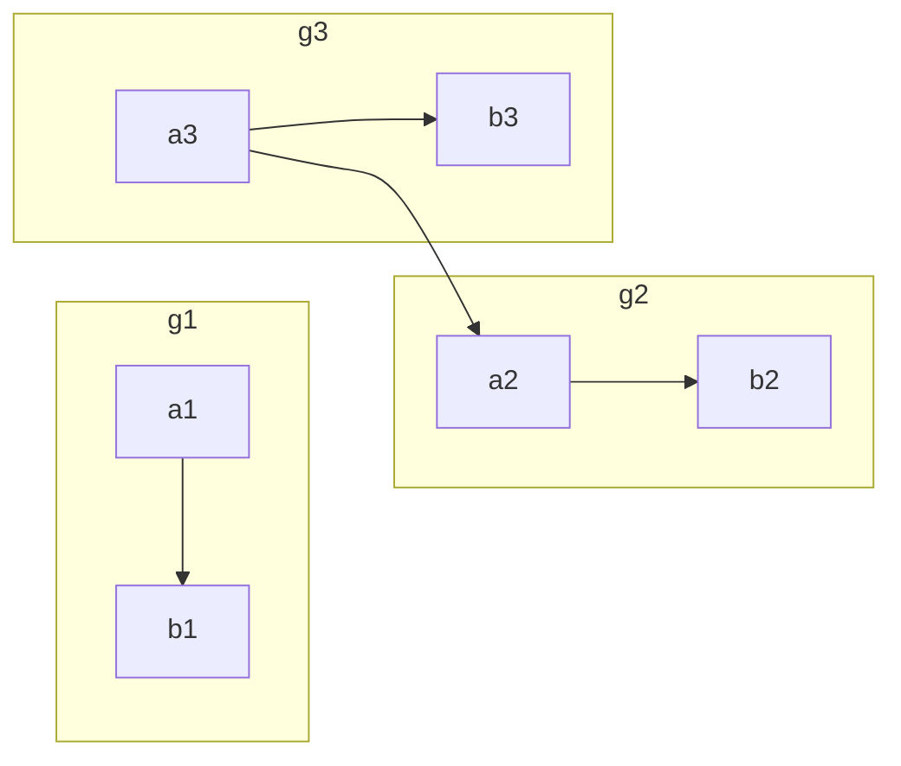

可以使用 & 同时指定多个节点之间的多个连线。

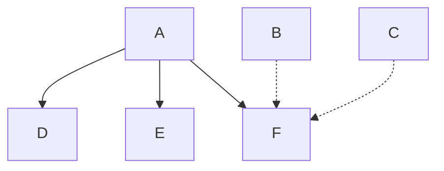

自定义样式
语法：style id 具体样式

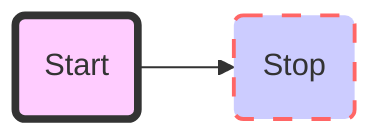

- 实例演示

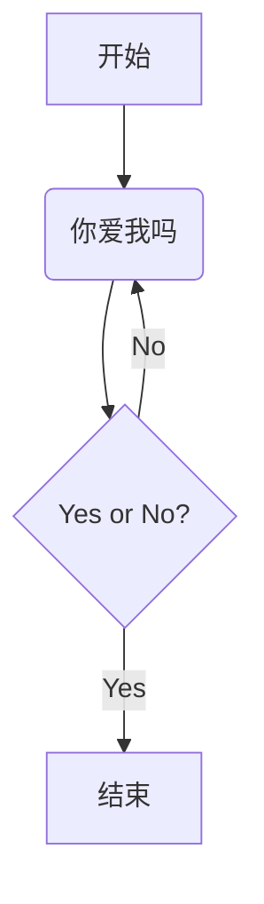

```text
graph TD
A[开始] --> B(你爱我吗)
B --> C{Yes or No?}
C --> |Yes| D[结束]
C --> |No| B
```

3）Mermaid甘特图。甘特图（Gantt chart）是将活动与时间联系起来的一种图表形式，能够显示每个活动的历时长短。甘特图很清晰地标识出每一项任务的起始与结束时间，通常在项目管理中使用，方便人们从时间上整体把握项目进度。 Mermaid甘特图的语法如下（可参考[http://knsv.github.io/mermaid/index.html#mermaid-cli](https://link.zhihu.com/?target=http%3A//knsv.github.io/mermaid/index.html%23mermaid-cli)）

```text
\```mermaid
Mermaid甘特图
\```
```

- 实例演示

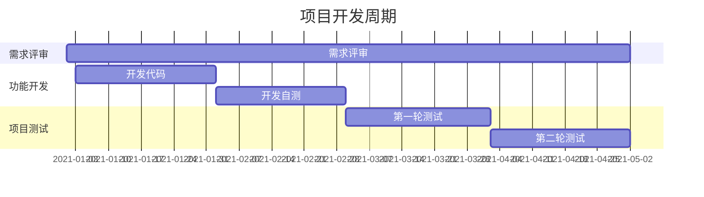

```text
gantt
dateFormat YYYY-MM-DD
title 项目开发周期
section 需求评审
需求评审: 2021-01-01,2021-05-02
section 功能开发
开发代码: 2021-01-03,2021-02-02
开发自测: 2021-02-02,2021-03-02
section 项目测试
第一轮测试: 2021-03-02,2021-04-02
第二轮测试: 2021-04-02,2021-05-02
```

### 3.使用HTML标签

Typora还支持很多常用的HTML标签，使用这些标签可以让样式更加丰富，但这也导致纯粹的写作变得更加复杂，提高了用户使用的门槛。

### a. 文字颜色和大小

- 示例代码

```text
<font color="green">绿色</font>

<font color="yellow" size=5>黄色</font>

<font color="red" size=6>红色</font>
```

### b. 嵌入网页

- 示例代码

```text
<iframe height='256' scrolling='yes' title='百度首页' src='https://www.baidu.com' frameborder='no' allowtransparency='true' allowfullscreen='true' style='width: 100%'></iframe>
```

**注意：** 内嵌的网页在导出文件时是无法显示的。

### c. 插入视频

- 示例代码`<vide0 src="文件路径">`

**注意：** 内嵌的视频在导出文件时是无法显示的。

这些标签的使用专业要求相对较高，不适合普通读者，感兴趣的读者可以到[https://support.typora.io/HTML/](https://link.zhihu.com/?target=https%3A//support.typora.io/HTML/)了解更多。

## 3.3 一些实用的功能

### 3.3.1 文件操作

### 1. 快速打开文件

执行：菜单栏→【文件】→【快速打开】，此时会打开一个弹窗，弹窗会列出最近打开过的文件列表，并且可以通过文件名进行查找，这样就能不离开窗口而快速打开文件了。

```text
|           操作           |      macOS系统      |   Windows系统    |
| :----------------------: | :-----------------: | :--------------: |
|         打开文件         |     Command + O     |     Ctrl + O     |
|  打开最近一个关闭的文件  | Shift + Command + T | Ctrl + Shift + T |
| 快速打开最近打开过的文件 | Shift + Command + O |     Ctrl + P     |
```

| 操作                     | macOS系统           | Windows系统      |
| ------------------------ | ------------------- | ---------------- |
| 打开文件                 | Command + O         | Ctrl + O         |
| 打开最近一个关闭的文件   | Shift + Command + T | Ctrl + Shift + T |
| 快速打开最近打开过的文件 | Shift + Command + O | Ctrl + P         |

### 2. 复原历史版本

在macOS系统下，Typora提供了文件复原功能，相当于对文件进行了版本管理，此功能可以把文件复原到某个指定的时间点。

菜单栏→【文件】→【回退到】→【上次存储的版本/上次打开的版本/浏览所有版本...】→单击【浏览所有版本...】，在这个界面选择想复原到哪个时间点的版本。

虽然Windows下的Typora不支持版本控制功能，但是可以恢复自动保存到草稿中的内容。恢复的步骤：【文件】→【偏好设置】→【保存&恢复】→单击【恢复未保存的草稿】→找到以日期和文件名（或文件的第一个标题/句子）命名的草稿进行恢复。

### 3. 自动保存

在Windows系统下，通过【文件】→【偏好设置】→【保存&恢复】→勾选【自动保存】。 在macOS系统下，文档的自动保存功能是由操作系统控制的，默认始终被开启，但是可以设置在关闭文稿时是否弹出保存提醒。这需要通过系统设置：macOS→系统偏好设置→【通用】→确认是否勾选【关闭文稿时要求保存更改】。

### 4.导入/导出

如果想把其他格式的文件转成Markdown文件，可以使用Typora的导入功能，如果想把Markdown格式的文件转换成其他格式的文件，则可以使用导出功能。具体步骤是，首先安装Pandoc，然后执行：菜单栏→【文件】→【导入】/【导出】。

**小提示：**

>1. 导入后缀为.docx、.latex、.opml、.epub等格式的文件，导入后的文件格式会自动转换为Markdown格式的文件。
>2. Markdown格式的文件可以直接导出为HTML、PDF、Word、OpenOffice、ePub、LA TEX、reStructuredText、PNG等格式的文件。

### 3.3.2 编辑技巧

### 1. 复制和粘贴

在默认情况下，在Typora中复制文本时，复制的是渲染后的格式。如果想复制Markdown源码，可以执行：菜单栏→【编辑】→【复制为Markdown】，或者选择要复制内容，单击鼠标右键，在弹出的菜单中选择【复制为Markdown】。

| macOS系统           | Windows系统      |
| ------------------- | ---------------- |
| Command + Shift + C | Ctrl + Shift + C |

如果我们想把“复制Markdown源码”设置为默认的复制行为，可以执行：文件→【偏好设置】→【默认复制行为】→勾选【当复制纯文件时复制Markdown源码】。 如果想直接复制HTML源码，可以执行：菜单栏→【编辑】→【复制为HTML代码】；如果想在粘贴时去掉所有格式，可以执行：菜单栏→【编辑】→【粘贴为纯文本】。

| macOS系统           | Windows系统      |
| ------------------- | ---------------- |
| Command + Shift + V | Ctrl + Shift + V |

### 2. 选择

【编辑】菜单中的选择功能有选中当前词、选中当前行/句、选中当前格式文本和全选。

| 操作             | macOS系统   | Windows系统      |
| ---------------- | ----------- | ---------------- |
| 选中当前词       | Command + D | Ctrl + D         |
| 选中当前行/句    | Command + L | Ctrl + Shift + L |
| 选中当前格式文本 | Command + E | Ctrl + E         |
| 全选             | Command + A | Ctrl + A         |

### 3. 删除

由于选择操作（选中当前词、选中当前行/句、选中当前格式文本和全选）都有快捷键，因此在Typora中，删除内容最便捷的方法就是先选择再删除，仅需两步。

| macOS系统           | Windows系统      |
| ------------------- | ---------------- |
| Command + Shift + D | Ctrl + Shift + D |

### 4. 查找和替换

通过快捷键Command+F（Windows：Ctrl+F）调出查找面板，在查找面板上可以设置是否“区分大小写”和是否“查找整个单词”，默认都是否。 可以在查找面板上切换上一个和下一个查找结果，也可以按回车键切换下一个，或者通过快捷键切换。

| 操作       | macOS系统           | Windows系统 |
| ---------- | ------------------- | ----------- |
| 查找上一个 | Command + G         | F3          |
| 查找下一个 | Command + Shift + G | Shift + F3  |

单击查找面板上【查找】右边的向下三角，或者通过快捷键Option+Command+F（Windows：Ctrl+H）可以显示查找和替换面板 如果把光标放在替换内容输入框中，按回车键会替换下一个，也可以通过快捷键（macOS系统:Command+Option+E）来替换下一个。

### 5. 跳转

除通过侧边栏的大纲列表进行跳转外，还可以通过快捷键快速跳转到页首、页尾和选中的文本区域。

| 操作           | macOS系统   | Windows系统 |
| -------------- | ----------- | ----------- |
| 跳转到文首     | Command + ↑ | Ctrl + Home |
| 跳转到文末     | Command + ↓ | Ctrl + End  |
| 跳转到所选内容 | Command + J | Ctrl + J    |

### 6. 图片操作

在Typora中，可以快速插入本地图片、复制插入的图片到指定文件夹、上传图片到图床（仅支持macOS系统）、图片居中、调整图片大小等功能。关于图片居中：当一个段落中只包含一张图片时，图片会居中对齐，否则会左对齐。

### a. 插入本地图片

1. 在插入图片标记后，单击右边的文件夹图标，可以快速插入本地图片。
2. 菜单栏→【编辑】→【图片工具】→【插入本地图片】。
3. 直接拖动本地图片到编辑器中，
4. 直接从剪切板中复制并粘贴到编辑器。

**小提示：** 插入的图片名称会被自动提取为Markdown文件中的图片替代文字，图片链接为绝对地址。

### b. 管理本地图片

- 复制图片到指定的文件夹

在默认情况下，插入的本地图片链接是原地址，图片可能分散在电脑的各处，不便于管理。为了便于管理，我们可以将插入的本地图片自动复制到指定的文件夹中。其操作步骤如下。
菜单栏→【编辑】→【图片工具】→【当插入本地图片时】→【复制到文件夹...】，然后选择或新建一个文件夹用于存放插入的本地图片。
设置完成后，当我们再次插入本地图片时，图片就会被自动复制到之前选择的文件夹中了。

- 使用iPic上传到网络

此功能只适用于macOS系统，需先安装iPic（在App Store 中搜索iPic即可安装）。
iPic是一个图床工具，可自动将本地图片上传到指定图床（支持微博、七牛云、又拍云、阿里云、腾讯云等图床），然后自动保存为Markdown格式的链接，非常方便。
免费版的iPic支持将图片匿名上传至微博图床，但这不利于隐私保护，不建议使用。若想使用其他图床，需要将iPic升级到高级版本。
假设你已经安装了iPic，若想把本地图片自动上传到图床，需要先在Typora中进行设置：【偏好设置】→【图片插入】→勾选【允许根据YAML设置自动上传图片】。然后在插入的本地图片上，单击鼠标右键，选择【上传图片】就可以通过iPic上传到指定的图床了。

### c. 全局设置

在默认情况下，插入图片时并没有什么特殊操作，但是我们可以在全局状态下，设置一些特殊的操作功能。具体是在【偏好设置】→【图片插入】中进行设置的，此处可选的操作如下。

1. 无特殊操作。
2. 复制图片到当前文件夹（./）。
3. 复制图片到./assets 文件夹。
4. 复制图片到./$（filename).assets 文件夹。
5. 复制到自定义路径。
6. 通过iPic上传图片。

**小提示：** 可以对本地图片和网络图片应用所选中的规则，只需勾选【对本地位置的图片应用上述规则】和【对网络位置的图片应用上述规则】即可。

### d. 设置图片大小

在Typora中，支持使用``标签插入图片，也支持其对图片大小进行设置（理论上也支持其他属性的设置，但Typora在预览和编辑时可能会忽略图片大小之外的属性，这可能会影响导出效果）。

```text
通过设置属性，设置图片宽和高
    
通过设置样式，设置图片宽和高

通过设置样式，设置图片缩放比例

```

### 3.3.3 显示模式

### 1. 3种视图模式

Typora支持3种视图模式：大纲视图、文件树视图和文档列表视图，这让我们能够方便地在不同段落和文件之间进行切换。

1. 大纲视图：方便查看全文的结构。
2. 文件树视图：方便切换当前目录及子目录中的文档。
3. 文档列表视图：方便切换当前目录中的文档。

### 2. 沉浸式写作体验

如果想拥有沉浸式写作体验，可以执行：菜单栏→【视图】，并依次勾选下面的选项。

1. 打字机模式：光标始终位于屏幕的中间。
2. 专注模式：只高亮显示光标所在行，其余内容全部变灰。
3. 全屏：最大化文件窗口，排除其他软件的干扰。

```text
|    操作    |       macOS系统       | Windows系统 |
| :--------: | :-------------------: | :---------: |
|    全屏    | Command + Control + F |     F11     |
| 打字机模式 |          F9           |     F9      |
|  专注模式  |          F8           |     F8      |
```

| 操作       | macOS系统             | Windows系统 |
| ---------- | --------------------- | ----------- |
| 全屏       | Command + Control + F | F11         |
| 打字机模式 | F9                    | F9          |
| 专注模式   | F8                    | F8          |

## 3.4 本章小结

本章主要介绍了目前最流行的Markdown编辑器——Typora，它支持所见即所得，支持GFM和一些常用的扩展语法，并且为几乎每一种语法都提供了快捷的操作方式。它支持导入和导出各种常见的文件格式，在文件操作、编辑和显示方面也极为出色。
Typora基本上能够满足我们的日常写作需求，但它无法在手机端使用，也不支持云同步。如果你觉得这些非常重要，可以使用Bear。Bear支持在Mac、iPhone和iPad上使用Markdown，也支持多端同步。
开源软件MarkText有着跟Typora类似的用户体验，但功能相对简单一些。

图像实例

flowchart

例1

```flow
st=>start: Start:>http://www.google.com[blank]
e=>end:>http://www.google.com
op1=>operation: My Operation
sub1=>subroutine: My Subroutine
cond=>condition: Yes
or No?:>http://www.google.com
io=>inputoutput: catch something...
para=>parallel: parallel tasks

st->op1->cond
cond(yes)->io->e
cond(no)->para
para(path1, bottom)->sub1(right)->op1
para(path2, top)->op1
```

例2

```flow
st=>start: Start|past:>http://www.google.com[blank]
e=>end: End|future:>http://www.google.com
op1=>operation: My Operation|past
op2=>operation: Stuff|current
sub1=>subroutine: My Subroutine|invalid
cond=>condition: Yes
or No?|approved:>http://www.google.com
c2=>condition: Good idea|rejected
io=>inputoutput: catch something...|future

st->op1(right)->cond
cond(yes, right)->c2
cond(no)->sub1(left)->op1
c2(yes)->io->e
c2(no)->op2->e
```

例3

```flow
st=>start: Improve your
l10n process!
e=>end: Continue to have fun!:>https://youtu.be/YQryHo1iHb8[blank]
op1=>operation: Go to locize.com:>https://locize.com[blank]
sub1=>subroutine: Read the awesomeness
cond(align-next=no)=>condition: Interested to
getting started?
io=>inputoutput: Register:>https://www.locize.app/register[blank]
sub2=>subroutine: Read about improving
your localization workflow
or another source:>https://medium.com/@adrai/8-signs-you-should-improve-your-localization-process-3dc075d53998[blank]
op2=>operation: Login:>https://www.locize.app/login[blank]
cond2=>condition: valid password?
cond3=>condition: reset password?
op3=>operation: send email
sub3=>subroutine: Create a demo project
sub4=>subroutine: Start your real project
io2=>inputoutput: Subscribe

st->op1->sub1->cond
cond(yes)->io->op2->cond2
cond2(no)->cond3
cond3(no,bottom)->op2
cond3(yes)->op3
op3(right)->op2
cond2(yes)->sub3
sub3->sub4->io2->e
cond(no)->sub2(right)->op1

st@>op1({"stroke":"Red"})@>sub1({"stroke":"Red"})@>cond({"stroke":"Red"})@>io({"stroke":"Red"})@>op2({"stroke":"Red"})@>cond2({"stroke":"Red"})@>sub3({"stroke":"Red"})@>sub4({"stroke":"Red"})@>io2({"stroke":"Red"})@>e({"stroke":"Red","stroke-width":6,"arrow-end":"classic-wide-long"})
```

例4

```flow
st=>start: Need something to be translated!:>https://www.localistars.com[blank]
e=>end: Be happy!:>https://youtu.be/e6Ede8hdU8c
cond=>condition: Are you a client
or a translator?
subc=>subroutine: Why should you choose a localistar?:>https://www.localistars.com/for-clients.html
subt=>subroutine: Why should you become a localistar?:>https://www.localistars.com/for-translators.html
op=>operation: Check out how it works!:>https://www.localistars.com/how-it-works.html
io=>inputoutput: Work together with your partner!:>https://www.localistars.app/login

st->cond
cond(no@client)->subc->op->io->e
cond(yes@translator)->subt->op->io->e
```

Sequence Diagrams

例1

```sequence
Andrew->China: Says Hello
Note right of China: China thinks\nabout it
China-->Andrew: How are you?
Andrew->>China: I am good thanks!
```

例2

```sequence
Title: Here is a title
A->B: Normal line
B-->C: Dashed line
C->>D: Open arrow
D-->>A: Dashed open arrow
```

例3

```sequence
# Example of a comment.
Note left of A: Note to the\n left of A
Note right of A: Note to the\n right of A
Note over A: Note over A
Note over A,B: Note over both A and B
```

例4

```sequence
participant C
participant B
participant A
Note right of A: By listing the participants\n you
```

Mermaid

PlantUML

- Java 是需要先被安装好的

WaveDrom

```wavedrom
{ assign:[
  ["out",
    ["|",
      ["&", ["~", "a"], "b"],
      ["&", ["~", "b"], "a"]
    ]
  ]
]}
```

GraphViz

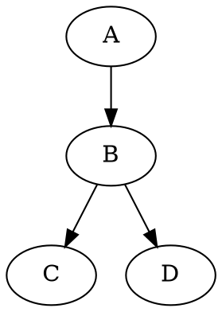


Vega 和 Vega-lite

```Vega-lite
{
  "$schema": "https://vega.github.io/schema/vega-lite/v5.json",
  "description": "A simple bar chart with embedded data.",
  "data": {
    "values": [
      {"a": "A", "b": 28}, {"a": "B", "b": 55}, {"a": "C", "b": 43},
      {"a": "D", "b": 91}, {"a": "E", "b": 81}, {"a": "F", "b": 53},
      {"a": "G", "b": 19}, {"a": "H", "b": 87}, {"a": "I", "b": 52}
    ]
  },
  "mark": "bar",
  "encoding": {
    "x": {"field": "a", "type": "nominal", "axis": {"labelAngle": 0}},
    "y": {"field": "b", "type": "quantitative"}
  }
}
```

Ditaa

- Java 是需要先被安装好的
