# mermaid

## flowchart基本语法

### flowchart方向

- TB - top to bottom
- TD - top-down/ same as top to bottom
- BT - bottom to top
- RL - right to left
- LR - left to right

### 节点


### 节点之间的链接

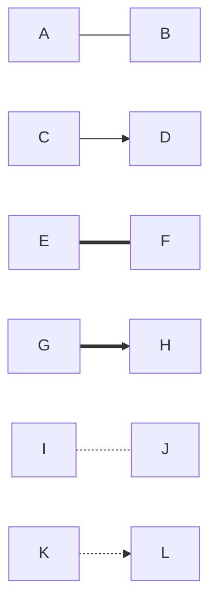

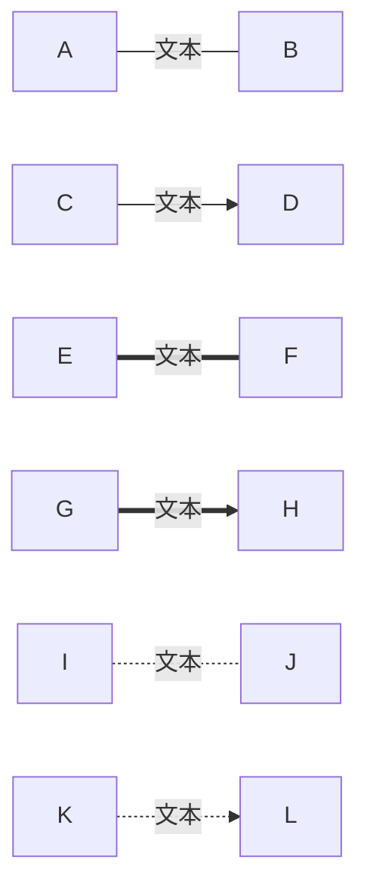


### 多链接

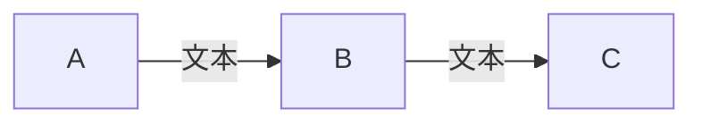

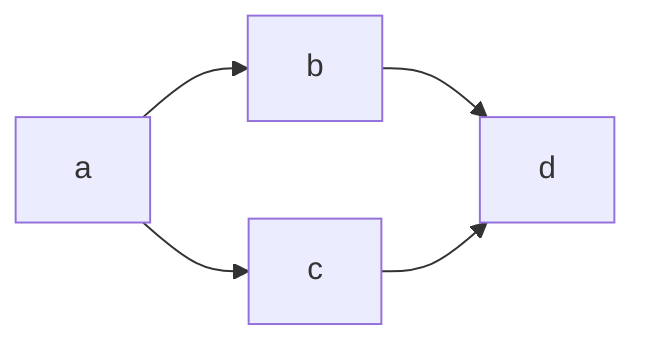

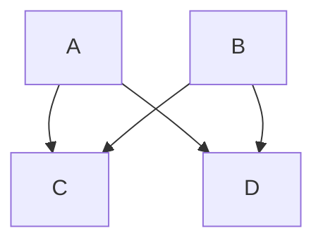


### 新链接

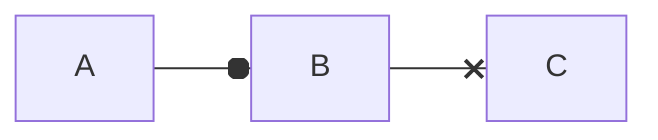

### 多向剪头

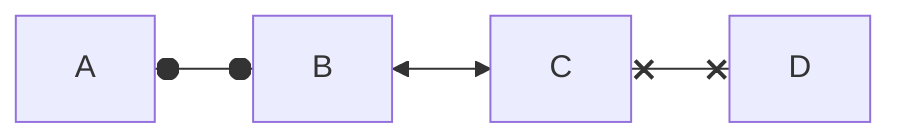

### 链接最小长度

| Length            | 1      | 2       | 3        |
| ----------------- | ------ | ------- | -------- |
| Normal            | `---`  | `----`  | `-----`  |
| Normal with arrow | `-->`  | `--->`  | `---->`  |
| Thick             | `===`  | `====`  | `=====`  |
| Thick with arrow  | `==>`  | `===>`  | `====>`  |
| Dotted            | `-.-`  | `-..-`  | `-...-`  |
| Dotted with arrow | `-.->` | `-..->` | `-...->` |

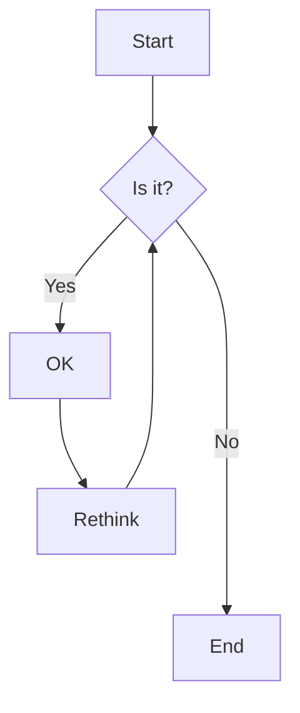


### 特殊字符


### 转义字符

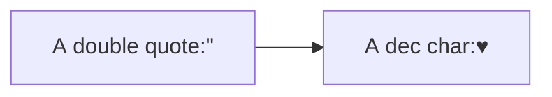

### 子图

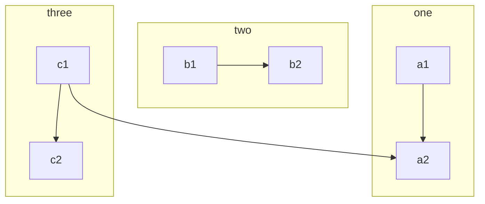

### 流程图

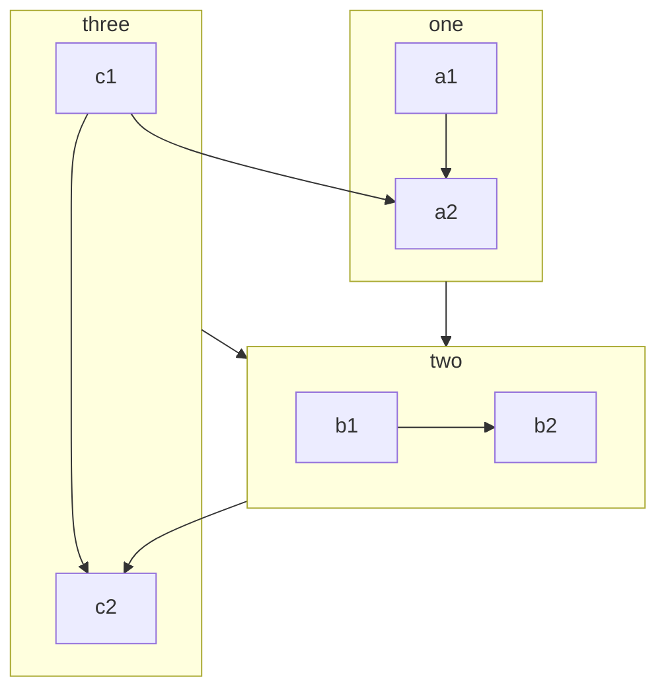

### 子图中的方向

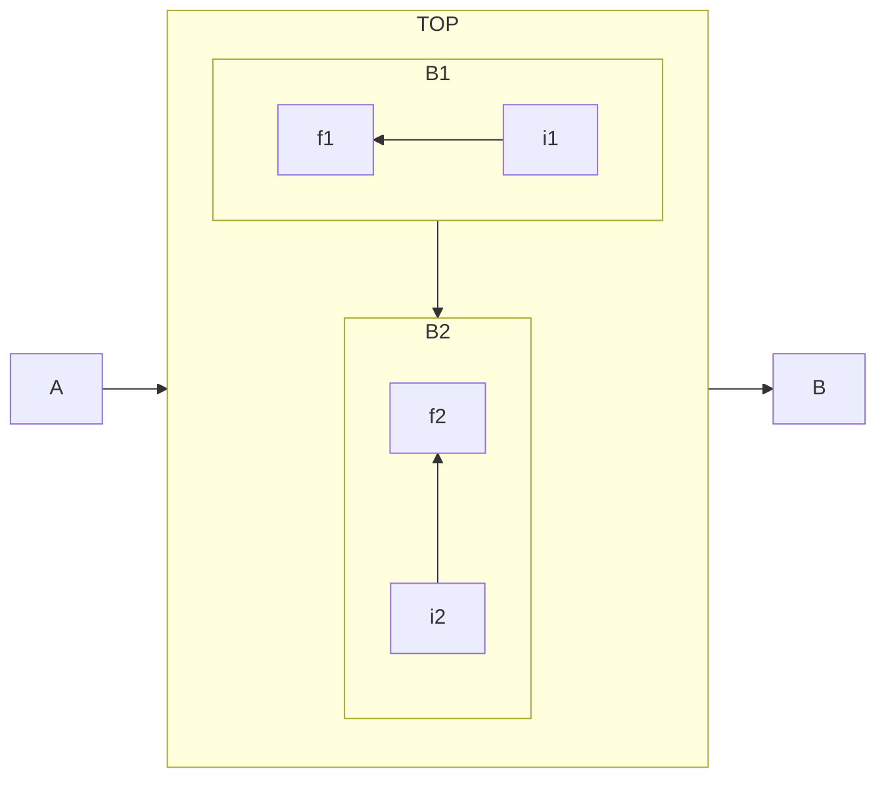

## Sequence diagrams

| Type | Description                                                                       |
| ---- | --------------------------------------------------------------------------------- |
| ->   | Solid line without arrow 不带箭头实线                                             |
| -->  | Dotted line without arrow  不带箭头虚线                                           |
| ->>  | Solid line with arrowhead  带箭头实线                                             |
| -->> | Dotted line with arrowhead  带箭头虚线                                            |
| -x   | Solid line with a cross at the end 末端有十字的实线                               |
| --x  | Dotted line with a cross at the end.  末端有十字的虚线                            |
| -)   | Solid line with an open arrow at the end (async) 末端有一个打开箭头的实线（异步） |
| --)  | Dotted line with a open arrow at the end (async) 末尾带有打开箭头的虚线（异步）   |

| 片段类型 | 名称   | 说明                                                                                                                                                                                                                                            |
| -------- | ------ | ----------------------------------------------------------------------------------------------------------------------------------------------------------------------------------------------------------------------------------------------- |
| Opt      | 选项   | 包含一个可能发生或可能不发生的序列。可以在临界中指定序列发生的条件。                                                                                                                                                                            |
| Alt      | 抉择   | 包含一个片段列表,这些片段包含备选消息序列。在任何场合下只发生一个序列。可以在每个片段中设置一个临界来指示该片段可以运行的条件。 else 的临界指示其他任何临界都不为 True 时应运行的片段。如果所有临界都为 false 并且没有 else ,则不执行任何片段。 |
| Loop     | 循环   | 片段重复一定次数。可以在临界中指示片段重复的条件。Loop 组合片段具有“Min”和"Max"属性,它们指示片段可以重复的最小和最大次数。默认值是无限制。                                                                                                      |
| Break    | 中断   | 如果执行此片段,则放弃序列的其余部分。可以使用临界来指示发 生中断的条件。                                                                                                                                                                        |
| Par      | 并行   | 并行处理。片段中的事件可以交错。                                                                                                                                                                                                                |
| Critical | 关键   | 用在 Par 或 Seq 片段中。指示此片段中的消息不得与其他消息交错。                                                                                                                                                                                  |
| Seq      | 弱顺序 | 有两个或更多操作数片段。涉及同一生命线的消息必须以片段的顺序发生。如果消息涉及的生命线不同 ,来自不同片段的消息可能会并行交错。                                                                                                                  |
| Strict   | 强顺序 | 有两个或更多操作数片段。这些片段必须按给定顺序发生。                                                                                                                                                                                            |
| Consider | 考虑   | 指定此片段描述的消息列表。其他消息可发生在运行的系统中,但对此描述来说意义不大。在"Messages"属性中键入该列表。                                                                                                                                   |
| Ignore   | 忽略   | 此片段未描述的消息列表。这些消息可发生在运行的系统中 ，但对此描述来说意义不大。在"Messages"属性中键入该列表。                                                                                                                                   |
| Assert   | 断言   | 操作数片段指定唯一有效的序列。 通常用在 Consider 或 Ignore 片段中。                                                                                                                                                                             |
| Neg      | 否定   | 此片段中显示的序列不得发生。通常用在 Consider 或 Ignore 片段中。                                                                                                                                                                                |

### 演员

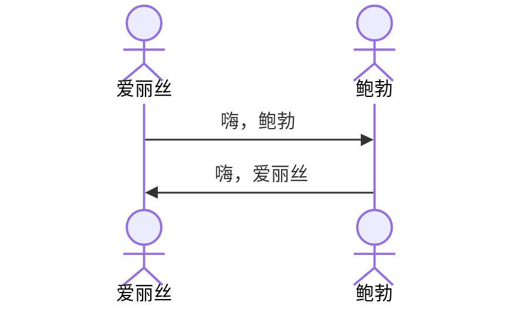

### 别名

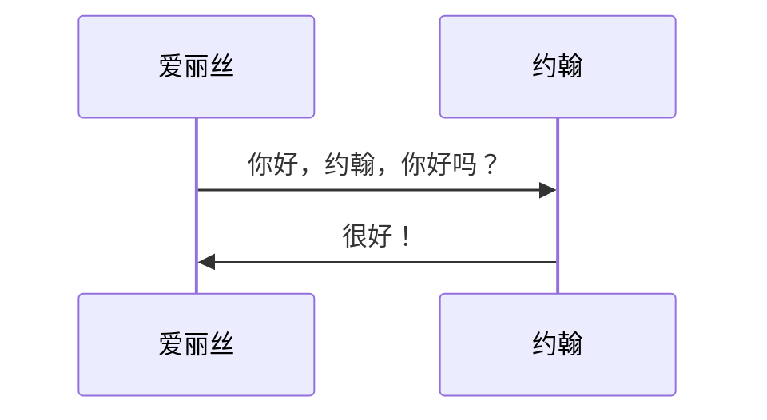

### 控制焦点

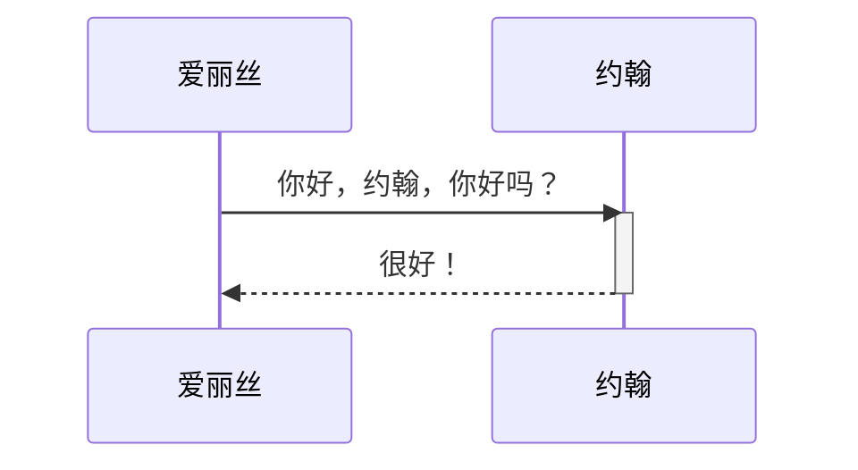

- 还有一个快捷方式表示法，通过将 / 后缀附加到消息箭头：`+` `-`

```mermaid
sequenceDiagram
    爱丽丝->>+约翰: 你好，约翰，你好吗？
    约翰-->>-爱丽丝: 很好！
```

- 可以为同一个参与者堆叠激活

```mermaid
sequenceDiagram
    爱丽丝->>+约翰: Hello 约翰, 你好吗?
    爱丽丝->>+约翰: 约翰, 你能听见我说话吗?
    约翰-->>-爱丽丝: Hi 爱丽丝, 我能听见!
    约翰-->>-爱丽丝: 我感觉很棒!
```

### 文本

- 右侧注释

```mermaid
sequenceDiagram
    participant 约翰
    Note right of 约翰: Text in note
```

- 上方注释

```mermaid
sequenceDiagram
    爱丽丝->约翰: Hello 约翰, how are you?
    Note over 爱丽丝,约翰: A typical interaction
```

### 循环

```mermaid
sequenceDiagram
    爱丽丝->约翰: Hello 约翰, how are you?
    loop 每分钟
        约翰-->爱丽丝: Great!
    end
```

### 替代路径

```mermaid
sequenceDiagram
    爱丽丝->>鲍勃: Hello 鲍勃, how are you?
    alt 生病了
        鲍勃->>爱丽丝: 不太好
    else 很好
        鲍勃->>爱丽丝: 感觉很舒心
    end
    opt 额外响应
        鲍勃->>爱丽丝: 感谢你的提问
    end
```

### 并行

```mermaid
sequenceDiagram
    par 爱丽丝对鲍勃
        爱丽丝->>鲍勃: 大家好!
    and 爱丽丝约翰约翰
        爱丽丝->>约翰: 大家好!
    end
    鲍勃-->>爱丽丝: Hi 爱丽丝!
    约翰-->>爱丽丝: Hi 爱丽丝!
```

- 也可以嵌套并行块。

```mermaid
sequenceDiagram
    par 爱丽丝对鲍勃
        爱丽丝->>鲍勃: 去帮助约翰
    and 爱丽丝对约翰
        爱丽丝->>约翰: 我想今天完成
        par 约翰对查理
            约翰->>查理: 我们今天能做到吗?
        and 约翰对戴安娜
            约翰->>戴安娜: 你今天能帮助我们吗?
        end
    end
```

### 背景突出显示

```mermaid
sequenceDiagram
    participant 爱丽丝
    participant 约翰

    rect rgb(191, 223, 255)
    note right of 爱丽丝: 爱丽丝 calls 约翰.
    爱丽丝->>+约翰: Hello 约翰, how are you?
    rect rgb(200, 150, 255)
    爱丽丝->>+约翰: 约翰, can you hear me?
    约翰-->>-爱丽丝: Hi 爱丽丝, I can hear you!
    end
    约翰-->>-爱丽丝: I feel great!
    end
    爱丽丝 ->>+ 约翰: Did you want to go to the game tonight?
    约翰 -->>- 爱丽丝: Yeah! See you there.
```

### 注释

```mermaid
sequenceDiagram
    爱丽丝->>约翰: Hello 约翰, how are you?
    %% this is a comment
    约翰-->>爱丽丝: Great!
```

#### 用于转义字符的实体代码

```mermaid
sequenceDiagram
    A->>B: I #9829; you!
    B->>A: I #9829; you #infin; times more!
```

### 序列编号

```mermaid
sequenceDiagram
    autonumber
    爱丽丝->>约翰: Hello 约翰, how are you?
    loop Healthcheck
        约翰->>约翰: Fight against hypochondria
    end
    Note right of 约翰: Rational thoughts!
    约翰-->>爱丽丝: Great!
    约翰->>鲍勃: How about you?
    鲍勃-->>约翰: Jolly good!
```

### 演员菜单

```mermaid
sequenceDiagram
    participant 爱丽丝
    participant 约翰
    link 爱丽丝: Dashboard @ https://dashboard.contoso.com/爱丽丝
    link 爱丽丝: Wiki @ https://wiki.contoso.com/爱丽丝
    link 约翰: Dashboard @ https://dashboard.contoso.com/约翰
    link 约翰: Wiki @ https://wiki.contoso.com/约翰
    爱丽丝->>约翰: Hello 约翰, how are you?
    约翰-->>爱丽丝: Great!
    爱丽丝-)约翰: See you later!
```

### 高级菜单语法

```mermaid
sequenceDiagram
    participant 爱丽丝
    participant 约翰
    links 爱丽丝: {"Dashboard": "https://dashboard.contoso.com/爱丽丝", "Wiki": "https://wiki.contoso.com/爱丽丝"}
    links 约翰: {"Dashboard": "https://dashboard.contoso.com/约翰", "Wiki": "https://wiki.contoso.com/约翰"}
    爱丽丝->>约翰: Hello 约翰, how are you?
    约翰-->>爱丽丝: Great!
    爱丽丝-)约翰: See you later!
```

## 样式

| Class        | Description                                                 |
| ------------ | ----------------------------------------------------------- |
| actor        | Style for the actor box at the top of the diagram.          |
| text.actor   | Styles for text in the actor box at the top of the diagram. |
| actor-line   | The vertical line for an actor.                             |
| messageLine0 | Styles for the solid message line.                          |
| messageLine1 | Styles for the dotted message line.                         |
| messageText  | Defines styles for the text on the message arrows.          |
| labelBox     | Defines styles label to left in a loop.                     |
| labelText    | Styles for the text in label for loops.                     |
| loopText     | Styles for the text in the loop box.                        |
| loopLine     | Defines styles for the lines in the loop box.               |
| note         | Styles for the note box.                                    |
| noteText     | Styles for the text on in the note boxes.                   |

## 可能的配置参数

| 参数              | 描述                                                                                                                                       | 默认值                         |
| ----------------- | ------------------------------------------------------------------------------------------------------------------------------------------ | ------------------------------ |
| mirrorActors      | Turns on/off the rendering of actors below the diagram as well as above it                                                                 | false                          |
| bottomMarginAdj   | Adjusts how far down the graph ended. Wide borders styles with css could generate unwanted clipping which is why this config param exists. | 1                              |
| actorFontSize     | Sets the font size for the actor's description                                                                                             | 14                             |
| actorFontFamily   | Sets the font family for the actor's description                                                                                           | "Open Sans", sans-serif        |
| actorFontWeight   | Sets the font weight for the actor's description                                                                                           | "Open Sans", sans-serif        |
| noteFontSize      | Sets the font size for actor-attached notes                                                                                                | 14                             |
| noteFontFamily    | Sets the font family for actor-attached notes                                                                                              | "trebuchet ms", verdana, arial |
| noteFontWeight    | Sets the font weight for actor-attached notes                                                                                              | "trebuchet ms", verdana, arial |
| noteAlign         | Sets the text alignment for text in actor-attached notes                                                                                   | center                         |
| messageFontSize   | Sets the font size for actor<->actor messages                                                                                              | 16                             |
| messageFontFamily | Sets the font family for actor<->actor messages                                                                                            | "trebuchet ms", verdana, arial |
| messageFontWeight | Sets the font weight for actor<->actor messages                                                                                            | "trebuchet ms", verdana, arial |
