# mermaid

## flowchart基本语法

### flowchart方向

- TB - top to bottom
- TD - top-down/ same as top to bottom
- BT - bottom to top
- RL - right to left
- LR - left to right

### 节点

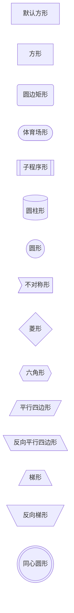

### 节点之间的链接

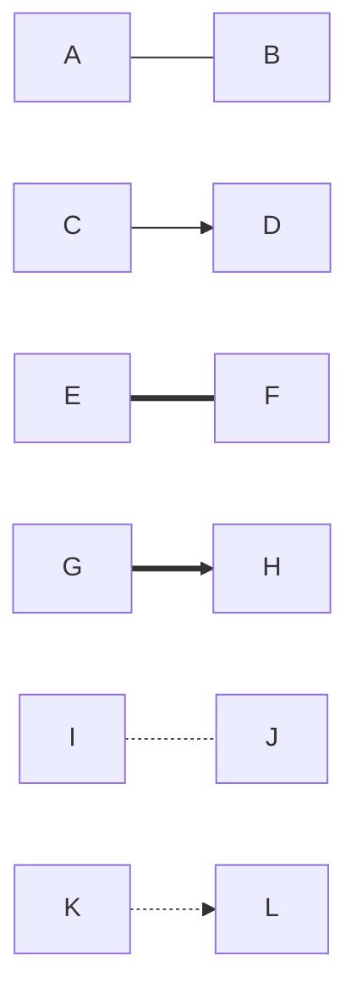

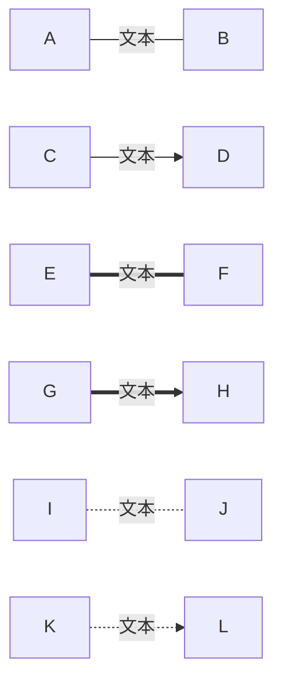


### 多链接

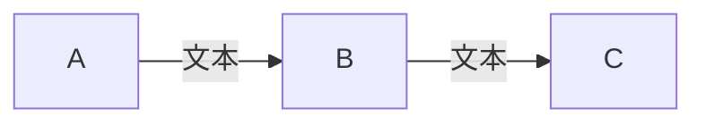

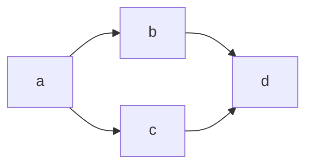

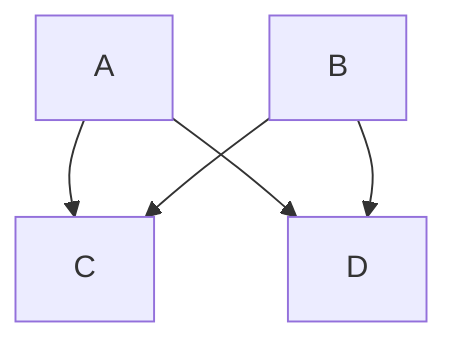


### 新链接

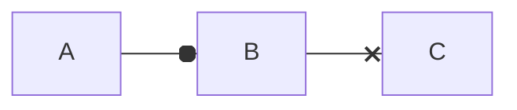

### 多向剪头

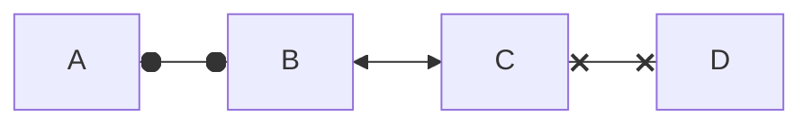

### 链接最小长度

| Length            | 1      | 2       | 3        |
| ----------------- | ------ | ------- | -------- |
| Normal            | `---`  | `----`  | `-----`  |
| Normal with arrow | `-->`  | `--->`  | `---->`  |
| Thick             | `===`  | `====`  | `=====`  |
| Thick with arrow  | `==>`  | `===>`  | `====>`  |
| Dotted            | `-.-`  | `-..-`  | `-...-`  |
| Dotted with arrow | `-.->` | `-..->` | `-...->` |

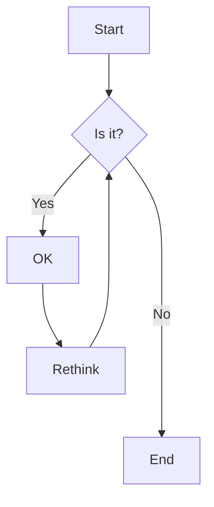


### 特殊字符

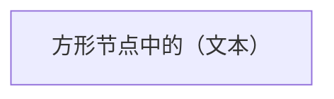

### 转义字符

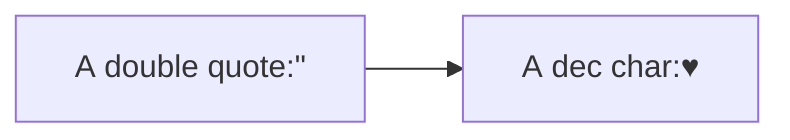

### 子图

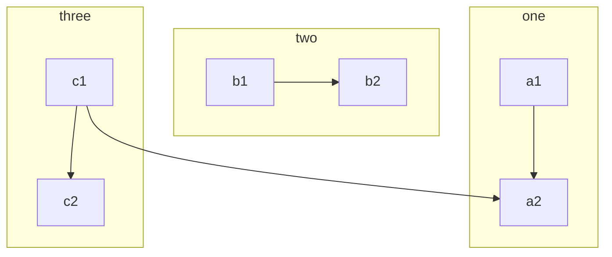

### 流程图

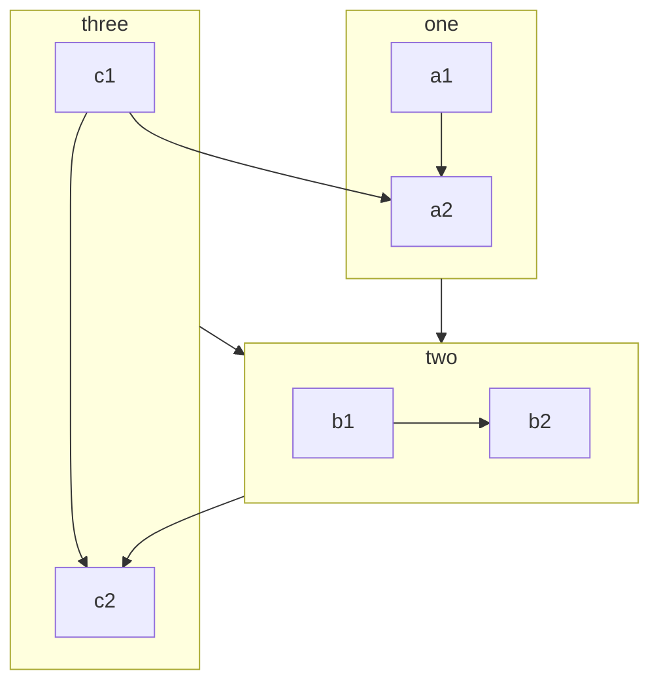

### 子图中的方向

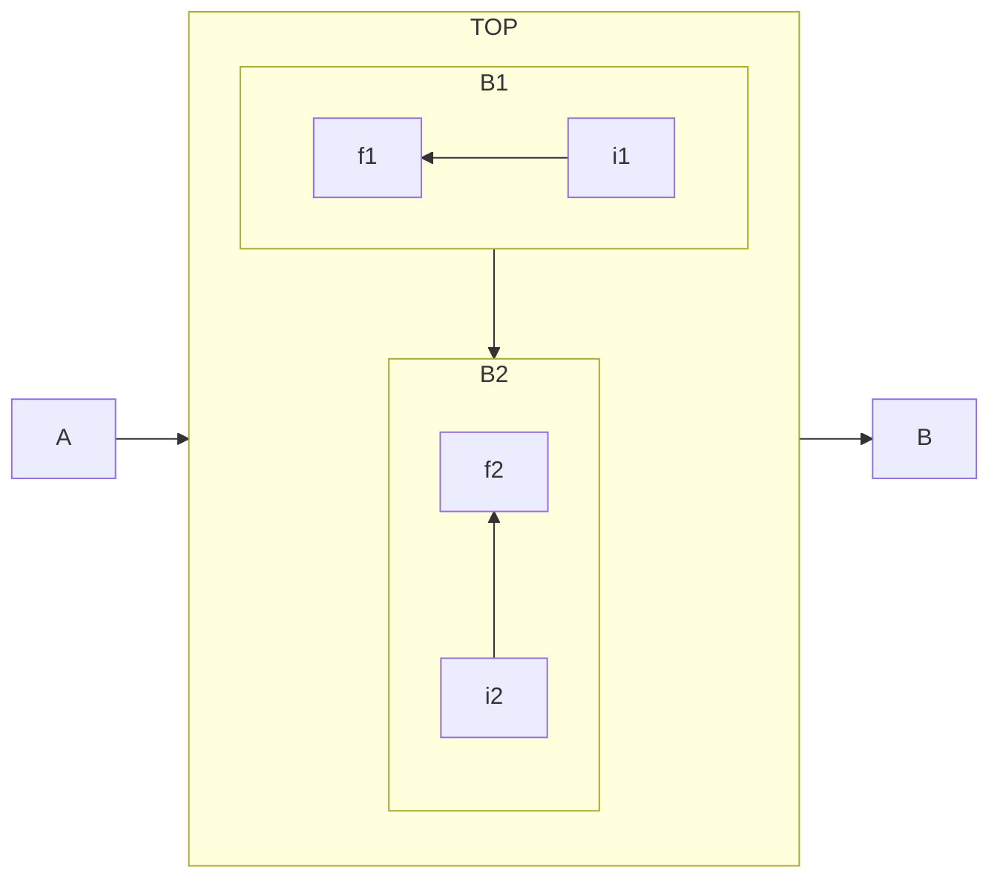

```text
<body>
  <div class="mermaid">
    flowchart LR
        A-->B
        B-->C
        C-->D
        click A callback "Tooltip"
        click B "https://www.github.com" "This is a link"
        click C call callback() "Tooltip"
        click D href "https://www.github.com" "This is a link"
  </div>

  <script>
    var callback = function () {
        alert('A callback was triggered');
    };
    var config = {
        startOnLoad: true,
        flowchart: { useMaxWidth: true, htmlLabels: true, curve: 'cardinal' },
        securityLevel:'loose'
    };
    mermaid.initialize(config);
  </script>
</body>
```
