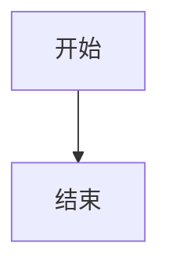
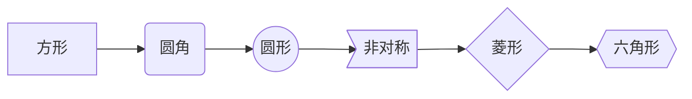
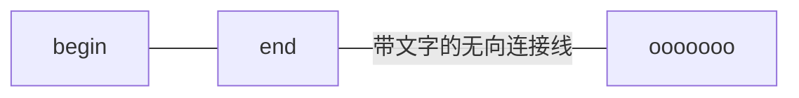
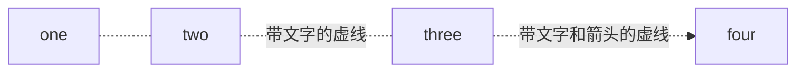
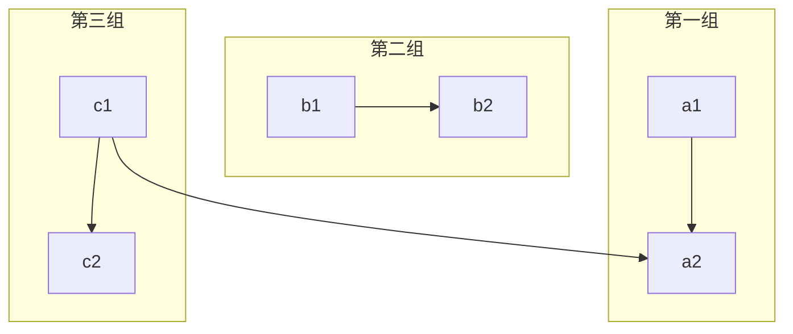
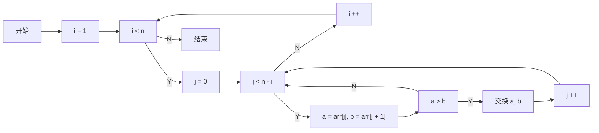

==1.标题==
大标题
===

中标题
---

# 一级标题

## 二级标题

### 三级标题

#### 四级标题

##### 五级标题

###### 六级标题

==2.换行==
换行<br>换行
换行用\<br>或\<br/>
==3.单行文本==

    单行文本
==4.多行文本==

    多
    行
    文
    本
==5.部分文字的高亮==
部分文字的`高亮`
==6.文字超链接==
这是一个[文字超链接](https://www.baidu.com)
==7.悬停显示文本==
这是一个[悬停显示文本](https://www.baidu.com "悬停显示")
==8.插入符号==

* 1
  * 2
    * 3

* 1
  * 2
    * 3

==9.缩进==
>数据结构
>>树
>>>二叉树
>>>>平衡二叉树
>>>>>满二叉树

==10.插入图片==
[](http://baidu.com)
==11.插入代码片段==

```java
Java public static void main(String[]Jarga){}//Java
```

```c
int main(int argc, char * argv[])//C
```

```bash
echo "hello GitHub"# Bash
```

```javascript
document. getElementdyId("myH1"). innerHTML="Welcome to my Homepage"; //javascript
```

```cpp
string &operator+(const atrings A, const atrings B)//cpp
```

==12.斜体==
*斜体*
==13.有序序号==

1. 111
2. 222
3. 333

==14.横线==

---
***
==15.表格==

 | 表头表头表头 | 表头表头表头 | 表头表头表头 | 表头表头表头 |
 | ------------ | :----------: | -----------: | ------------ |
 | 居左         |     居中     |         居右 | aaa          |

<table>
<tr><th align="left">表头表头表头</th><th>表头表头表头</th><th>表头表头表头</th><th>表头表头表头</th></tr>
<tr><td align="left">左</td><td align="center">中</td><td align="right">右</td><td>aaa</td></tr>
</table>

==16.文字上下标==
文字^上标^
文字~下标~

==17.流程图==

| 标志 |         方向          |
| :--: | :-------------------: |
|  TB  | top bottom - 从上到下 |
|  BT  | bottom top - 从下到上 |
|  RL  | right left - 从右到左 |
|  LR  | left right - 从左到右 |
|  TD  |       等同于 TB       |






* 样式的含义：
  * 有箭头：一般指数据流方向
  * 无箭头：仅表示相关性
  * 实线：强关联
  * 虚线：弱关联












